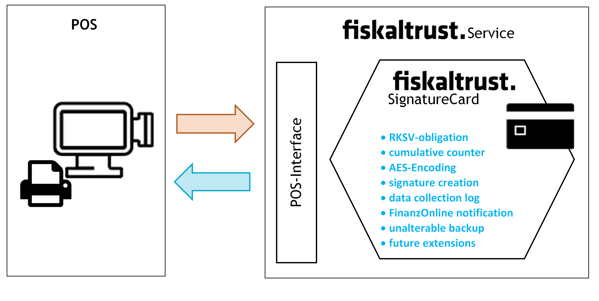
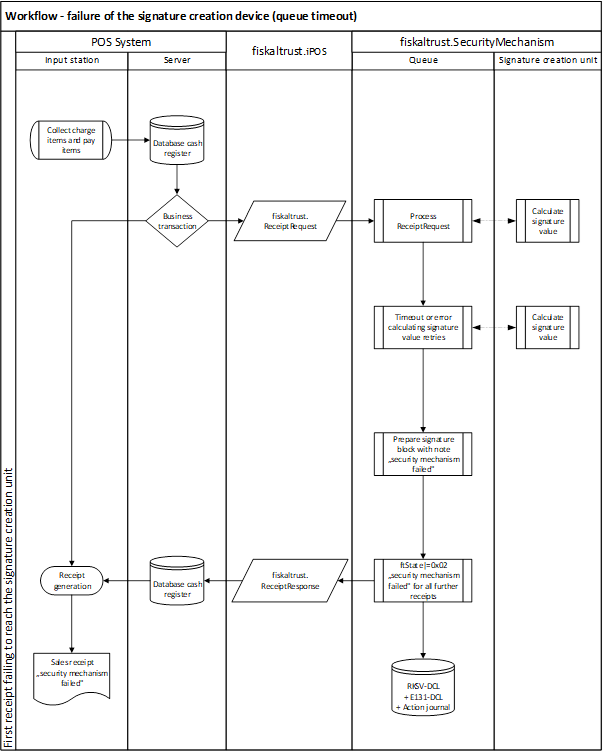
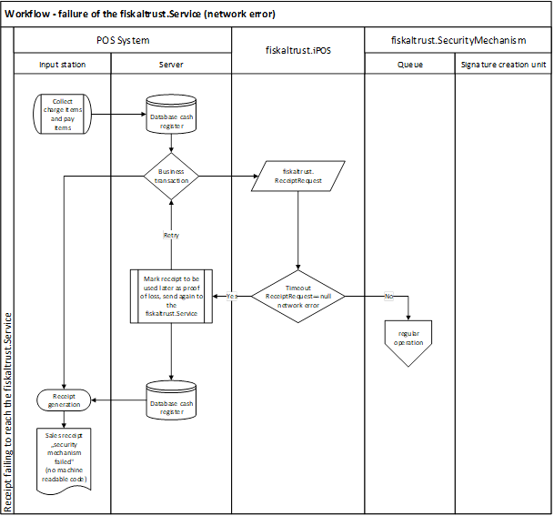

# Appendix: AT - RKSV

This appendix expands on the information provided in the General Part by adding details specific to the Austrian market. This additional information is provided only where applicable. The remaining chapters, for which there is no additional information required, were omitted.

The links to regulations and further information, can be found at:

<https://www.fiskaltrust.at/rechtsgrundlagen>

Further literature can be found at:

<http://www.lindeverlag.at/titel-1-1/swk_spezial_registrierkassen_und_belegerteilungspflicht-6515>

Ritz/Koran/Kutschera, SWK-Spezial Registrierkassen- und Belegerteilungspflicht, 1. Auflage 2016, Linde Verlag Wien. ISBN: 9783707333763

## Version History

For general Version History, please refer to page 16.

## Terminology

This table expands on the descriptions of all general terms and abbreviations provided in Table 2 of the General Part with information specific to the Austrian market.

| **Term**                                | **Description**                                                                                                                                                                                                                                                                                                                                                                                                                                                                                                                                                                                                                                                                                                                                                                                                                                                                                                                                                                                                                                                                                                                                                                                          |
|-----------------------------------------|----------------------------------------------------------------------------------------------------------------------------------------------------------------------------------------------------------------------------------------------------------------------------------------------------------------------------------------------------------------------------------------------------------------------------------------------------------------------------------------------------------------------------------------------------------------------------------------------------------------------------------------------------------------------------------------------------------------------------------------------------------------------------------------------------------------------------------------------------------------------------------------------------------------------------------------------------------------------------------------------------------------------------------------------------------------------------------------------------------------------------------------------------------------------------------------------------------|
| fiskaltrust.Journal                     | The Austrian implementation of the Journal enforces the RKSV DEP.                                                                                                                                                                                                                                                                                                                                                                                                                                                                                                                                                                                                                                                                                                                                                                                                                                                                                                                                                                                                                                                                                                                                        |
| fiskaltrust.SignatureCreationDevice     | Facility for creating electronic signatures, which guarantees immutability of receipts chains.<br />The requirements of a signature creation device are defined in the Austrian law in sections 12 to 14 RKSV.                                                                                                                                                                                                                                                                                                                                                                                                                                                                                                                                                                                                                                                                                                                                                                                                                                                                                                                                                                                           |
| business transaction                    | Accordingly to the "Cash Register Directive 2012", business transactions are business events starting with the initial recording of each ordered sales item (e.g. enter order into the POS system, article-scan at the cash desk, switch on the taximeter) and ending with a payment exchange which takes place between the business owners and the customer.                                                                                                                                                                                                                                                                                                                                                                                                                                                                                                                                                                                                                                                                                                                                                                                                                                            |
| BAO                                     | Bundesabgabenordnung / Austrian Fiscal Code                                                                                                                                                                                                                                                                                                                                                                                                                                                                                                                                                                                                                                                                                                                                                                                                                                                                                                                                                                                                                                                                                                                                                              |
| KRL 2012                                | Kassenrichtlinie 2012 / Cash Register Directive 2012<br />The Cash Register Directive 2012 provides answers to frequently asked questions on legal compliance regarding cash registers/point of sale systems in accordance with the changes to the relevant statutory requirements for recording, retention, and technology.<br />German PDF version:<br /><https://findok.bmf.gv.at/findok/resources/pdf/fdea69e7-6370-4555-9f06-d7446547268f/72122.1.X.X.pdf><br />English PDF version:<br />https://english.bmf.gv.at/taxation/Security_Device_in_Cash_Registers.html                                                                                                                                                                                                                                                                                                                                                                                                                                                                                                                                                                                                                                 |
| Cash register (RegK)                    | A cash register system (as well as classic cash register) combined with a fiskaltrust.SecurityMechanism is a POS system in terms of RKSV. It may be associated with an additional input station. For simplicity in the following text we do not distinguish between the cash register itself and input stations - this difference is important only for the calculation of the state grant for each cash register.                                                                                                                                                                                                                                                                                                                                                                                                                                                                                                                                                                                                                                                                                                                                                                                       |
| RKSV                                    | Registrierkassensicherheitsverordnung / Cash Register Ordinance (RKSV)<br />German version:<br /><https://www.bmf.gv.at/steuern/BGBLA_2015_II_410.pdf?56ycd7>                                                                                                                                                                                                                                                                                                                                                                                                                                                                                                                                                                                                                                                                                                                                                                                                                                                                                                                                                                                                                                            |
| RKSV-DEP / DCL                          | Datenerfassungsprotokoll (DEP) /<br />Data Collection Log (DCL) in accordance to the RKSV                                                                                                                                                                                                                                                                                                                                                                                                                                                                                                                                                                                                                                                                                                                                                                                                                                                                                                                                                                                                                                                                                                                |
| E131-DEP                                | Datenerfassungsprotokoll (DEPI pursuant to §131 BAO as well as KRL points 4.2.2 and 5.1.2) is a protocol for all data collection relevant to dues and taxes.<br />§131 Abs 1 Z 6 b BAO:<br />If during bookkeeping or recording or during the collection of business transactions data carriers are used, an inspection of the complete, correct and consistent collection of all business transactions should be possible, especially in the case of password determination with electronic recording system through respective logging of the data collection and subsequent editing.<br />KRL point 5.1.2: If a cash register type 3 is used, a running event protocols documents continuously and chronologically, the business transactions and the respective principles (e.g. individual services, sold products) should be documented.<br />If the data collection protocol also logs other events (e.g. master data, cash drawer openings, etc.) simultaneously to the collection of business transactions, then the importing via control software and hence the verifiability (overview of business transactions by a competent third party) should be secured through respective formatting. |
| Journal                                 | Journal is a data collection log with content in accordance to the RKSV-DEP.                                                                                                                                                                                                                                                                                                                                                                                                                                                                                                                                                                                                                                                                                                                                                                                                                                                                                                                                                                                                                                                                                                                             |
| SSCD (Secure Signature Creation Device) | Secure signature creation device (see §3 Z 23 RKSV) - configured software or hardware that is used to process the signature creation data and that complies with the security requirements of the Signature Law (SigG) and its associated regulations.                                                                                                                                                                                                                                                                                                                                                                                                                                                                                                                                                                                                                                                                                                                                                                                                                                                                                                                                                   |
| fiskaltrust.SignatureCard               | The fiskaltrust.SignatureCard can be addressed with the uniform interface (fiskaltrust.iPOS) via SOAP and REST protocols. This product is installed on the user’s existing hardware and runs on Windows as a service, on Linux and Mac as a daemon, and on mobile devices as a background worker.                                                                                                                                                                                                                                                                                                                                                                                                                                                                                                                                                                                                                                                                                                                                                                                                                                                                                                        |
| fiskaltrust.SignatureBox                | The fiskaltrust.SignatureBox can be addressed with the uniform interface (fiskaltrust.iPOS) via SOAP, REST, TCP/IP and RS232 and is provided as an external hardware box.                                                                                                                                                                                                                                                                                                                                                                                                                                                                                                                                                                                                                                                                                                                                                                                                                                                                                                                                                                                                                                |
| fiskaltrust.SignatureCloud              | The fiskaltrust.SignatureCloud can be addressed using the uniform interface(fiskaltrust.iPOS) via REST and is hosted in the cloud.                                                                                                                                                                                                                                                                                                                                                                                                                                                                                                                                                                                                                                                                                                                                                                                                                                                                                                                                                                                                                                                                       |

<span id="_Toc510009099" class="anchor"></span>*Table 17. Defintion of Terms and Abbreviations (AT - RKSVO)*

## Cash Register Integration

This chapter describes the cash register integration in accordance with the Austrian law. The general rules for cash register integration are described in Chapter 6.3 of this document.

### Receipt Creation Process

This chapter describes the general process of creating receipts with fiskaltrust.Service and its workflow, in accordance with the Austrian law.

#### The fiskaltrust.SecurityMechanism

The regular workflow of the fiskaltrust.SecurityMechanism in the Austrian market defines the steps required for creation of a receipt as follows:

  - assign a sequential receipt number
  - increase the cumulative sales counter according to the RKSV
  - encrypt the cumulative sales counter
  - create a signature
  - create machine-readable code according to the RKSV and
  - create all other necessary receipts
  - save all data



<span id="_Toc527986813" class="anchor"></span>*Illustration* *12. Process of the cash register integration (AT) with fiskaltrust.SecurityMechanism (AT - RKSVO)*

#### Workflow - regular operation

The following diagram illustrates the regular creation of a receipt with fiskaltrust.Service in accordance with the Austrian law.


<span id="_Toc527986814" class="anchor"></span>*Illustration 13. Workflow - regular operation (AT - RKSVO)*

#### Workflow - special receipts

The following diagram illustrates the creation of a special receipt with fiskaltrust.Service in accordance with the Austrian law.


<span id="_Toc52798681511111" class="anchor"></span>*Illustration 14. Workflow - special receipts (AT) (initial-, zero-, collective- , closing-receipt, shift-, daily-, monthly-, yearly-tally) (AT - RKSVO)*

#### Workflow - failure of the signature creation unit (queue timeout)

The following diagram illustrates the workflow of a failure of the signature creation device in accordance with the Austrian law.



<span id="_Toc527986815" class="anchor"></span>*Illustration 15. Workflow - failure of the SCD (queue timeout) (AT - RKSVO)*


<span id="_Toc527986816" class="anchor"></span>*Illustration 16. Workflow - failure of the SCD (wrong state) (AT - RKSVO)*


<span id="_Toc527986817" class="anchor"></span>*Illustration 17. Workflow - failure of the SCD (SCD timeout) (AT - RKSVO)*

#### Workflow - failure of the fiskaltrust.SecurityMechanism (network error)

The following diagram illustrates the workflow of a failure of the fiskaltrust.SecurityMechanism in accordance with the Austrian law.



<span id="_Toc527986818" class="anchor"></span>*Illustration 18. Workflow - failure of the fiskaltrust.SecurityMechanism (network error) (AT - RKSVO)*


<span id="_Toc527986819" class="anchor"></span>*Illustration 19. Workflow - failure of the fiskaltrust.Service (recover after more than 48 hours) (AT - RKSVO)*

### Receipt for special functions

This section describes receipt types used for special functions on the Austrian market and expands on the descriptions from chapter 6.3.2.

In accordance with §131b para. 2 BAO and the RKSV, as per 1.1.2017 (now 1.4.2017), each transaction receipt needs to be cryptographically signed with a signature creation device assigned to the taxpayer, in order to guarantee the immutability of the recording. In addition to these receipts, there are several other requirements stated by the RKSV which can be met by creating the following receipts with special functions.

#### Zero Receipt

In the following chapters you can find examples of special cases of zero receipts applicable to the Austrian market.

#### Start Receipt (Initial Receipt)

There is a number of RKSV requirements for the implementation of a new, or a replaced security mechanism (RKSV-DEP). A new data collection log (RKSV-DEP) must be started, with the register ID used as a start value for the signature linking. An initial receipt must be issued after the implementation and must be checked for correctness. Such check is at fiskaltrust a verification if the certificate serial number of the data record corresponds with the number registered in the BMF security mechanisms database, and if the signature matches the public key code of the certificate.

This receipt must be archived.

#### Stop Receipt (Closing Receipt)

In case of a scheduled decommissioning of a security mechanism or a cash register, the RKSV requires a generation of a closing receipt. The closing receipt concludes the data collection log (RKSV-DEP) and has to be archived.

At fiskaltrust.SecurityMechanisms, a scheduled decommissioning triggers after returning the data to the cash register and discarding of the currently used certificate (so that the signature creation device (security mechanism) cannot issue any more valid signatures). Within the framework of the data collection log (RKSV-DEP), the certificate remains preserved. In case of decommissioning, a "FinanzOnline" (finance online) notification is required (it will also be created through the fiskaltrust.SecurityMechanism).

Once the queue has been closed with a stop receipt, no hashing and signing of receipts will be done for that queue.

#### End of Failure Receipt (Collective Failure Report)

If, for technical reasons, signatures cannot be created, receipts need to be issued (according to the RKSV) and marked with a comment "security mechanism failed". Once the technical failure has been resolved, a signed collective receipt has to be issued to make up for the signature linking of all receipts issued during the technical failure.

Further you can find two fundamentally different types of failure distinguished by the fiskaltrust.SecurityMechanism:

#### Signature Creation Device Failure

A signature creation device failure must be assumed if the fiskaltrust.SecuritymMechanisms cannot communicate with the signature creation device temporarily. This can happen when e.g. the chip-card reader is faulty.

In case of a signature creation device failure, the machine-readable code from the fiskaltrust.SecurityMechanism (in accordance with the RKSV) is processed and sent back to the cash register. The status of the fiskaltrust.SecurityMechanism is communicated to the cash register input station with every response. The failure status can only be terminated through a zero receipt. Requesting the zero receipt can be done automatically through the input station or manually by the user.

A non-temporary failure (longer than 48 hours) of the signature creation device must be reported through FinanzOnline without undue delay. Afterwards, the return to service also must be reported through FinanzOnline. This is automatically done through the extension of the fiskaltrust.Carefree package.

#### fiskaltrust.SecurityMechanism Failure

A fiskaltrust.SecurityMechanism failure means that there is no access to the RKSV-DEP. In case of the failure lasting for more than 48 hours, a failure notification via FinanzOnline must be triggered. This notification is sent automatically when using fiskaltrust.Carefree, or otherwise, the notification regarding the reporting requirement is issued on the failure zero receipt.

#### Monthly Receipt

Before the beginning of a new monthly period, the preliminary result of the cumulative sales counter (monthly counter) has to be recorded accordingly to §8 Abs 2 RKSV. The cash register can request this monthly receipt via zero receipt from fiskaltrust.SecurityMechanisms for this purpose. The running sales counter is sent back to the cash register within the charge items block in unencrypted format.

#### Annual Receipt

Before the beginning of a new annual period, a note of the counter reading must be taken in accordance with §8 para. 3 RKSV. This procedure replaces the monthly receipt at the end of the year. As an additional requirement, the correctness of the signature on this annual receipt needs to be checked against the database through fiskaltrust.SecurityMechanism. This can be processed automatically when using fiskaltrust.Carefree or done manually through the BMF App, which is available at:

<https://www.bmf.gv.at/kampagnen/Unsere-Apps.html#heading_BMF_App>

### Receipt structure

This chapter describes the receipt structure applicable ot the Austrian market.


<span id="_Toc527986820" class="anchor"></span>*Illustration* *20. Receipt Structure (AT); cash register- receipt data (header, charge items, pay items, footer) and fiskaltrust-receipt data (header, charge items, pay items, signature, footer) (AT - RKSVO)*

#### Receipt Header

In accordance with §132a para. 3 BAO, the receipt header should receive a label and/or a logo of the issuing company (see figure above) already from the cash register. For example, it is necessary for annual receipts where the heading "Annual Receipt" is added to a zero receipt (receipt with a value of zero).

#### Charge Items Block

The charge items block on the cash register receipt contains the services (quantity and customary description of the purchased goods or type and extent of other services in accordance with §132a para. 3 Z 4 BAO or else in the form of symbols, code numbers or reference displayed).

As previously mentioned, a Charge Items block can be extended through fiskaltrust.SecurityMechanisms. An example of such an extension is the monthly receipt where the sum of current business transactions (cumulative sales counter) is listed as a charge item within the charge items block of a zero receipt at the end of the month.

#### Pay Items Block

According to the RKSV, there are currently no specific applications where the pay items block should be extended.

#### Signature Block

If, in accordance with §131b para. 2 BAO, a cryptographic signature is required, the signature block is generated by fiskaltrust.SecurityMechanisms. This includes receipt signature as required by RKSV, an information about the signature format, as well as potential further information such as references to training or reverse posting, or an operating failure of the signature creation device. The cash register should contain the signature block between the Pay Items block and the Receipt Footer.

#### Receipt Footer

According to the RKSV, there are currently no specific information where the footer should be extended.

### Data Collection Log

The RKSV defines the following logging features as obligatory for cash registers.

#### Data Collection Log according to RKSV (RKSV-DEP)

The RKSV-DEP is autonomously managed by the fiskaltrust.SecurityMechanism. It is recommended to save the values returned from the fiskaltrust.SecurityMechanism in the cash register’s database. A connection between the return values and the receipt is established through the receipt reference of the cash register request and the receipt ID of the fiskaltrust.ReceiptResponse.

Data from the data collection log can also be provided in form of a data stream, in accordance with the format specified by the RKSV.

When using the fiskaltrust.Carefree package, the RKSV-DEP is automated timely and saved in an external cloud, which is revision-safe and cannot be altered by the user.

#### Data Collection Log according to §131 para. 1 Z 6 b BAO (E131-DEP)

A E131-DEP, conducted by Cash Register, can be sent to fiskaltrust.SecurityMechanisms.

When using the fiskaltrust.Carefree package, the E131-DEP is automated timely and saved in an external cloud, which is revision-safe and cannot be altered by the user.

## Data Structures

This chapter expands on the descriptions of the data structures covered in chapter 6.4 of the General Part on page 25, with country specific information applicable to the Austrian market.

### Receipt Request

There are no special requirements or laws for the Austrian market.

### Receipt Response

This table describes additional fields of the Receipt Response applicable to the Austrian market.

| **Field name**            | **Data type** | **Default Value Mandatory Field** | **Description**                                                                                         | **Version** |
|---------------------------|---------------|-----------------------------------|---------------------------------------------------------------------------------------------------------|-------------|
| `ftCashBoxIdentification` | `string`      | mandatory                         | Cash register identification number in accordance with the RKSV.                                        | 0-          |
| `ftReceiptIdentification` | `string`      | mandatory                         | Upcounting receipt number allocated through fiskaltrust.SecurityMechanisms in accordance with the RKSV. | 0-          |

<span id="_Toc510009100" class="anchor"></span>*Table 18. Receipt Response (AT - RKSVO)*

### Charge Items Entry

This entry determines which counter will be used to sum up the value of the sales tax field (normal, discounted-1, discounted-2, zero or special) for the individual services. It is required for signature creation.

This table describes additional fields of the Charge Items Entry applicable to the Austrian market.

| **Field Name** | **Data Type** | **Default Value Mandatory Field** | **Description**                                                                                        | **Version** |
|----------------|---------------|-----------------------------------|--------------------------------------------------------------------------------------------------------|-------------|
| `Description`  | `string`      | empty-string<br />mandatory       | Name, description of customary indication, or type of the service or item in accordance with the RKSV. | 0-          |

<span id="_Toc510009101" class="anchor"></span>*Table 19. Charge Items Entry (ftChargeItems) (AT - RKSVO)*

### Pay Items Entry

There are no special requirements or laws for the Austrian market.

### Signature Entry

In addition to the description provided in chapter 6.4.5 of the General part, a Signature Entry for Austrian market may contain a FinanzOnline notification, which can be sent back depending on the operating mode. This is in particular the case for receipts with special functions.

| **Field Name**      | **Data Type** | **Default Value**<br />**Mandatory Field** | **Description**                                                                                                                                                                       | **Version** |
|---------------------|---------------|--------------------------------------------|---------------------------------------------------------------------------------------------------------------------------------------------------------------------------------------|-------------|
| `ftSignatureFormat` | `Int64`       | 0<br />mandatory                           | Format for displaying signature data according to the reference table in the appendix.                                                        | 0-          |
| `ftSignatureType`   | `Int64`       | 0<br />mandatory                           | Type of signature according to the reference table in the appendix, for example signature according to the RKSV or FinanzOnline notification. | 0-          |

<span id="_Toc510009102" class="anchor"></span>*Table 20. Signature Entry (AT - RKSVO)*

## Function Structures

This chapter expands on the descriptions of the function structures covered in chapter 6.5 of the General Part, with country specific information applicable to the Austrian market.

### iPOS Interface

#### Echo Function

In case of the Austrian product SignaturCloud, there is a special condition when the Echo-Function is called with null as a Message, which forces to reinitialize the fiskaltrust.Queue at service side.

#### Sign Function

The sign function meets the RKSV requirements when the fiskaltrust.SecurityMechanism is run in the following mode: the country set for creating the queue is AT and the cbReceiptCase has the flag `0x4154000000000000`.

#### Journal Function

A list with possible values for the request parameter ftJournalType for the Austrian market is provided in the reference table on page 84.

### RKSV-DEP Export

This interface allows requesting the RKSV-DEP by means of ftJournalType `0x4154…01`. It is required to retrieve data at the cash register in case of a check or an inspection (for example through fiscal authorities).

In addition, a security file of the RKSV-DEP is generated with each monthly report. The file name of this backup file can also be retrieved. The name of the file is composed as follows:

`QueueID + CurrentDateTime + CashboxId + LastSettlementMonth + "\_rksv\_dep.json"`

The CurrentDateTime is provided in the `yyyyMMddhhmmssfff` format.

### IATSSCD Interface

This interface is applicable only for the Austrian market and enables direct communication with the signature creation device for own purposes: it can be used for testing if the service is running ("Echo" call), for getting the certificate ("Certificate" call), or signing autonomously ("Sign" call).

#### ZDA Indicator Request

The ZDA indicator can be requested with the function:

`string ZDA();`

#### Certificate Request

The signature certificate can be requested with the public key of the signature creation device with the function:

`byte[] Certificate();`

#### Signature Function

The data can be signed with the function:

`byte[] Sign(byte[] data);`

## Communication

This chapter expands on the descriptions of the ways to communicate with the fiskaltrust.Service covered in chapter 6.6 of the General Part on page 37, with country specific information applicable to the Austrian market.

### WCF Web Service

#### SOAP

The fiskaltrust.SignatureCloud products use the SOAP protocol with the `<basicHttpsBinding>` to provide functionality via Internet. The fiskaltrust.SignatureBox, and fiskaltrust.SignatureCard products also use the `<NetTcpBinding>` and the `<NetNamedPipeBinding>`.

Moreover, the fiskaltrust.SignatureBox also provides the REST and the Stream protocols.

### Stream for Serial Interface over TCP

## Operation Modes

### Components of the fiskaltrust.Service

#### ASP.<span></span>net 5/Core Web App

An ASP.<span></span>NET application provides the functionality of a queue via the REST service. It is available at:

<https://signaturcloud.fiskaltrust.at>

This application is the bridge between the queue nutshell and fiskaltrust.SignatureCloud. Thanks to the ASP.NET Core, the fiskaltrust.SignatureCloud can be used across platforms and can, after release, be run directly in a computing centre or on a server. As signature creation device, a HSM, or also another software signature creation device, can provide a closed overall system.

### SSCD Nutshell

In Austria it is mandatory to have an unmodifiable smartcard (write once read many) which must store the issued certificate containing the POS operator data. This smartcard must be read from a reader, which must be connected to the machine of the POS system via: internal device, connected external device, network connected device, or web service.

### Configuration of the fiskaltrust.Service

#### Online Portal

All configuration settings, as well as the relevant extensions, are managed via the online fiskaltrust.Portal, which for Austrian market is available at:

<https://portal.fiskaltrust.at>

#### Signature Creation Device (SSCD)

Signature creation devices used on the Austrian market have various characteristics and requirements.

SmartCard – it is the most simple form of a SSCD. It is connected directly via a USB connection to the hardware, which runs the fiskaltrust.SecurityMechanism. A PCSC driver, supported by the respective operating system is necessary for the chip-card reader to operate such local signature creation devices. Windows provides this for many chip-card readers. For Linux or Mac the [PCSC lite project](https://pcsclite.alioth.debian.org/pcsclite.html) can be consulted.

Online signature service - a SSCD can also be used as an online service, where it is not necessary to access any local hardware in order to use it. However, for each signature an internet connection is required. An example for this type of SSCD module is the "atrustonline".

Another type of SSCD is an HSM module. Such module is usually installed on the local network and is not dependent on the internet connection. By using an HSM module, signing can be done extremely efficiently. These types of SSCD can be addressed with the SSCD module "lan".

On testing environments, a software based private key can be used for signing. Such software based certificate storage with public key and password encrypted private key is used in the SSCD module "pfx".

All signature creation devices can be directly addressed with the interface definition IATSSCD and per network. The fiskaltrust.SecurityMechanism uses the SSCD module "lan" to achieve this.

#### Queue

In this implementation, each receipt is processed accordingly with the RKSV requirements and signed with a configured signature creation device.

#### Journal

The Journal in Austria extracts the RKSV-DEP and includes the machine-readable code with the receipt signatures. It can also export the E131-DEP which provides a protocol for all receipt requests and responses. The journal also exports the processing protocol which records all events happening in the queue.

#### Notifications

Events are extracted from the notification-processing protocol. Special events have localized reporting requirements - for Austrian market they contain also the FinanzOnline notification according to the RKSV.

#### Configuration Scenarios

#### Single Queue scenario

In the simplest scenario, a fiskaltrust.SecurityMechanism consists of a single signature creation device and a single Queue with a data collection protocol (RKSV-DEP).


<span id="_Toc527986821" class="anchor"></span>*Illustration 21. Single Queue scenario (AT)*

#### Scenario with several queues for performance improvement

In order to handle scenarios of higher complexity, a fiskaltrust.SecurityMechanism can also consist of several signature creation devices (SSCD) and several queues with data collection protocols (RKSV-DEP). If there are several Queues in a fiskaltrust.SecurityMechanism, a load balancer can be used to maximize the performance, and also as a backup outage scenario. In a backup outage scenario signature creation devices (SSCD) can also be used across services.

The fiskaltrust.SecurityMechanism illustrated below hosts several Queues. Each Queue runs a RKSV-DEP and a E131-DEP. The Queues can address a signature creation device available within a pool.


<span id="_Toc527986822" class="anchor"></span>*Illustration 22. Scenario with several Queues for performance improvement (AT)*

#### Cash Register Network with Backup SSCD

As with the fiskaltrust.SecurityMechanism, the signature creation device is also available via network, and it is possible to use a signature creation device of a different cash register system in backup mode (indicated by the orange access line on the following illustration). Legal prerequisite for this is the registration of both signature creation devices with the same tax payer.


<span id="_Toc527986823" class="anchor"></span>*Illustration 23. Several fiskaltrust.SecurityMechanisms use the SSCD via network*

## Installation

### fiskaltrust.SignatureCard

The fiskaltrust.SignatureCard consists of a Smart Card, which stores the certificate, and of a reader, which can be: an external device attached to the machine using a USB cable, or an internal device installed inside the machine.

### fiskaltrust.SignatureBox

The fiskaltrust.SignatureBox is a pre-configured hardware solution with a network interface and a signature creation device.

The main settings such as CashboxId and AccessToken can be set via a basic Web-GUI.

### fiskaltrust.SignatureCloud

The fiskaltrust.SignatureCloud is a pure online solution. The receipt linking as well as the signature creation are handled entirely online. The advantage of this solution is that no installation or configuration is required for the client and any platform can use this service. CashboxId and AccessToken are transferred in an http-Header. The QueueId is part of the request link. The configuration can be done only via the fiskaltrust.Portal.

### iOS-Devices, Android-Devices, Windows Universal App (XBox, Windows Phone, …)

With regard to the SSCD nutshell, there will be restrictions: the queue will run on the device but the SSCD which must be provided through the network (LAN, WAN or Internet)

## Receipt Case Definitions

This chapter expands on the definitions of Receipt Cases covered in chapter 6.9 of the General Part on page 49, with country specific information applicable to the Austrian market.

### Voucher (Service/Product)

The issuance is a process with RKSV requirement and determines the time of sale. The redemption of a voucher, and thus the distribution of the goods, constitute a process without RKSV requirement but has to be recorded in accordance with §131 BAO. A data set with ftReceiptCase "delivery note" or "protocol data" can be issued to process this recording.

### Voucher (Value)

A voucher with a certain value constitutes a means of payment and its issuance is thus a process without RKSV requirement. Once a business transaction is made and paid for by redeeming a voucher, it constitutes a process with RKSV requirement - thus, (value) voucher can usually be found in the pay items block. If however, it is for technical reasons necessary to enter a (value) voucher obligations in the pay items block, then respective obligations should be transferred as ftChargeItemCase: for issuance this is (`0x4154000000000023`) and for intake (redemption) this is (`0x4154000000000022`).

### Agency Business

### Delivery Note

### Tips

Tips are to be divided into two categories:

  - Tips that go to the company are normal sales and must be indicated with the respective ftChargeItemCase: "other normal services", "discounted 1"/ "discounted 2", "special" or "zero".
  - Tips that do not go to the company, are to be treated like obligations or not own sales in the charge items block. In general, tips that don’t go to the company but, e.g. to staff, can be processed in the pay items block.

## Reference Tables

This chapter expands on the reference tables covered in chapter 6.10 of the General Part on page 50, with country specific information applicable to the Austrian market.

### Service Status: ftState

The table below describes supported statuses for the ftState field in accordance with the Austrian law. These codes can be added through the logic operator "OR".

The country specific code, is made of the country’s code value following the ISO-3166-1-ALPHA-2 standard, converted from ASCII into hex. For Austria (AT) this is `0x4154`, which results in `0x4154000000000000` as the value for the "ready" status.

| **Value**            | **Description**                                                                                                                                                                                                                                                                                                                                                                                                                                                                                                 | **Service-Version** |
|----------------------|-----------------------------------------------------------------------------------------------------------------------------------------------------------------------------------------------------------------------------------------------------------------------------------------------------------------------------------------------------------------------------------------------------------------------------------------------------------------------------------------------------------------|---------------------|
| `0x4154000000000001` | "out of service"<br />No RKSV signatures are generated or sent back. No RKSV-DEP is written, as nothing is being signed. The E131-DEP records requests and responses.                                                                                                                                                                                                                                                                                                                                           | 1.0                 |
| `0x4154000000000002` | "SSCD temporary out of service"<br />For at least one receipt, it was not possible to receive the signature from an allocated SSCD. Thus, the security mechanism has been put into "signature creation device out of service" mode. Regardless of whether an allocated SSCD is available again or not, the mode remains in place until, via zero receipt, all previous receipts can be signed. If this mode is activated, an out of service signature, in accordance with the RKSV, is generated and sent back. | 1.0                 |
| `0x4154000000000004` | "SSCD permanently out of service"<br />The status "SSCD temporary out of service" was activated more than 48h ago. Thus a FinanzOnline notification has been generated.<br />For conduct and termination of this mode, see "SSCD temporary out of service".                                                                                                                                                                                                                                                     | 1.0                 |
| `0x4154000000000008` | "subsequent entry activated"<br />At least one receipt has been transferred with a subsequent entry flag. In order to finalize the subsequent entry and leave the mode, it is necessary to generate a zero receipt. This zero receipt signs and secures the preliminary receipts accordingly to the RKSV.                                                                                                                                                                                                       | 1.0                 |
| `0x4154000000000010` | "monthly report due"<br />If the latest monthly or annual report are not in the current month, the service will signal this. This status does not impact the signature conduct of the service, it is merely an indicative notification.                                                                                                                                                                                                                                                                         | 1.0                 |
| `0x4154000000000020` | "annual report due"<br />Same conduct as for "monthly report due"                                                                                                                                                                                                                                                                                                                                                                                                                                               | 1.0                 |
| `0x4154000000000040` | "message / notification pending"<br />A status message and/or FinanzOnline notification is ready for collection.<br />By means of a zero receipt, the messages can be retrieved and should then be archived or processed in bookkeeping.                                                                                                                                                                                                                                                                        | 1.0                 |
| `0x4154000000000080` | "backup SSCD in use"<br />The receipt was signed by a signaturcreationunit configured for backup use.                                                                                                                                                                                                                                                                                                                                                                                                           | 1.1.17248           |

<span id="_Toc527986673" class="anchor"></span>*Table 21. Service statuts: ftState for AT - RKSVO*

### Type of Receipt: ftReceiptCase

The ftReceiptCase indicates the receipt type and defines how it should be processed by the fiskaltrust.SecurityMechanism in accordance with the Austrian law.

For Austria (AT) the country code is `0x4154`. Thus, the value for an unknown ftReceiptCase in Austria is `0x4154000000000000`.

| **Value**            | **Description**                                                                                                                                                                                                                                                                                                                                                                                                                                                        | **Service- Version** |
|----------------------|------------------------------------------------------------------------------------------------------------------------------------------------------------------------------------------------------------------------------------------------------------------------------------------------------------------------------------------------------------------------------------------------------------------------------------------------------------------------|----------------------|
| `0x4154000000000000` | "unknown type of receipt for AT"<br />This receipt is processed like a cash transaction with RKSV requirement.                                                                                                                                                                                                                                                                                                                                                         | 1.0-                 |
| `0x4154000000000001` | "Cash transaction with RKSV requirement for AT"<br />The fiskaltrust decision tree is being run through, and, if needed, the signature process is started and the cumulative counter adjusted respectively.<br />An example for a signature being needed, is an "other service" which is paid for with a "credit card".<br />An example for a case where no signature is needed, is a receipt with only "no own sales" on it which has been paid for by "credit card". |                      |
| `0x4154000000000002` | "zero receipt"<br />Charge items block (ftChargeItems) as well as pay items block (ftPayItems) are empty.<br />This can be used to test operability in order to be able to collect a service status notification, for example a out of service notification for FinanzOnline.                                                                                                                                                                                          | 0-                   |
| `0x4154000000000003` | "initial operation receipt"<br />The request is only valid as a zero receipt. The initial operation procedure is started. When using fiskaltrust.SecuritymMechansimsPlus, the receipt will also be checked for correctness.                                                                                                                                                                                                                                            | 0-                   |
| `0x4154000000000004` | "out of operation receipt"<br />The procedure to take the service out of operation is started.<br />The request is only valid as a zero receipt. When using the fiskaltrust.Carefree package, the receipt will also be checked for correctness and the notification to the "FinanzOnLine" will be performed automatically in background.                                                                                                                               | 0-                   |
| `0x4154000000000005` | "monthly receipt"<br />The procedure for the creation of the monthly receipt is started. The request is only valid as a zero receipt.                                                                                                                                                                                                                                                                                                                                  | 0-                   |
| `0x4154000000000006` | "annual receipt"<br />The procedure for the creation of the annual receipt is started.<br />The request is only valid as a zero receipt. When using the fiskaltrust.Carefree package, the receipt will also be checked for correctness and the notification to the "FinanzOnLine" will be performed automatically in background.                                                                                                                                       | 0-                   |
| `0x4154000000000007` | "cash transaction RKSV relief or cash revenue law"<br />This is used to process cash transactions which do not have a RKSV requirement (e.g. emptying a vending machine).                                                                                                                                                                                                                                                                                              | 0-                   |
| `0x4154000000000008` | "target business"<br />An outgoing invoice which does not necessarily have to be issued by a cash register but can also be issued by an invoicing system.                                                                                                                                                                                                                                                                                                              | 0-                   |
| `0x4154000000000009` | "delivery note"<br />Information about an internal or external delivery or also a transfer into a different IT system. The sales tax statement is issued through the outgoing invoice or in the other system.                                                                                                                                                                                                                                                          | 0-                   |
| `0x415400000000000A` | "cash deposit"<br />For example the payment of a target calculation, deposit on customer card, etc.<br />Usually, the receipt data only includes pay items while the charge items block remains empty. Since the total amount must always be zero, a negative payitem must be used to balance the sum of payitems to zero.                                                                                                                                             | 0-                   |
| `0x415400000000000B` | "cash pay-out"<br />For example to pay for deliveries .                                                                                                                                                                                                                                                                                                                                                                                                                | 0-                   |
| `0x415400000000000C` | "means of payment transfer"<br />For example the switching between "cash", "credit card", "ATM", etc. This function is also used to issue vouchers.                                                                                                                                                                                                                                                                                                                    | 0-                   |
| `0x415400000000000D` | "protocol"<br />Simple protocol function. The data sets that need to be logged can be transferred in the field ftReceiptCaseData in manufacturer-specific JSON format. For example opening the cash drawer or changing master data.                                                                                                                                                                                                                                    | 0-                   |
| `0x415400000000000E` | "Internal / material consumption"<br />For example recording breakages or own consumption.                                                                                                                                                                                                                                                                                                                                                                             | 0-                   |
| `0x415400000000000F` | "sales in online shop, telephone-/fax orders"<br />Through the cash revenue law, sales from online shops and similar are exempted, even if these have been paid by credit card or comparable means of payments with RKSV requirement but not paid on business premises. The issued receipt can, as a cash transaction, come with a recording requirement in accordance with §131 BAO and needs to be processed in bookkeeping.                                         | 0-                   |
| `0x4154000000000010` | "foreign sales"<br />Foreign sales do not have an RKSV-requirement. The issued receipt can, as a cash transaction, come with a recording requirement in accordance with §131 BAO and need to be processed in bookkeeping. Foreign requirements, for example in connection with receipt generation or cash register requirements have to be taken into account.                                                                                                         | 0-                   |

<span id="_Toc527986674" class="anchor"></span>*Table 22. Type of Receipt: ftReceiptCase (AT - RKSVO)*

#### ftReceiptCaseFlag

This table expands on the values provided in table 10 of chapter 6.10.2.1 on page 51 with values applicable to the Austrian market.

| Value                | Description                                                                                                                                                                                                                                                                                                                                                                                                                                                                                                                                                                                                                                                                       | Service-Version |
|----------------------|-----------------------------------------------------------------------------------------------------------------------------------------------------------------------------------------------------------------------------------------------------------------------------------------------------------------------------------------------------------------------------------------------------------------------------------------------------------------------------------------------------------------------------------------------------------------------------------------------------------------------------------------------------------------------------------|-----------------|
| `0x0000000000010000` | "out of service"<br />The transferred receipt contains data which has been created during an outage of the security mechanism. The original receipts are available in handwritten or digital format and must now be transferred and subsequently consolidated and signed via zero receipt. In order to decide whether it is a temporary or permanent (more than 48 hours) outage of the security mechanism (for example in case of theft), the "oldest" or the receipt with the earliest date/time value of all retrieved receipts is used. This can be necessary for example after a power or server outage.                                                                     | 0-              |
| `0x0000000000020000` | "training receipt"<br />Requests with this type of receipt are annotated with the reference "TRA" in the signature block. Instead of the encrypted cumulative sales counter, the BASE64 encrypted value of the TRA string is entered. The sales counter is, in accordance with the RKSV, not adjusted.                                                                                                                                                                                                                                                                                                                                                                            | 0-              |
| `0x0000000000040000` | "reverse receipt"<br />Requests with this type of receipt are annotated with the reference "STO" in the signature block. Instead of the encrypted cumulative sales counter, a BASE64 encrypted value of the STO string is entered. Further processing depends on the underlying type of receipt.                                                                                                                                                                                                                                                                                                                                                                                  | 0-              |
| `0x0000000000080000` | "handwritten receipt" or "subsequent entry"<br />The transferred receipt contains data which has been collected in a handwritten receipt. Although there is no requirement for a time annotation on a handwritten receipt we recommend using 12:00 for this purpose.<br />Further processing depends on the underlying type of receipt. For example, this can conduct after §7 cash revenue law for sales that were made outside business premises.                                                                                                                                                                                                                               | 0-              |
| `0x0000000000100000` | "small business, sales tax relief in accordance with §6 Abs 1 Z 27 UStG (sales tax law)"<br />The transferred receipt contains data which have been generated by a small business. A special note "sales tax relief in accordance with §6 Abs 1 Z 27" is possible. The RKSV requirement is handled according to the basic business transaction.<br />The transferred receipt data should contain the correct VAT rate and the correct ftChargeItemCase, even if the identified sales tax is 0%.                                                                                                                                                                                   | 0-              |
| `0x0000000000200000` | "receiver is company"<br />The transferred receipt contains a sales receipt and the receiver is a trader.<br />Note with regards to the characteristics of §11 UStG: for receipts with up to €400 gross amount, an invoice for small amounts can be issued. From €400 onwards, there are additional features to be displayed on the invoice, in order to enable the pre-tax deduction for the receiver of the invoice.<br />For receipts with a gross amount of €10.000 or more, in addition the service receiver’s UID number has to be indicated.<br />We suggest to transfer the data about the receiver in the field ftReceiptCaseData, in manufacturer-specific JSON format. | 0-              |
| `0x0000000000400000` | "contains characteristics in accordance with §11 UStG"<br />On the receipt, the characteristics are issued in accordance with §11 UStG and the transferred receipt contains receiver data in manufacturer-specific JSON format within the field ftReceiptCaseData.                                                                                                                                                                                                                                                                                                                                                                                                                | 0-              |
| `0x0000800000000000` | Receipt request. Common behaviour.                                                                                                                                                                                                                                                                                                                                                                                                                                                                                                                                                                                                                                                |                 |

<span id="_Toc527986675" class="anchor"></span>*Table 23. Type of Receipt: ftReceiptCase Flags(AT - RKSVO)*

### Type of Service: ftChargeItemCase

This table expands on the values provided in Table 12 on page 53 with values applicable to the Austrian market.

| **Value**            | **Description**                                                                                                                                                                                                                                                                                                                                                                                                                                                                                                                                                                                                                                                             | **Service-Version** |
|----------------------|-----------------------------------------------------------------------------------------------------------------------------------------------------------------------------------------------------------------------------------------------------------------------------------------------------------------------------------------------------------------------------------------------------------------------------------------------------------------------------------------------------------------------------------------------------------------------------------------------------------------------------------------------------------------------------|---------------------|
| `0x4154000000000000` | "unknown type of service for AT"<br />With help of the VAT-rates table saved within fiskaltrust.SecurityMechanisms, an allocation to normal /discounted-1 /discounted-2/zero is attempted.                                                                                                                                                                                                                                                                                                                                                                                                                                                                                  | 0-                  |
| `0x4154000000000001` | "undefined type of service for AT discounted-1"<br />(as of 1.7.2016, this is calculated with 10%).                                                                                                                                                                                                                                                                                                                                                                                                                                                                                                                                                                         | 0-                  |
| `0x4154000000000002` | "undefined type of service for AT discounted-2"<br />(as of 1.7.2016, this is calculated with 13%).                                                                                                                                                                                                                                                                                                                                                                                                                                                                                                                                                                         | 0-                  |
| `0x4154000000000003` | "undefined type of service for AT normal"<br />(as of 1.7.2016, this is 20%).                                                                                                                                                                                                                                                                                                                                                                                                                                                                                                                                                                                               | 0-                  |
| `0x4154000000000004` | "undefined type of service for AT special"<br />Includes all rates which are not contained in the previous ones (as of1.7.2016, this can be for example 12% or 19%).                                                                                                                                                                                                                                                                                                                                                                                                                                                                                                        | 0-                  |
| `0x4154000000000005` | "undefined type of service for AT zero"<br />Includes data which is indicated with 0% sales tax and also data where the sales tax is unknown, for example in a reference to an outgoing invoice. Also in cases where the sales tax should not be apparent, for example in the case of differential taxation, the data can be issued with this code.                                                                                                                                                                                                                                                                                                                         | 0-                  |
| `0x4154000000000006` | "reverse charge"<br />Reversal of tax liability.<br />These can e.g. include construction works, mobile phones from € 5.000,-, services abroad, etc.                                                                                                                                                                                                                                                                                                                                                                                                                                                                                                                        | 0-                  |
| `0x4154000000000007` | "not own sales"<br />In the data, a VAT-rate can be indicated, whereby the gross amount according to the RKSV always has to be recorded in the signature field, set zero.                                                                                                                                                                                                                                                                                                                                                                                                                                                                                                   | 0-                  |
| `0x4154000000000008` | "delivery discounted-1"<br />For processing, see (0x4154000000000001)                                                                                                                                                                                                                                                                                                                                                                                                                                                                                                                                                                                                       | 0-                  |
| `0x4154000000000009` | "delivery discounted-2"<br />For processing, see (0x4154000000000002)                                                                                                                                                                                                                                                                                                                                                                                                                                                                                                                                                                                                       | 0-                  |
| `0x415400000000000A` | "delivery normal"<br />For processing, see (0x4154000000000003)                                                                                                                                                                                                                                                                                                                                                                                                                                                                                                                                                                                                             | 0-                  |
| `0x415400000000000B` | "delivery special"<br />For processing, see (0x4154000000000004)                                                                                                                                                                                                                                                                                                                                                                                                                                                                                                                                                                                                            | 0-                  |
| `0x415400000000000C` | "delivery zero"<br />For processing, see (0x4154000000000005)                                                                                                                                                                                                                                                                                                                                                                                                                                                                                                                                                                                                               | 0-                  |
| `0x415400000000000D` | "other services discounted-1"<br />For processing, see (0x4154000000000001)                                                                                                                                                                                                                                                                                                                                                                                                                                                                                                                                                                                                 | 0-                  |
| `0x415400000000000E` | "other services discounted-2"<br />For processing, see (0x4154000000000002)                                                                                                                                                                                                                                                                                                                                                                                                                                                                                                                                                                                                 | 0-                  |
| `0x415400000000000F` | "other services normal"<br />For processing, see (0x4154000000000003)                                                                                                                                                                                                                                                                                                                                                                                                                                                                                                                                                                                                       | 0-                  |
| `0x4154000000000010` | "other services special"<br />For processing, see (0x4154000000000004)                                                                                                                                                                                                                                                                                                                                                                                                                                                                                                                                                                                                      | 0-                  |
| `0x4154000000000011` | "other services zero"<br />For processing, see (0x4154000000000005)                                                                                                                                                                                                                                                                                                                                                                                                                                                                                                                                                                                                         | 0-                  |
| `0x4154000000000012` | "catalogue services discounted-1"<br />For processing, see (0x4154000000000001)                                                                                                                                                                                                                                                                                                                                                                                                                                                                                                                                                                                             | 0-                  |
| `0x4154000000000013` | "catalogue services discounted-2"<br />For processing, see (0x4154000000000002)                                                                                                                                                                                                                                                                                                                                                                                                                                                                                                                                                                                             | 0-                  |
| `0x4154000000000014` | "catalogue services normal"<br />For processing, see (0x4154000000000003)                                                                                                                                                                                                                                                                                                                                                                                                                                                                                                                                                                                                   | 0-                  |
| `0x4154000000000015` | "catalogue services special"<br />For processing, see (0x4154000000000004)                                                                                                                                                                                                                                                                                                                                                                                                                                                                                                                                                                                                  | 0-                  |
| `0x4154000000000016` | "catalogue services zero"<br />For processing, see (0x4154000000000005)                                                                                                                                                                                                                                                                                                                                                                                                                                                                                                                                                                                                     | 0-                  |
| `0x4154000000000017` | "own consumption discounted-1"<br />For processing, see (0x4154000000000001)                                                                                                                                                                                                                                                                                                                                                                                                                                                                                                                                                                                                | 0-                  |
| `0x4154000000000018` | "own consumption discounted-2"<br />For processing, see (0x4154000000000002)                                                                                                                                                                                                                                                                                                                                                                                                                                                                                                                                                                                                | 0-                  |
| `0x4154000000000019` | "own consumption normal"<br />For processing, see (0x4154000000000003)                                                                                                                                                                                                                                                                                                                                                                                                                                                                                                                                                                                                      | 0-                  |
| `0x415400000000001A` | "own consumption special"<br />For processing, see (0x4154000000000004)                                                                                                                                                                                                                                                                                                                                                                                                                                                                                                                                                                                                     | 0-                  |
| `0x415400000000001B` | "own consumption zero"<br />For processing, see (0x4154000000000005)                                                                                                                                                                                                                                                                                                                                                                                                                                                                                                                                                                                                        | 0-                  |
| `0x415400000000001C` | "down payment discounted-1"<br />For processing, see (0x4154000000000001)                                                                                                                                                                                                                                                                                                                                                                                                                                                                                                                                                                                                   | 0-                  |
| `0x415400000000001D` | "down payment discounted-2"<br />For processing, see (0x4154000000000002)                                                                                                                                                                                                                                                                                                                                                                                                                                                                                                                                                                                                   | 0-                  |
| `0x415400000000001E` | "down payment normal"<br />For processing, see (0x4154000000000003)                                                                                                                                                                                                                                                                                                                                                                                                                                                                                                                                                                                                         | 0-                  |
| `0x415400000000001F` | "down payment special"<br />For processing, see (0x4154000000000004)                                                                                                                                                                                                                                                                                                                                                                                                                                                                                                                                                                                                        | 0-                  |
| `0x4154000000000020` | "down payment zero"<br />For processing, see (0x4154000000000005)                                                                                                                                                                                                                                                                                                                                                                                                                                                                                                                                                                                                           | 0-                  |
| `0x4154000000000021` | "account of a third party/ third party name/ collection"<br />For processing, see (0x4154000000000007)                                                                                                                                                                                                                                                                                                                                                                                                                                                                                                                                                                      | 0-                  |
| `0x4154000000000022` | "obligation with RKSV requirement"<br />Obligations are to be equalized with pay items. If however, it is for technical reasons necessary to transfer obligations in the charge items block, then this code should be used for obligations with RKSV requirement. The gross amount due is recorded in the signature field, set zero, according to the RKSV.<br />For example, a receipt for a voucher issuance, for which the voucher is indicated as item in the charge items block and the corresponding cash amount is indicated in the pay items block.<br />An example for this would be a voucher intake via charge items block, or a payment of an outgoing invoice. | 0-                  |
| `0x4154000000000023` | "obligation without RKSV requirement"<br />Obligations are to be equalized with pay items. If however, it is systematically necessary to transfer obligations in the charge items block, then this code should be used for obligations without RKSV requirement. The gross amount due is recorded in the signature field, set zero, according to the RKSV. For processing, also see (0x4154000000000007).                                                                                                                                                                                                                                                                   | 0-                  |

<span id="_Toc527986676" class="anchor"></span>*Table 24. Type of Service: ftChargeItemCase (AT - RKSVO)*

### Type of Payment: ftPayItemCase

This table expands on the values provided in table Table 13 on page 53 with values applicable to the Austrian market.

| **Value**            | **Description**                                                                                                                   | **Service-Version** |
|----------------------|-----------------------------------------------------------------------------------------------------------------------------------|---------------------|
| `0x4154000000000000` | "default value"<br />unknown payment type: automatic processing through the fiskaltrust.SecurityMechanisms settings is attempted. | 0-                  |
| `0x4154000000000000` | "unknown payment type for AT"<br />This is handled like a cash payment in national currency.                                      | 0-                  |
| `0x4154000000000001` | "cash payment in national currency"                                                                                               | 0-                  |
| `0x4154000000000002` | "cash payment in foreign currency"                                                                                                | 0-                  |
| `0x4154000000000003` | "crossed cheque"                                                                                                                  | 0-                  |
| `0x4154000000000004` | "debit card payment"                                                                                                              | 0-                  |
| `0x4154000000000005` | "credit card payment"                                                                                                             | 0-                  |
| `0x4154000000000006` | "voucher payment (coupon)"                                                                                                        | 0-                  |
| `0x4154000000000007` | "online payment"                                                                                                                  | 0-                  |
| `0x4154000000000008` | "customer card payment"                                                                                                           | 0-                  |
| `0x4154000000000009` | "other debit card"                                                                                                                | 0-                  |
| `0x415400000000000A` | "other credit card"                                                                                                               | 0-                  |
| `0x415400000000000B` | "account receivable"<br />delivery note/ settlement in foreign currency                                                           | 0-                  |
| `0x415400000000000C` | "SEPA transfer"                                                                                                                   | 0-                  |
| `0x415400000000000D` | "other transfer"                                                                                                                  | 0-                  |
| `0x415400000000000E` | "cash book expense"                                                                                                               | 0-                  |
| `0x415400000000000F` | "cash book contribution"                                                                                                          | 0-                  |
| `0x4154000000000010` | "levy"<br />AT: Anzahlung                                                                                                         | 0-                  |
| `0x4154000000000011` | "internal/ material consumption"                                                                                                  | 0-                  |
| `0x4154000000000012` | "change"<br />tip                                                                                                                 | 0-                  |

<span id="_Toc527986677" class="anchor"></span>*Table 25. Type of Payment: ftPayItemCase (AT - RKSVO)*

### Type of Signature: ftSignatureFormat

This table expands on the values provided in table Table 14 on page 54 with values applicable to the Austrian market.

According to the RKSV, there is one exception: if the fiskaltrust.SecurityMechanism responds with a QR code but the printer, through which the receipt is supposed to be printed (or electronically issued), cannot display QR codes, it is allowed to convert the signature value and display it as bar code, link, or in OCR typeface on the receipt. This requirement and a sample code can be found in <span class="underline">7.10.8</span> on page 84.

| **Value** | **Description**                             |
|-----------|---------------------------------------------|
| `0x00`    | unknown / without                           |
| `0x01`    | Text                                        |
| `0x02`    | Link                                        |
| `0x03`    | QR code (2D code)                           |
| `0x04`    | Code128 (bar code)                          |
| `0x05`    | OCR-A (text recognition, Base32 compatible) |
| `0x06`    | PDF417-(2D code)                            |
| `0x07`    | DATAMATRIX-(2D code)                        |
| `0x08`    | AZTEC-(2D Code)                             |
| `0x09`    | EAN-8 (bar code)                            |
| `0x0A`    | EAN-13 (bar code)                           |
| `0x0B`    | UPC-A (bar code)                            |
| `0x0C`    | Code39 (bar code, Base32 compatible)        |

<span id="_Toc527986678" class="anchor"></span>*Table 26. Type of Signature: ftSignatureFormat (AT - RKSVO)*

### Type of Signature: ftSignatureType

This table expands on the values provided in table <span class="underline">6.10.6</span> on page 54 with values applicable to the Austrian market.

| **Value**            | **Description**                                                                                                                                       | **Version** |
|----------------------|-------------------------------------------------------------------------------------------------------------------------------------------------------|-------------|
| `0x4154000000000000` | unknown                                                                                                                                               | 0-          |
| `0x4154000000000001` | signature according to RKSV                                                                                                                           | 0-          |
| `0x4154000000000002` | Archiving required according to RKSV or BAO §132.<br />E.g. notification of collective receipt after failure, initial receipt, monthly receipt, etc.. | 0-          |
| `0x4154000000000003` | FinanzOnline notification                                                                                                                             | 0-          |

<span id="_Toc527986679" class="anchor"></span>*Table 27. Type of Signature: ftSignatureType (AT - RKSVO)*

### Type of Journal: ftJournalType

This table expands on the values provided in table of chapter xxx on page xxx with values applicable to the Austrian market.
<!-- PVO: chapter references-->

| **Value**            | **Description**                | **Version** |
|----------------------|--------------------------------|-------------|
| `0x4154000000000000` | status information for QueueAT | 0-          |
| `0x4154000000000001` | RKSV-DEP-Export                | 0-          |

<span id="_Ref522606169" class="anchor"></span>*Table 28. Type of Journal: ftJournalType (AT - RKSVO)*

### Printing of QR-Code not supported

In the case that no QR code can be issued, it is allowed to place text using OCR typeface onto the receipt. For this procedure, BASE64-coded data fields are displayed in BASE32 according to §11 para. 2 RKSV. The reason for this is that the capital "i" and lowercase "L" are not distinguishable from each other in many typefaces.

For example, the following signature value is converted in the way described above. Whereby the following output BASE64 (bold) is:

```
_R1-AT0_DEMO-CASH-BOX426_776730_2015-10-14T18:20:23_0,00_0,00_0,00_0,00_0,00_0gJTFI8/zqc=_968935007593160625_fP7/PMP-SnQ0=_Xh5wNe0akaTOVvMgLVrCcRh2xmIyP91ogbxc5xv4Rrw64lpQsqLm+1GZxuCz4D1sZl9WCv3wMMoE0p+gyLaufg==
```

<span id="_Toc527986839" class="anchor"></span>*Code 15. Example of OCR output in Base64*

The BASE32 display in accordance with the RKSV for this OCR text output in BASE32 (bold) looks as follows:

```
_R1-AT0_DEMO-CASH-BOX426_776730_2015-10-14T18:20:23_0,00_0,00_0,00_0,00_0,00_2IBFGFEPH7HKO===_968935007593160625_PT7P6PGD2KOQ2===_LYPHANPNDKI2JTSW6MQC2WWCOEMHNRTCGI7522EBXROOOG7YI26DVYS2KCZKFZX3KGM4NYFT4A6WYZS7KYFP34BQZICNFH5AZC3K47Q=
```

<span id="_Toc527986840" class="anchor"></span>*Code 16. Example of OCR output in Base32*

This procedure has to be carried out by the cash register or input station itself because the service does not know whether a QR code can be printed or not, and because the data format for DEP storage requires a BASE64 display anyway.

A conversion tool is provided in the class fiskaltrust.ifPOS.Utility.

**C# code example Converting to OCR:**
```cs
string ocr = fiskaltrust.ifPOS.Utilities.AT_RKSV_Signature_ToBase32(qr_data);
```

<span id="_Toc527986841" class="anchor"></span>*Code 17. Example for converting the QR-Code to OCR*

