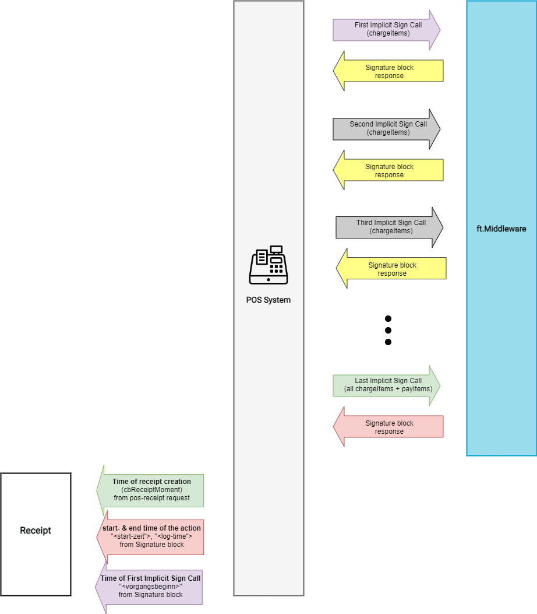
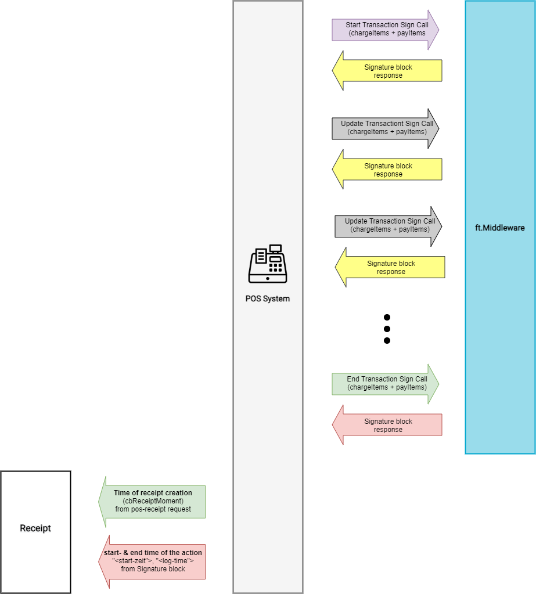

# Cash register integration

This chapter describes the cash register integration in accordance with German law. The general rules for cash register integration are described in the General Part of this document.

## Receipt Creation Process

This chapter describes the general process of creating receipts with fiskaltrust.Middleware and its workflow, according to German law. It requires giving a scope to an ongoing [action](../terminology/terminology.md) over time. This scope is named a [transaction](../terminology/terminology.md). Calls to fiskaltrust.Middleware are processed just in time and cannot be asynchronous over multiple minutes. Therefore and in accordance with German law, a single call is maybe not able to scope a complete transaction. To solve this, multiple calls are used, scoping the same transaction.

The "**transaction**" describes the steps, at least at the beginning and end of the action, within the SCU.

The "**flow**" describes the communication between the POS System and the fiskaltrust.Middleware to trigger transactions. This can be done either 

- **implicitly** (a "Start-Transaction" is done automatically - implicitly - behind the scenes upfront the final call), or
- **explicitly** (every single transaction like "Start" and "Finish" are initiated)


*Flow and Transaction (DE - KassenSichV)*

Implicit- and explicit flow can be combined, dependent on the actual needs.

### The implicit flow

#### When to use

This is the regular workflow of the fiskaltrust-SecurityMechanism in the German market for actions which should fit for around 90% of all use cases. 

##### Characteristics

- No open TSE-transactions to be managed.
- Reduces complexity of business-process handling.
- Each sign-request uses two TSE signatures
- Slower TSE performance

#### How to use

Sign-call with a [ftReceiptCase for implicit flow](https://docs.fiskaltrust.cloud/docs/poscreators/middleware-doc/germany/reference-tables/ftreceiptcase#type-of-receipt-ftreceiptcase) + ftReceiptCaseFlag `0x0000000100000000`.
The up-counting transaction number defined in TR-03153 is responded behind the hash-tag in the property 'ftReceiptIdentification' of 'ReceiptResponse', prefixed by "IT".

**Please be aware that for the implicit flow, ADDITIONALLY the start time of the first transaction of the business-action (e.g. start time of the first order) has to be printed on the receipt as the start-time of the action.**


*Implicit Flow - Start/Finish Transaction (DE - KassenSichV)*

<details>
  <summary>Background information</summary>
  <p>

There has to be a "Start-Transaction" and a "Finish-Transaction" executed against the TSE. In order to speed up these two steps into one call to the 'Sign' method, a special 'ReceiptCaseFlag' is used. Each time this is used in combination with a usual 'ReceiptCase', a "Start-Transaction" is done behind the scenes upfront the final call, using the given 'ReceiptCase'.

Please be aware:

- Using a unique identifier in 'cbReceiptReference' that was already used with a 'Sign' call with 'ReceiptCase' "Start-Transaction" will end up in an exception.
- Because the implicit flow triggers a "Start-Transaction" AND a "Finish-Transaction" against the TSE, for each implicit 'Sign' call two TSE-signatures are consumed.

</p>
</details>

#### Examples

<details>
  <summary><b>Short lasting actions, e.g. Retail</b></summary>
  <p>

<details>
  <summary>Scenario description and graphical illustration (click to expand)</summary>
  <p>

In this example, a customer wants to pay and no more orders are expected. A ftReceiptCase `0x4445000000000001` (POS receipt) + ftReceiptCaseFlag `0x0000000100000000` (Implicit Flag) is beeing sent to the middleware. The call includes all collected charge- and payitems of the business action (in this example: Soda Zitrone and Kaffee Haag, including cash payment).

The response's signature block includes all information needed to be printed on the receipt (time of receipt creation - which is the returned value of cbReceiptMoment of the sign-request, start time of the action, and end time of the action). 


</p>
</details>

<details>
  <summary>Request code (click to expand)</summary>
  <p>

```json
{
    "ftCashBoxID":"cashboxid-guid",
    "ftPosSystemId":"possystemid-guid",
    "cbTerminalID":"T1",
    "cbReceiptReference":"4747847",
    "cbReceiptMoment":"2020-05-22T11:33:00.260Z",
    "cbChargeItems":[
        {
            "Quantity":1.0,
            "Description":"0,5 Soda Zitrone",
            "Amount":3.50,
            "VATRate":19.0000,
            "ftChargeItemCase":4919338167972134913,
            "Moment":"2020-05-22T10:47:40.960Z"
        },
        {
            "Quantity":1.0,
            "Description":"Kaffe Hag",
            "Amount":4.00,
            "VATRate":19.0000,
            "ftChargeItemCase":4919338167972134913,
            "Moment":"2020-05-22T10:58:03.960Z"
        }
    ],
    "cbPayItems":[
        {
            "Quantity":1.0,
            "Description":"Cash",
            "Amount":7.50,      
            "ftPayItemCase":4919338167972134913,
            "Moment":"2020-05-22T11:33:00.260Z"
        }
    ], 
    // 0x4445 0000 0000 0001 (pos-receipt) + 0000 0001 0000 0000 (implicit flow)  
    "ftReceiptCase":4919338172267102209,
    "cbArea":"Tisch 19"
}
```

</p>
</details>

<details>
  <summary>Response code (click to expand)</summary>
  <p>

```json
{
    "ftCashBoxID": "cashboxid-guid",
    "ftQueueID": "b6c9f13b-b987-43cd-ab08-3f5cb2a850d6",
    "ftQueueItemID": "beada6fc-fbc3-4371-9330-f80c16e3035e",
    "ftQueueRow": 14,
    "cbTerminalID": "T1",
    "cbReceiptReference": "4747847",
    "ftCashBoxIdentification": "220130d5-9060-4e26-b75c-35968f49aae3",
    "ftReceiptIdentification": "ftD#IT11",
    "ftReceiptMoment": "2020-05-22T11:33:01.1497618Z",
    "ftSignatures": [
        {
            "ftSignatureFormat": 3,
            "ftSignatureType": 4919338167972134913,
            "Caption": "www.fiskaltrust.de",
            "Data": "V0;220130d5-9060-4e26-b75c-35968f49aae3;Kassenbeleg-V1;Beleg^7.50_0.00_0.00_0.00_0.00^7.50:Bar;11;21;2020-05-22T11:33:01.000Z;2020-05-22T11:33:02.000Z;ecdsa-plain-SHA256;utcTime;HSmIZw0g6tpJ/UeNYutHic5PXORANAH5V9+Fon9SfCvx3A/gO7Dguaxd8Mn/YKadgfLTV7s1VzWPe/QolS6dAg==;MFkwEwYHKoZIzj0CAQYIKoZIzj0DAQcDQgAENFFPGk1vDk92IL6tjsVQ6kpwc4TCsYNNGGoc0cN4dUPQZwOo2tuQlrQAVvMfO+XHWsnphAtN5cUbIwdtMk/Z6g=="
        },
        {
            "ftSignatureFormat": 13,
            "ftSignatureType": 4919338167972134928,
            "Caption": "start-transaction-signature",
            "Data": "kDLXgbGDuHGZmfF1vVlCDqgKMdZkxy0Gsm9jUeJBumhN6UhHPEW83T66PtVrJ/Xzs4IQpt2eFyDHB4g/1BCoWA=="
        },
        {
            "ftSignatureFormat": 13,
            "ftSignatureType": 4919338167972134929,
            "Caption": "finish-transaction-payload",
            "Data": "QmVsZWdeNy41MF8wLjAwXzAuMDBfMC4wMF8wLjAwXjcuNTA6QmFy"
        },
        {
            "ftSignatureFormat": 13,
            "ftSignatureType": 4919338167972134930,
            "Caption": "finish-transaction-signature",
            "Data": "HSmIZw0g6tpJ/UeNYutHic5PXORANAH5V9+Fon9SfCvx3A/gO7Dguaxd8Mn/YKadgfLTV7s1VzWPe/QolS6dAg=="
        },
        {
            "ftSignatureFormat": 1,
            "ftSignatureType": 4919338167972134931,
            "Caption": "<qr-code-version>",
            "Data": "V0"
        },
        {
            "ftSignatureFormat": 1,
            "ftSignatureType": 4919338167972134932,
            "Caption": "<kassen-seriennummer>",
            "Data": "220130d5-9060-4e26-b75c-35968f49aae3"
        },
        {
            "ftSignatureFormat": 1,
            "ftSignatureType": 4919338167972134933,
            "Caption": "<processType>",
            "Data": "Kassenbeleg-V1"
        },
        {
            "ftSignatureFormat": 1,
            "ftSignatureType": 4919338167972134934,
            "Caption": "<processData>",
            "Data": "Beleg^7.50_0.00_0.00_0.00_0.00^7.50:Bar"
        },
        {
            "ftSignatureFormat": 1,
            "ftSignatureType": 4919338167972134935,
            "Caption": "<transaktions-nummer>",
            "Data": "11"
        },
        {
            "ftSignatureFormat": 1,
            "ftSignatureType": 4919338167972134936,
            "Caption": "<signatur-zaehler>",
            "Data": "21"
        },
        {
            "ftSignatureFormat": 1,
            // 0x4445 0000 0000 0019
            "ftSignatureType": 4919338167972134937,
            "Caption": "<start-zeit>",
            "Data": "2020-05-22T11:33:01.000Z"
        },
        {
            "ftSignatureFormat": 1,
            // 0x4445 0000 0000 001A
            "ftSignatureType": 4919338167972134938,
            "Caption": "<log-time>",
            "Data": "2020-05-22T11:33:02.000Z"
        },
        {
            "ftSignatureFormat": 1,
            "ftSignatureType": 4919338167972134939,
            "Caption": "<sig-alg>",
            "Data": "ecdsa-plain-SHA256"
        },
        {
            "ftSignatureFormat": 1,
            "ftSignatureType": 4919338167972134940,
            "Caption": "<log-time-format>",
            "Data": "utcTime"
        },
        {
            "ftSignatureFormat": 1,
            "ftSignatureType": 4919338167972134941,
            "Caption": "<signatur>",
            "Data": "HSmIZw0g6tpJ/UeNYutHic5PXORANAH5V9+Fon9SfCvx3A/gO7Dguaxd8Mn/YKadgfLTV7s1VzWPe/QolS6dAg=="
        },
        {
            "ftSignatureFormat": 1,
            "ftSignatureType": 4919338167972134942,
            "Caption": "<public-key>",
            "Data": "MFkwEwYHKoZIzj0CAQYIKoZIzj0DAQcDQgAENFFPGk1vDk92IL6tjsVQ6kpwc4TCsYNNGGoc0cN4dUPQZwOo2tuQlrQAVvMfO+XHWsnphAtN5cUbIwdtMk/Z6g=="
        },
        {
            "ftSignatureFormat": 1,
            // 0x4445 0000 0000 001F
            "ftSignatureType": 4919338167972134943,
            "Caption": "<vorgangsbeginn>",
            "Data": "2020-05-22T10:47:40.960Z"
        },
    ],
    "ftState": 4919338167972134912
}
```

</p>
</details>

<details>
  <summary>Receipt details to be printed (click to expand)</summary>
  <p>

1. time of receipt creation (DE: Datum der Belegausgabe):  `2020-05-22T11:33:00.260Z"` from `cbReceiptMoment` of the pos-receipt request

2. start time of the action (DE: Zeitpunkt des Vorgangbeginns):   `2020-05-22T10:47:40.960Z` from the signature block with `ftSignatureType`: `0x444500000000001F` (`dec: 4919338167972134943`)

3. end time of the action (DE: Zeitpunkt der Vorgangsbeendigung):   `2020-05-22T11:33:02.000Z` from the signature block with `ftSignatureType`: `0x444500000000001A`  (`dec: 4919338167972134938`)

</p>
</details>

</p>
</details>

##### Long lasting actions, multiple orders, e.g. gastronomy, hospitality

<details>
  <summary>Scenario description and graphical illustration (click to expand)</summary>
  <p>

In this example, ongoing orders are expected over a longer period of time before a payment is made. Therefore, a ftReceiptCase `0x44450000000000010` (Info-order without pay-items) + ftReceiptCaseFlag `0x0000000100000000` (Implicit Flag) is beeing sent to the middleware to document the long-lasting business-action. This is beeing repeated for every new order, using 'cbReceiptReference' to connect the new order with the previous corresponding one.

For the payment (which may include a last order as well), a ftReceiptCase `0x4445000000000001` (POS receipt) + ftReceiptCaseFlag `0x0000000100000000` (Implicit Flag) is beeing sent to the middleware like in the previous example above to close this business action. All in the previous sign-requests collected chargeItems have to be included in this POS receipt, including the pay-items.

The response's signature block of the POS receipt includes all information needed to be printed on the receipt (time of receipt creation - which is the returned value of cbReceiptMoment of the first sign-request of cbReceiptReference-connected orders, start time of the action, and end time of the action). 



</p>
</details>

###### Day 1 - first order

<details>
  <summary>Request code (click to expand)</summary>
  <p>

  ```json

{
    "ftCashBoxID": "cashboxid-guid",
    "ftQueueID": "b6c9f13b-b987-43cd-ab08-3f5cb2a850d6",
    "ftPosSystemId": "d4a62055-ca6c-4372-ae4d-f835a88e4a5d",
    "cbTerminalID": "T1",
    "cbReceiptReference":"LLA_1",
    "cbReceiptMoment":"2020-05-26T10:47:40.960Z",
    "cbChargeItems":[
        {
            "Quantity":1.0,
            "Description":"0,5 Soda Zitrone",
            "Amount":3.50,
            "VATRate":19.0000,
            "ftChargeItemCase":4919338167972134913,
            "Moment":"2020-05-26T10:31:34.960Z"
        }
    ],
    "cbPayItems":[], 
    // 0x4445 0000 0000 0010 (info-order) + 0000 0001 0000 0000 (implicit flow)
    "ftReceiptCase":4919338172267102224,
    "cbArea":"Zimmer 12"
}
  ```

  </p>
</details>

<details>
  <summary>Response code (click to expand)</summary>
  <p>

  ```json
{
    "ftCashBoxID": "cashboxid-guid",
    "ftQueueID": "b6c9f13b-b987-43cd-ab08-3f5cb2a850d6",
    "ftQueueItemID": "14d06319-52d7-4fa6-841b-c296f81b716e",
    "ftQueueRow": 68,
    "cbTerminalID": "T1",
    "cbReceiptReference": "LLA_1",
    "ftCashBoxIdentification": "220130d5-9060-4e26-b75c-35968f49aae3",
    "ftReceiptIdentification": "ft3D#IT92",
    "ftReceiptMoment": "2020-05-29T13:54:53.9023323Z",
    "ftSignatures": [
        {
            "ftSignatureFormat": 13,
            "ftSignatureType": 4919338167972134928,
            "Caption": "start-transaction-result",
            "Data": "luQPVPNDHv+V3aQ14exAT8uO8oXWCxfBWQM+UlcBnDK1bPgFnhurbTPoX7a2PdEtlr76qDFlW78dOX13S/Cm/w=="
        },
        {
            "ftSignatureFormat": 13,
            "ftSignatureType": 4919338167972134929,
            "Caption": "finish-transaction-payload",
            "Data": "MTsiMCw1IFNvZGEgWml0cm9uZSI7My41MAo="
        },
        {
            "ftSignatureFormat": 13,
            "ftSignatureType": 4919338167972134930,
            "Caption": "finish-transaction-result",
            "Data": "IKLNsqh0CvUIIqpVdh1pAEc6qOwWM3LKnlPLBWPO05JoDsuSyqbKqXR5D6j7prgxY5JysmqF49h0zSk12N/3gA=="
        },
        {
            "ftSignatureFormat": 1,
            "ftSignatureType": 4919338167972134933,
            "Caption": "<processType>",
            "Data": "Bestellung-V1"
        }
    ],
    "ftState": 4919338167972134912
}
  ```

nothing to print here

  </p>
</details>

###### Day 2 - second order

<details>
  <summary>Request code (click to expand)</summary>
  <p>

  ```json
{
    "ftCashBoxID": "cashboxid-guid",
    "ftQueueID": "b6c9f13b-b987-43cd-ab08-3f5cb2a850d6",
    "ftPosSystemId": "d4a62055-ca6c-4372-ae4d-f835a88e4a5d",
    "cbTerminalID": "T1",
    "cbReceiptReference":"LLA_1",
    "cbReceiptMoment":"2020-05-27T12:47:40.960Z",
    "cbChargeItems":[
        {
            "Quantity":1.0,
            "Description":"Kaffe Hag",
            "Amount":4.00,
            "VATRate":19.0000,
            "ftChargeItemCase":4919338167972134913,
            "Moment":"2020-05-27T12:11:22.233Z"
        }
    ],
    "cbPayItems":[], 
    // 0x4445 0000 0000 0010 (info-order) + 0000 0001 0000 0000 (implicit flow)
    "ftReceiptCase":4919338172267102224,
    "cbArea":"Zimmer 12"
}
  ```

  </p>
</details>

<details>
  <summary>Response code (click to expand)</summary>
  <p>

  ```json
{
    "ftCashBoxID": "cashboxid-guid",
    "ftQueueID": "b6c9f13b-b987-43cd-ab08-3f5cb2a850d6",
    "ftQueueItemID": "2005ad2d-a00b-4b44-9871-5806f036a220",
    "ftQueueRow": 69,
    "cbTerminalID": "T1",
    "cbReceiptReference": "LLA_1",
    "ftCashBoxIdentification": "220130d5-9060-4e26-b75c-35968f49aae3",
    "ftReceiptIdentification": "ft3E#IT93",
    "ftReceiptMoment": "2020-05-29T13:59:33.1843023Z",
    "ftSignatures": [
        {
            "ftSignatureFormat": 13,
            "ftSignatureType": 4919338167972134928,
            "Caption": "start-transaction-result",
            "Data": "ThADGCPpoSsOx/BN6bNlA1t2JQCd+SFWpJjGpalaDfMhlTMLx30yjCGtFZHyq8ZzXJIyOQ18BxWJ8SM/233U6Q=="
        },
        {
            "ftSignatureFormat": 13,
            "ftSignatureType": 4919338167972134929,
            "Caption": "finish-transaction-payload",
            "Data": "MTsiS2FmZmUgSGFnIjs0LjAwCg=="
        },
        {
            "ftSignatureFormat": 13,
            "ftSignatureType": 4919338167972134930,
            "Caption": "finish-transaction-result",
            "Data": "CFm7yisXpQ/ncBolxwSSJ4au4ibGNoK1wKqp/HI7VTPdo8GyaJ0keVgtcCQGAIIeZZv//mvLG9u0ROH83nFdXw=="
        },
        {
            "ftSignatureFormat": 1,
            "ftSignatureType": 4919338167972134933,
            "Caption": "<processType>",
            "Data": "Bestellung-V1"
        }
    ],
    "ftState": 4919338167972134912
}
  ```
nothing to print here.

  </p>
</details>

###### Day 3 - payment (POS receipt)

<details>
  <summary>Request code (click to expand)</summary>
  <p>

  ```json
{
    "ftCashBoxID": "cashboxid-guid",
    "ftQueueID": "b6c9f13b-b987-43cd-ab08-3f5cb2a850d6",
    "ftPosSystemId": "d4a62055-ca6c-4372-ae4d-f835a88e4a5d",
    "cbTerminalID": "T1",
    "cbReceiptReference":"LLA_1",
    "cbReceiptMoment":"2020-05-28T14:11:22.233Z",
    "cbChargeItems":[
        {
            "Quantity":1.0,
            "Description":"0,5 Soda Zitrone",
            "Amount":3.50,
            "VATRate":19.0000,
            "ftChargeItemCase":4919338167972134913,
            "Moment":"2020-05-26T10:31:34.960Z"
        },
        {
            "Quantity":1.0,
            "Description":"Kaffe Hag",
            "Amount":4.00,
            "VATRate":19.0000,
            "ftChargeItemCase":4919338167972134913,
            "Moment":"2020-05-27T12:11:22.233Z"
        }
        ],
        "cbPayItems":[
        {
            "Quantity":1.0,
            "Description":"Cash",
            "Amount":7.50,      
            "ftPayItemCase":4919338167972134913,
            "Moment":"2020-05-28T14:11:22.233Z"
        }
    ], 
    // 0x4445 0000 0000 0001 (pos-receipt) + 0000 0001 0000 0000 (implicit flow) 
    "ftReceiptCase":4919338172267102209,
    "cbArea":"Zimmer 12"
}

  ```

  </p>
</details>

<details>
  <summary>Response code (click to expand)</summary>
  <p>

  ```json
{
    "ftCashBoxID": "cashboxid-guid",
    "ftQueueID": "b6c9f13b-b987-43cd-ab08-3f5cb2a850d6",
    "ftQueueItemID": "d6de2c89-04c7-4be4-9c07-44e234947277",
    "ftQueueRow": 70,
    "cbTerminalID": "T1",
    "cbReceiptReference": "LLA_1",
    "ftCashBoxIdentification": "220130d5-9060-4e26-b75c-35968f49aae3",
    "ftReceiptIdentification": "ft3F#IT94",
    "ftReceiptMoment": "2020-05-29T14:08:22.9158623Z",
    "ftSignatures": [
        {
            "ftSignatureFormat": 3,
            "ftSignatureType": 4919338167972134913,
            "Caption": "www.fiskaltrust.de",
            "Data": "V0;220130d5-9060-4e26-b75c-35968f49aae3;Kassenbeleg-V1;Beleg^7.50_0.00_0.00_0.00_0.00^7.50:Bar;94;168;2020-05-29T14:08:23.000Z;2020-05-29T14:08:24.000Z;ecdsa-plain-SHA256;utcTime;+dZ0zPEUJbjd7/vp5hA8GtbcGJvPxT/SyNiBWLxs3EzgjqL4HPFrmET/jalGD/ZiyIdZq9mx+YphP5tjCiT1pw==;MFkwEwYHKoZIzj0CAQYIKoZIzj0DAQcDQgAENFFPGk1vDk92IL6tjsVQ6kpwc4TCsYNNGGoc0cN4dUPQZwOo2tuQlrQAVvMfO+XHWsnphAtN5cUbIwdtMk/Z6g=="
        },
        {
            "ftSignatureFormat": 13,
            "ftSignatureType": 4919338167972134928,
            "Caption": "start-transaction-signature",
            "Data": "P5EYY5ORoRlEql8mH2FrmPuHgi6fonsamlCc1tyIhgYRz69ColwOW5DB4N33r/OpNapHwjI4ryGF6ZU/ZzXoag=="
        },
        {
            "ftSignatureFormat": 13,
            "ftSignatureType": 4919338167972134929,
            "Caption": "finish-transaction-payload",
            "Data": "QmVsZWdeNy41MF8wLjAwXzAuMDBfMC4wMF8wLjAwXjcuNTA6QmFy"
        },
        {
            "ftSignatureFormat": 13,
            "ftSignatureType": 4919338167972134930,
            "Caption": "finish-transaction-signature",
            "Data": "+dZ0zPEUJbjd7/vp5hA8GtbcGJvPxT/SyNiBWLxs3EzgjqL4HPFrmET/jalGD/ZiyIdZq9mx+YphP5tjCiT1pw=="
        },
        {
            "ftSignatureFormat": 1,
            "ftSignatureType": 4919338167972134931,
            "Caption": "<qr-code-version>",
            "Data": "V0"
        },
        {
            "ftSignatureFormat": 1,
            "ftSignatureType": 4919338167972134932,
            "Caption": "<kassen-seriennummer>",
            "Data": "220130d5-9060-4e26-b75c-35968f49aae3"
        },
        {
            "ftSignatureFormat": 1,
            "ftSignatureType": 4919338167972134933,
            "Caption": "<processType>",
            "Data": "Kassenbeleg-V1"
        },
        {
            "ftSignatureFormat": 1,
            "ftSignatureType": 4919338167972134934,
            "Caption": "<processData>",
            "Data": "Beleg^7.50_0.00_0.00_0.00_0.00^7.50:Bar"
        },
        {
            "ftSignatureFormat": 1,
            "ftSignatureType": 4919338167972134935,
            "Caption": "<transaktions-nummer>",
            "Data": "94"
        },
        {
            "ftSignatureFormat": 1,
            "ftSignatureType": 4919338167972134936,
            "Caption": "<signatur-zaehler>",
            "Data": "168"
        },
        {
            "ftSignatureFormat": 1,
            // 0x4445 0000 0000 0019
            "ftSignatureType": 4919338167972134937,
            "Caption": "<start-zeit>",
            "Data": "2020-05-29T14:08:23.000Z"
        },
        {
            // 0x4445 0000 0000 001A
            "ftSignatureFormat": 1,
            "ftSignatureType": 4919338167972134938,
            "Caption": "<log-time>",
            "Data": "2020-05-29T14:08:24.000Z"
        },
        {
            "ftSignatureFormat": 1,
            "ftSignatureType": 4919338167972134939,
            "Caption": "<sig-alg>",
            "Data": "ecdsa-plain-SHA256"
        },
        {
            "ftSignatureFormat": 1,
            "ftSignatureType": 4919338167972134940,
            "Caption": "<log-time-format>",
            "Data": "utcTime"
        },
        {
            "ftSignatureFormat": 1,
            "ftSignatureType": 4919338167972134941,
            "Caption": "<signatur>",
            "Data": "+dZ0zPEUJbjd7/vp5hA8GtbcGJvPxT/SyNiBWLxs3EzgjqL4HPFrmET/jalGD/ZiyIdZq9mx+YphP5tjCiT1pw=="
        },
        {
            "ftSignatureFormat": 1,
            "ftSignatureType": 4919338167972134942,
            "Caption": "<public-key>",
            "Data": "MFkwEwYHKoZIzj0CAQYIKoZIzj0DAQcDQgAENFFPGk1vDk92IL6tjsVQ6kpwc4TCsYNNGGoc0cN4dUPQZwOo2tuQlrQAVvMfO+XHWsnphAtN5cUbIwdtMk/Z6g=="
        },
        {
            "ftSignatureFormat": 1,
            // 0x4445 0000 0000 001F
            "ftSignatureType": 4919338167972134943,
            "Caption": "<vorgangsbeginn>",
            "Data": "2020-05-26T10:31:34.960Z"
        }
    ],
    "ftState": 4919338167972134912
}
  ```

  </p>
</details>

###### Receipt details

<details>
  <summary>Receipt items to be printed (click to expand)</summary>
  <p>

1. time of receipt creation (DE: Datum der Belegausgabe):  `2020-05-28T14:11:22.233Z` from `cbReceiptMoment` of the pos-receipt request

2. start time of the action (DE: Zeitpunkt des Vorgangbeginns):   `2020-05-29T14:08:23.000Z` from the signature block with `ftSignatureType`: `0x4445000000000019` (`dec: 4919338167972134937`)

3. end time of the action (DE: Zeitpunkt der Vorgangsbeendigung):   `2020-05-29T14:08:24.000Z` from the signature block with `ftSignatureType`: `0x444500000000001A`  (`dec: 4919338167972134938`)

4. start time of the first order (DE: Startzeitpunkt der ersten „Bestellung“ im Bondruck):  `2020-05-26T10:31:34.960Z` from the signature block with `ftSignatureType`: `0x444500000000001F` (`dec: 4919338167972134943`)

  </p>
</details>

### The explicit flow

#### When to use

The explicit workflow of the fiskaltrust-SecurityMechanism in the German market is best used when performance and saving TSE-signatures matter. 

##### Characteristics

- TSE-transactions may need to be managed.
- Enhances complexity of business-process handling.
- Less TSE-signatures are used
- Better TSE performance

#### How to use

To document a business action from the start until the end, at least a Start- and an End-Transaction is needed. Long-lasting actions may be updated by using an Update- or a Delta-Transaction.

<details>
  <summary>Graphical Illustration (click to expand)</summary>
  <p>



*Explicit Flow - Multiple sign-calls (DE - KassenSichV)*

  </p>
</details>

<details>
  <summary>Start-Transaction (click to expand)</summary>
  <p>

Already before you know how your action will complete, you have to create and reserve a transaction number, to be able to track when the action started. This is done by a special call to the 'Sign' method using the 'ReceiptCase' "Start-Transaction". Details of this 'ReceiptRequest' have to match a Zero-Receipt, so no 'ChargeItems' and no 'PayItems' are allowed. In addition to the Zero-Receipt requirements, it is required to add a unique identification to the property 'cbReceiptReference'. This unique identifier can only be used once (at least between each daily closing) in a system. It creates a bracket around an ongoing action. For all further 'Sign' method calls which belong to the same action, it is mandatory to use the same unique identifier in the property 'cbReceiptReference'. Only one ongoing action/transaction per unique identifier is allowed. Calling two times the 'Sign' method using 'ReceiptCase' "Start-Transaction" with the same unique identifier ends up in an exception. If there are communication errors, use the 'ReceiptCaseFlag' "ReceiptRequest" to check if an action/transaction was already created.  
According to the German law and BSI TR-03153, a call to the 'Sign' method using the 'ReceiptCase' "Start-Transaction" takes care of starting a transaction inside the TSE. The up-counting transaction number, defined in TR-03153, is responded by the fiskaltrust.Middleware behind the hash-tag in the property 'ftReceiptIdentification' of 'ReceiptResponse', prefixed by "ST". For example "ftReceiptIdentification": "ft[queue-receiptnumerator-hex]#ST[tse-transaction]".


*Explicit Flow - Start Transaction (DE - KassenSichV)*

  </p>
</details>

<details>
  <summary>Update-Transaction (click to expand)</summary>
  <p>

Changes in ongoing actions have to be tracked. This is done by a special call to the 'Sign' method using the 'ReceiptCase' "Update-Transaction". Details of the 'ReceiptRequest' should show up the current overall 'ChargeItems' and 'PayItems' of the ongoing action. To identify the action/transaction, the unique identifier used in "Start-Transaction", handed over by the property 'cbReceiptReference', is utilised. Calling the 'Sign' method using a unique identifier that wasn't used to create a transaction, or was already used to finalise a transaction, will end up in an exception. According to the German law and BSI TR-03153, a call to the 'Sign' method using the 'ReceiptCase' "Update-Transaction" handles the updating a transaction inside the TSE. The same transaction number as responded at the call of "Start-Transaction" is responded behind the hash-tag in the property 'ftReceiptIdentification' of 'ReceiptResponse', prefixed by "UT".  
It is not mandatory to call 'Sign' using 'ReceiptCase' "Update-Transaction" before finalising a transaction. It is also possible to call 'Sign' using 'ReceiptCase' "Update-Transaction" multiple times for a single unique identifier/for a single transaction.


*Explicit Flow - Update Transaction (DE - KassenSichV)*

  </p>
</details>

<details>
  <summary>Delta Transaction (click to expand)</summary>
  <p>

The main functionality is the same as when calling the 'Sign' method using 'ReceiptCase' "Update-Transaction". The differences are the details used in 'ChargeItems' and 'PayItems'; they hey depict exactly the same delta that occurred since the last call using 'Start-Transaction' or the last call using 'Delta-Transaction'. There should be a system-wide decision for the implementation to use only one of the 'ReceiptCases' - 'Update-Transaction' or 'Delta-Transaction'.  
According to the German law and BSI TR-03153, a call to the 'Sign' method using the 'ReceiptCase' "Delta-Transaction" handles the updating of a transaction inside the TSE. The same transaction number as responded at the call of "Start-Transaction" is responded behind the hash-tag in the property 'ftReceiptIdentification' of 'ReceiptResponse', prefixed by "DT".  
It is not mandatory to call 'Sign' using 'ReceiptCase' "Delta-Transaction" before finalising a transaction. It is also possible to call 'Sign' using 'ReceiptCase' "Delta-Transaction" multiple times for a single unique identifier/for a single transaction.


*Explicit Flow - Delta Transaction (DE - KassenSichV)*

  </p>
</details>

<details>
  <summary>End Transaction (click to expand)</summary>
  <p>

According to German law and BSI TR-03153, each call to the 'Sign' method using other 'ReceiptCase' than "Start-Transaction", "Update-Transaction", "Delta-Transaction" and any 'Zero-Receipts', causes the end of a transaction inside the TSE.  
To identify the action/transaction that should be finalised the unique identifier in the property 'cbReceiptReference' inside the 'ReceiptRequest' is used. No matter if you used "Update-Transaction", "Delta-Transaction" or none of them, the 'ChargeItems' and 'PayItems' have to include the complete final state of all items involved.  
The transaction number, defined in TR-03153, is responded behind the hash-tag in the property 'ftReceiptIdentification' of 'ReceiptResponse', prefixed by "T".


*Explicit Flow - End Transaction (DE - KassenSichV)*

  </p>
</details>

#### Examples

##### Short lasting actions, e.g. Retail

<details>
  <summary>Scenario description (click to expand)</summary>
  <p>

In this example, a customer wants to pay in a retail store at a scanner cash register. A ftReceiptCase `0x4445000000000008` (Start Transaction) is beeing sent to the middleware. The chargeItems are collected (e.g. the products are scanned) and the business action is beeing closed by sending a sign-request using the ftReceiptCase '0x4445000000000001' (POS receipt) including all collected charge- and payitems of the business action (in this example: Feuerzeug BigRed and Kaffee Hag, including cash payment).

The response's signature block includes all information needed to be printed on the receipt (time of receipt creation, start time of the action, and end time of the action). 


*Explicit Flow - Scenario example (DE - KassenSichV)*

</p>
</details>

<details>
  <summary>Start-Transaction request code (click to expand)</summary>
  <p>

```json
{
    "ftCashBoxID":"cashboxid-guid",
    "ftPosSystemId":"possystemid-guid",
    "cbTerminalID":"T1",
    "cbReceiptReference":"233348",
    "cbReceiptMoment":"2020-05-22T10:47:40.960Z",
    "cbChargeItems":[],
    "cbPayItems":[],
    // 0x4445 0000 0000 0008 (start-transaction-receipt)  
    "ftReceiptCase":4919338167972134920,
    "cbArea":"Scannerkasse 14"
}
```

</p>
</details>

<details>
  <summary>Response code (click to expand)</summary>
  <p>

```json
{
    "ftCashBoxID": "cashboxid-guid",
    "ftQueueID": "b6c9f13b-b987-43cd-ab08-3f5cb2a850d6",
    "ftQueueItemID": "e617a29e-ed50-4a4c-ab8c-449884c0e217",
    "ftQueueRow": 11,
    "cbTerminalID": "T1",
    "cbReceiptReference": "233348",
    "ftCashBoxIdentification": "220130d5-9060-4e26-b75c-35968f49aae3",
    "ftReceiptIdentification": "ftA#ST10",
    "ftReceiptMoment": "2020-05-22T10:47:42.3247875Z",
    "ftSignatures": [
        {
            "ftSignatureFormat": 13,
            "ftSignatureType": 4919338167972134928,
            "Caption": "start-transaction-signature",
            "Data": "rYGXxEcXYlTqJ0K2VlcPXKG5G1cKBv1dCdcFPP9lFLguGa6tYGthqNUROqjxmID1/gZwv216P1CQklYiB8FV+A=="
        }
    ],
    "ftState": 4919338167972134912
}
```
nothing to print here.

</p>
</details>

<details>
  <summary>Finish-Transaction/POS receipt code (click to expand)</summary>
  <p>

```json
{
    "ftCashBoxID":"cashboxid-guid",
    "ftPosSystemId":"possystemid-guid",
    "cbTerminalID":"T1",
    "cbReceiptReference":"233348",
    "cbReceiptMoment":"2020-05-22T10:48:15.260Z",
    "cbChargeItems":[
        {
            "Quantity":1.0,
            "Description":"Feuerzeug BigRed",
            "Amount":3.50,
            "VATRate":19.0000,
            "ftChargeItemCase":4919338167972134913,
            "Moment":"2020-05-22T10:47:50.960Z"
        },
        {
            "Quantity":1.0,
            "Description":"Kaffe Hag",
            "Amount":4.00,
            "VATRate":19.0000,
            "ftChargeItemCase":4919338167972134913,
            "Moment":"2020-05-22T10:48:03.960Z"
        }
    ],
    "cbPayItems":[
        {
            "Quantity":1.0,
            "Description":"Cash",
            "Amount":7.50,
            // 0x4445 0000 0000 0001 (cash payment in national currency)         
            "ftPayItemCase":4919338167972134913,
            "Moment":"2020-05-22T10:48:10.260Z"
        }
    ],
    // 0x4445 0000 0000 0001  (pos-receipt)  
    "ftReceiptCase":4919338167972134913,
    "cbArea":"Scannerkasse 14"
}
```

</p>
</details>

<details>
  <summary>Response (click to expand)</summary>
  <p>

```json
{
    "ftCashBoxID": "cashboxid-guid",
    "ftQueueID": "b6c9f13b-b987-43cd-ab08-3f5cb2a850d6",
    "ftQueueItemID": "cd667ebf-bd66-4f3f-a977-fc1aefc54b55",
    "ftQueueRow": 13,
    "cbTerminalID": "T1",
    "cbReceiptReference": "233348",
    "ftCashBoxIdentification": "220130d5-9060-4e26-b75c-35968f49aae3",
    "ftReceiptIdentification": "ftC#T10",
    "ftReceiptMoment": "2020-05-22T10:48:17.7751885Z",
    "ftSignatures": [
        {
            "ftSignatureFormat": 3,
            "ftSignatureType": 4919338167972134913,
            "Caption": "www.fiskaltrust.de",
            "Data": "V0;220130d5-9060-4e26-b75c-35968f49aae3;Kassenbeleg-V1;Beleg^7.50_0.00_0.00_0.00_0.00^7.50:Bar;10;19;2020-05-22T10:47:42.000Z;2020-05-22T10:48:17.000Z;ecdsa-plain-SHA256;utcTime;FGq8kd0kuQjHmyK8/Ca73h1mqOSRsctDfM/h7zddskjM7iKLuVs+Mwff8WCUz45kA/F2lF9kI90zny8Tnuhf/w==;MFkwEwYHKoZIzj0CAQYIKoZIzj0DAQcDQgAENFFPGk1vDk92IL6tjsVQ6kpwc4TCsYNNGGoc0cN4dUPQZwOo2tuQlrQAVvMfO+XHWsnphAtN5cUbIwdtMk/Z6g=="
        },
        {
            "ftSignatureFormat": 13,
            "ftSignatureType": 4919338167972134928,
            "Caption": "start-transaction-signature",
            "Data": "rYGXxEcXYlTqJ0K2VlcPXKG5G1cKBv1dCdcFPP9lFLguGa6tYGthqNUROqjxmID1/gZwv216P1CQklYiB8FV+A=="
        },
        {
            "ftSignatureFormat": 13,
            "ftSignatureType": 4919338167972134929,
            "Caption": "finish-transaction-payload",
            "Data": "QmVsZWdeNy41MF8wLjAwXzAuMDBfMC4wMF8wLjAwXjcuNTA6QmFy"
        },
        {
            "ftSignatureFormat": 13,
            "ftSignatureType": 4919338167972134930,
            "Caption": "finish-transaction-signature",
            "Data": "FGq8kd0kuQjHmyK8/Ca73h1mqOSRsctDfM/h7zddskjM7iKLuVs+Mwff8WCUz45kA/F2lF9kI90zny8Tnuhf/w=="
        },
        {
            "ftSignatureFormat": 1,
            "ftSignatureType": 4919338167972134931,
            "Caption": "<qr-code-version>",
            "Data": "V0"
        },
        {
            "ftSignatureFormat": 1,
            "ftSignatureType": 4919338167972134932,
            "Caption": "<kassen-seriennummer>",
            "Data": "220130d5-9060-4e26-b75c-35968f49aae3"
        },
        {
            "ftSignatureFormat": 1,
            "ftSignatureType": 4919338167972134933,
            "Caption": "<processType>",
            "Data": "Kassenbeleg-V1"
        },
        {
            "ftSignatureFormat": 1,
            "ftSignatureType": 4919338167972134934,
            "Caption": "<processData>",
            "Data": "Beleg^7.50_0.00_0.00_0.00_0.00^7.50:Bar"
        },
        {
            "ftSignatureFormat": 1,
            "ftSignatureType": 4919338167972134935,
            "Caption": "<transaktions-nummer>",
            "Data": "10"
        },
        {
            "ftSignatureFormat": 1,
            "ftSignatureType": 4919338167972134936,
            "Caption": "<signatur-zaehler>",
            "Data": "19"
        },
        {
            "ftSignatureFormat": 1,
            // 0x4445 0000 0000 0019
            "ftSignatureType": 4919338167972134937,
            "Caption": "<start-zeit>",
            "Data": "2020-05-22T10:47:42.000Z"
        },
        {
            "ftSignatureFormat": 1,
            // 0x4445 0000 0000 001A
            "ftSignatureType": 4919338167972134938,
            "Caption": "<log-time>",
            "Data": "2020-05-22T10:48:17.000Z"
        },
        {
            "ftSignatureFormat": 1,
            "ftSignatureType": 4919338167972134939,
            "Caption": "<sig-alg>",
            "Data": "ecdsa-plain-SHA256"
        },
        {
            "ftSignatureFormat": 1,
            "ftSignatureType": 4919338167972134940,
            "Caption": "<log-time-format>",
            "Data": "utcTime"
        },
        {
            "ftSignatureFormat": 1,
            "ftSignatureType": 4919338167972134941,
            "Caption": "<signatur>",
            "Data": "FGq8kd0kuQjHmyK8/Ca73h1mqOSRsctDfM/h7zddskjM7iKLuVs+Mwff8WCUz45kA/F2lF9kI90zny8Tnuhf/w=="
        },
        {
            "ftSignatureFormat": 1,
            "ftSignatureType": 4919338167972134942,
            "Caption": "<public-key>",
            "Data": "MFkwEwYHKoZIzj0CAQYIKoZIzj0DAQcDQgAENFFPGk1vDk92IL6tjsVQ6kpwc4TCsYNNGGoc0cN4dUPQZwOo2tuQlrQAVvMfO+XHWsnphAtN5cUbIwdtMk/Z6g=="
        },
        {
            "ftSignatureFormat": 1,
            // 0x4445 0000 0000 001F
            "ftSignatureType": 4919338167972134943,
            "Caption": "<vorgangsbeginn>",
            "Data": "2020-05-22T10:47:50.960Z"
        },
    ],
    "ftState": 4919338167972134912
}
```

</p>
</details>

<details>
  <summary>Receipt Info to be printed (click to expand)</summary>
  <p>

1. time of receipt creation (DE: Datum der Belegausgabe):  `2020-05-22T10:48:15.260Z"` from `cbReceiptMoment` of the pos-receipt request

2. start time of the action (DE: Zeitpunkt des Vorgangbeginns):   `2020-05-22T10:47:50.960Z` from the signature block with `ftSignatureType`: `0x444500000000001F` (`dec: 4919338167972134943`)

3. end time of the action (DE: Zeitpunkt der Vorgangsbeendigung):   `2020-05-22T10:48:17.000Z` from the signature block with `ftSignatureType`: `0x444500000000001A`  (`dec: 4919338167972134938`)

</p>
</details>

### Receipt for special functions

This section describes receipt types used for special functions on the German market and expands the common descriptions.

#### Zero Receipt

You can find examples of special cases of zero receipts applicable to the German market in the following chapters.

#### Start Receipt (Initial Receipt)

There are many requirements for implementing a new, or a replaced German security mechanism (TSE). This kind of receipt can be used once in a lifetime of the queue/SCU combination and also initialises the underlying German security mechanism (TSE) for usage.
This receipt must be archived. On successful operation, for customers of the product "Finanzamtmeldung", tax authorities are notified automatically and behind the scenes about the active usage of the ftCashboxIdentification, and the serial number of the German security mechanism (TSE).

#### Stop Receipt (Closing Receipt)

Once the queue has been closed with a stop receipt, the German security mechanism's usage is deactivated.
On successful operation, for customers of the product "Finanzamtmeldung", tax authorities are notified automatically and behind the scenes about the deactivation.

