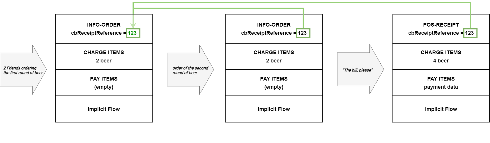
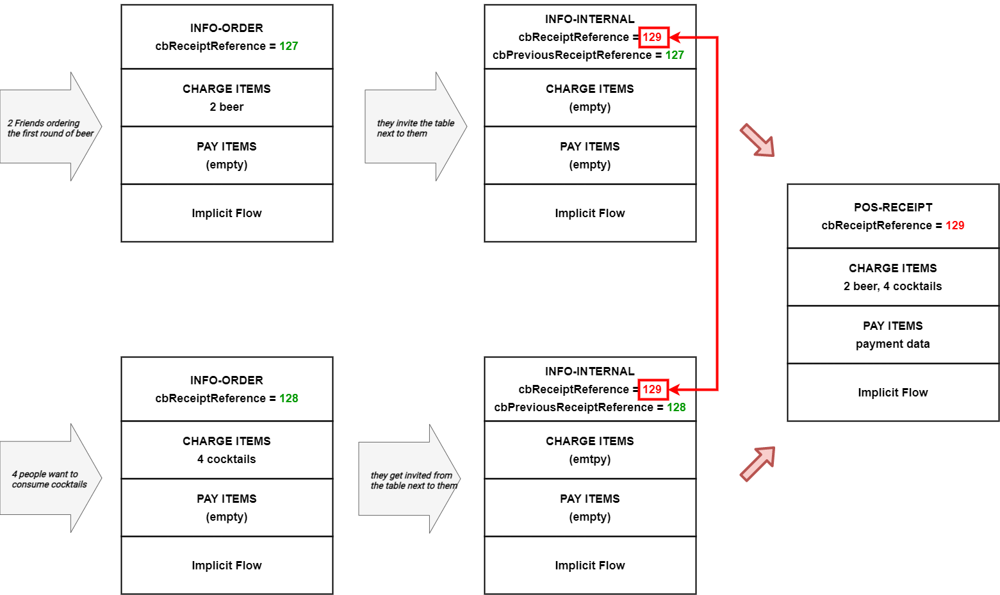
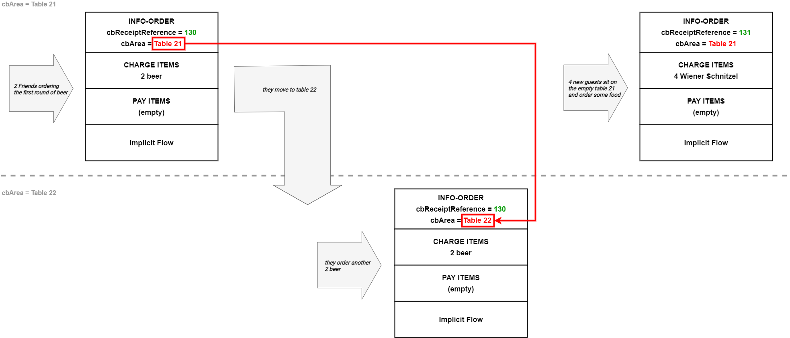
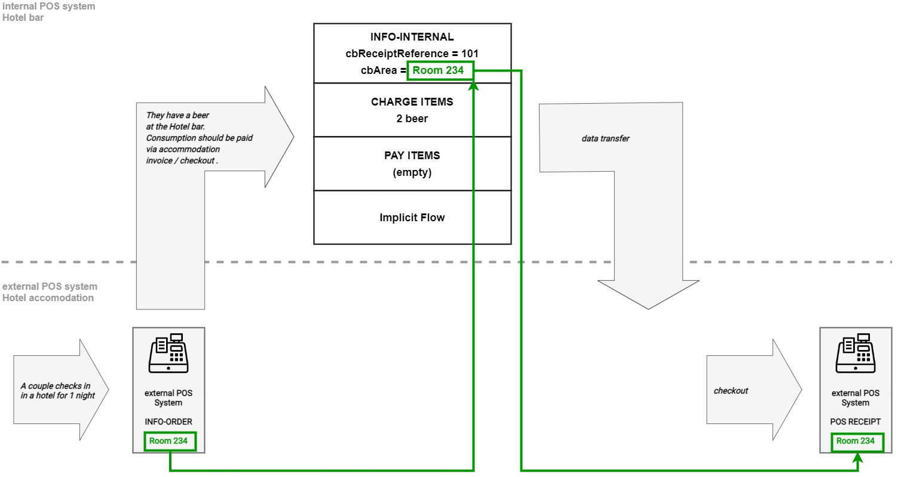
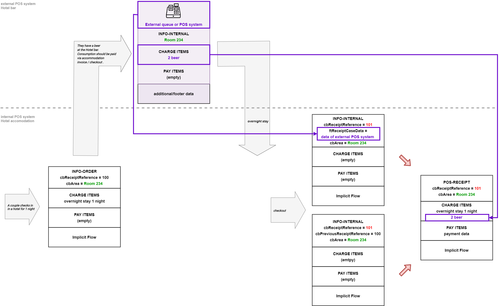
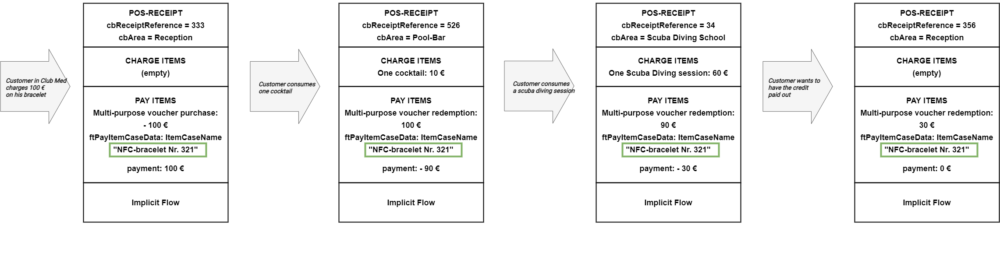

# Receipt sequences creation

In the chapter [Single receipt creation](single-receipt-creation.md), the creation of single receipts using either implicit and/or explicit flow has been described.

In this chapter, we will describe how to connect those single receipts to receipt sequences to integrate complex business cases.

## Referencing previous actions within a queue

#### Use case examples

- Multiple (long lasting) transactions/orders/consumptions before payment is made (gastronomy, ...)
- NFC-based/membership-based order solutions (e.g. accommodation/wellness, employee cards)
- Down payments

#### How to use

Connect requests representing a business action with ['cbReceiptReference'](https://docs.fiskaltrust.cloud/docs/poscreators/middleware-doc/germany/data-structures#single-fields).

#### Workflow example

Two friends are having a beer in a bar.  Because it is good German beer, they are ordering another one. They pay with one bill.

#### Code examples

Code examples of receipt sequences can be found in our [Postman collection](https://middleware-samples.docs.fiskaltrust.cloud/#e9b0b712-2dda-4c4c-a061-16d72daa723b).

## Splitting actions

#### Use case examples

- pos-receipt(s) paid by multiple people
- Voiding/cancelling receipts
- Correction of orders (f.e. gastronomy)

#### How to use

Use ['cbReceiptPreviousReference'](https://docs.fiskaltrust.cloud/docs/poscreators/middleware-doc/germany/data-structures#single-fields) to point to a 'cbReceiptReference' of a previous request to split or void a receipt.

#### Workflow example

Two friends are having a beer in a bar.  Each of them is paying his own consumption. Therefore, the receipt has to be split.

### Code examples

Code examples of splitting receipts can be found in our [Postman collection](https://middleware-samples.docs.fiskaltrust.cloud/#86967a8f-a1fe-4262-975e-c4a155209cb3).

## Merging actions

#### Use case examples

- invitation
- if you need to invoice more than one purchase receipt at a time/it can be paid all together

#### How to use

Merge receipts by combining ['cbReceiptReference' and 'cbReceiptPreviousReference'](https://docs.fiskaltrust.cloud/docs/poscreators/middleware-doc/germany/data-structures#single-fields). Use ftReceiptCase 'Info-internal' to create a new 'cbReceiptReference' and refer via 'cbPreviousReceiptReference' to the order you want to merge. Repeat this for each order you want to merge using the same 'cbReceiptReference' and using 'cbPreviousReceiptPreference' to point to the order to be merged.

#### Workflow example

Two friends are having a beer in a bar. One of them has birthday. To celebrate that, he invites the guests on the table next to them to pay what they have ordered and consumed so far. Therefore, their receipt has to be merged with the other receipt.

#### Code examples

Code examples of merging receipts can be found in our [Postman collection](https://middleware-samples.docs.fiskaltrust.cloud/#b81fedc6-919a-46e4-899a-52582606a6d7).

## Changing the area in which the receipt is created

#### Use case examples

Changing the area of value creation; e.g.

- Consumption in Restaurant-Hotel -> Restaurant-Wellness -> Bar-Sauna
- Moving between different tables within a Restaurant
- Providing information how business actions are connected to each other across multiple POS systems

#### How to use

Document the field/section in which the receipt is created with [cbArea](https://docs.fiskaltrust.cloud/docs/poscreators/middleware-doc/general/data-structures#receipt-request).

#### Workflow example

Two friends are having a beer in a bar on a big table. They change to a smaller table so that a bigger group of people can sit on their previous table to order some food.

## Referencing actions of external queues or external Systems

#### Use case examples

Multiple POS systems are involved in the business action and only one of them is used for invoice/receipt creation, e.g.:

- Restaurant/Bar using multiple queues; orders are done with one queue and payment with another queue
- Restaurant/Wellness/Hotel using different POS systems; one system is used for final invoice creation
- Membership cards/vouchers with multiple POS systems involved

### Option A: ChargeItems collected via "internal" queue are payed at an external system or queue

#### How to use

ChargeItems are collected via ftReceiptCase 'Info-internal' or 'Info-order'. 'cbArea' can be used as an identifier for documenting the business action across multiple POS systems. The obligation to issue receipts arises at the external POS system.

#### Workflow example

### Option B: ChargeItems collected at an external system or queue are payed at the internal queue

#### How to use

Use 'info-internal' with ['ftReceiptCaseData' according to the requirements of the DSFinV-K-specification](https://docs.fiskaltrust.cloud/docs/poscreators/middleware-doc/germany/dsfinv-k#file-bon_referenzen-referencescsv) to reference to an business-action recorded by an external queue or POS system which needs to be merged with your ongoing internal business-action. By creating a new 'cbReceiptReference', you create the precondition to merge the receipt the external system with your internal receipts of the ongoing business-action. Repeat this step to collect and reference to multiple external POS systems with related business-actions to be charged. The obligation to issue receipts arises at the POS system where the POS receipt is being created.

##### Prerequisites

For this workflow, the combination of following receipt-sequences is needed:

- Referencing previous receipts within a queue, using 'cbReceiptReference',
- Merging receipts, using 'cbReceiptreference' and 'cbPreviousReceiptReference',
- Providing additional information about how the business actions are connected to each other, using 'cbArea',
- Providing information about the external POS receipt, using 'ftReceiptCaseData'

#### Workflow example

 

1. A couple performs a check-in at the reception of a hotel for one night.
2. An info-order for the overnight-stay is created.
3. After the check-in, it decides to have a beer at the hotel-bar, which uses a different POS system (or fiskaltrust.queue). The consumption of the hotel-bar shall be paid with the final invoice of the overnight-stay. The room number is for 'cbArea' to provide information why the business actions across the different POS systems are connected. 
4. For the check-out, the receipt of the consumption of the hotel-bar and the receipt of the overnight stay need to be merged. Therefore, 'info-internal' receipts with a new, common 'cbReceiptReference' are created. One 'info-internal' receipt is used to reference to the external POS receipt using 'ftReceiptCaseData'. 
5. The other 'info-internal' receipt is used to reference to the internal 'info-order' of the overnight-stay using 'cbPreviousReceiptReference'. 
6. A 'POS receipt' is created, including all collected charge-items from external and internal POS system(s), and the pay-items of the internal POS system. The receipt is printed and handed over to the couple.

#### Code examples

Code examples of referencing external receipts can be found in our postman collection.

## Money substitutes based sequences (vouchers, membership cards,...)

### Issuing and redeeming multi-purpose vouchers/cards

#### Use case examples

- Consumption in Hospitality/Wellness/Spa with cards/bracelets
- Use of employee cards in cafeteria/canteen
- Multi-purpose vouchers

#### How to use

Issuing and redeeming a multi-purpose voucher can be achieved with charge- and payitems or within payitems only as shown in [following examples](https://middleware-samples.docs.fiskaltrust.cloud/#ef0d52d6-ac2f-4c75-b16c-d4d1380e3257) in the Postman collection. 

#### Workflow

In this example, we are using the payitem option for managing the multi-purpose voucher transactions. A negative amount of 'ftPayItemCase' `0x444500000000000D` gets converted to a multi-purpose voucher purchase. 'ftPayItemCaseData' is being used to add the additional information of the use of the "NFC-bracelet NR. 321". In this case, the bracelet can be used as identifier across multiple involved POS systems.

After charging the bracelet, the customer redeems the voucher in several cases. A positive amount of 'ftPayItemCase' `0x444500000000000D` gets converted to a multi-purpose voucher redemption. The negative amount of payment indicates the credit available after the redemption.

In the last business action, the customer wants to have his credit payed out. The positive amount of 'ftPayItemCase' `0x444500000000000D` is set to the actual credit value so that the payment amount is zero.

#### Code examples

- [Issuing](https://middleware-samples.docs.fiskaltrust.cloud/#db4f12c1-458e-4e23-903c-11366f90a1db) and [redeeming](https://middleware-samples.docs.fiskaltrust.cloud/#a3fdd7ee-ae43-424e-b3ee-d6d0a236bb72) multi-purpose voucher using pay-items

- [Issuing](https://middleware-samples.docs.fiskaltrust.cloud/#ef0d52d6-ac2f-4c75-b16c-d4d1380e3257) and [redeeming](https://middleware-samples.docs.fiskaltrust.cloud/#93929db4-1ba4-4634-92e4-a6f79cd3c5d9) multi-purpose voucher using charge- and pay-items
