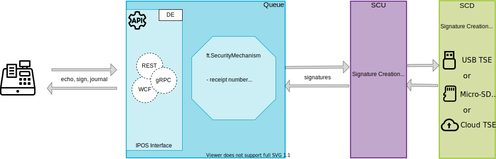

# On-premise installation

The illustration below shows the components available for the premise installation of the fiskaltrust.Middleware for the German market. For the operation modes available and the description of the components please refer to the [general part](../../general/operation-modes/operation-modes.md) .

## Supported software platforms

- [Windows](on-premise-platforms/windows.md)
- [Linux, macOs](on-premise-platforms/linux.md)
- [Android](on-premise-platforms/android.md)

## Communication services/platform support matrix

For the German market, depending on the platform, following communication services are available:

|          | Windows       | Linux, macOS  | Android       |
| -------- | ------------- | ------------- | ------------- |
| **gRPC** | **supported** | **supported** | **supported** |
| **REST** | **supported** | **supported** | **supported** |
| **WCF**  | **supported** | not supported | not supported |

## SCU/characteristics & platform support matrix

|                                                              | Type, Form factor | State of certification | Environmental protection    | Max. nr. of registered clients (queues) | Windows                                | Linux, macOS                                                 | Android                                |
| ------------------------------------------------------------ | ---------------------- | --------------------------- | --------------------------- | -------------------------------------- | ------------------------------------------------------------ | -------------------------------------- | -------------------------------------- |
| [A-Trust Cloud TSE](scu/a-trust.md) | Software | in certification       | unknown | unknown | not supported *available soon*    | not supported                                                | not supported                          |
| [Cryptovision Hardware-TSE](scu/cryptovision.md) | Hardware microSD | **certified**          | **not required**    | 128        | **supported**                          | **supported**                                                | not supported                          |
| [Deutsche Fiskal Cloud-TSE](scu/deutsche-fiskal.md) | Software  | **certified**          | required *currently exposed* | 1                 | **supported**                          | **supported** *Ubuntu LTS 20.04 only*                   | not supported                          |
| [Diebold-Nixdorf Hardware-TSE](scu/diebold-nixdorf.md) | Hardware USB Type A | **certified**          | **not required**    | unknown | **supported**                          | **supported**                                                | not supported                          |
| [Epson Hardware-TSE](scu/epson.md) | Hardware USB Type A, microSD | **certified** | **not required**        | 100 | **supported**                          | **supported**                                                | not supported                          |
| [fiskaly Cloud-TSE](scu/epson.md) | Software | in certification       | unknown | technically unlimited | **supported**                    | **supported**                                          | **supported** |
| [Swissbit Cloud-TSE](scu/swissbit-cloud.md) | Software | **certified** | required *currently exposed* | 1 | **supported** | **supported** *Ubuntu LTS 20.04 only* | not supported |
| [Swissbit Hardware-TSE](scu/swissbit.md) | Hardware USB Type A, SD, microSD | **certified** | **not required** | 100 | **supported**                          | **supported**                                                | **supported**                          |

## Hardware requirements

For hardware requirements, please refer to the [general part](../../general/operation-modes/operation-modes.md).

## Local data storage/platform support matrix

Following local data storage options can be configured in the queue:

|                                                            | Windows       | Linux, macOS  | Android       |
| ---------------------------------------------------------- | ------------- | ------------- | ------------- |
| **[EF-storage](on-premise-databases/entity-framework.md)** | **supported** | **supported** | not supported |
| **In-memory storage**                                      |               |               |               |
| **[MySQL-storage](on-premise-databases/mysql.md)**         | **supported** | **supported** | **supported** |
| **[SQLite-storage](on-premise-databases/sqlite.md)**       | **supported** | **supported** | **supported** |

## Local data export

-  TAR-File-Export 
-  [DSFinV-K export](../procedural-documentation/dsfinv-k-generation.md) 
-  DFKA-Taxonomie-Export 

## Configuration Scenarios

For configuration scenarios for operating the fiskaltrust.Middleware, please refer to the [Rollout documentation](https://docs.fiskaltrust.cloud/docs/posdealers/rollout-doc/middleware).

## Installation

For the on- and off-premise installation of the fiskaltrust.Middleware please refer to the [installation chapter in the general part](../../general/installation/installation.md).

