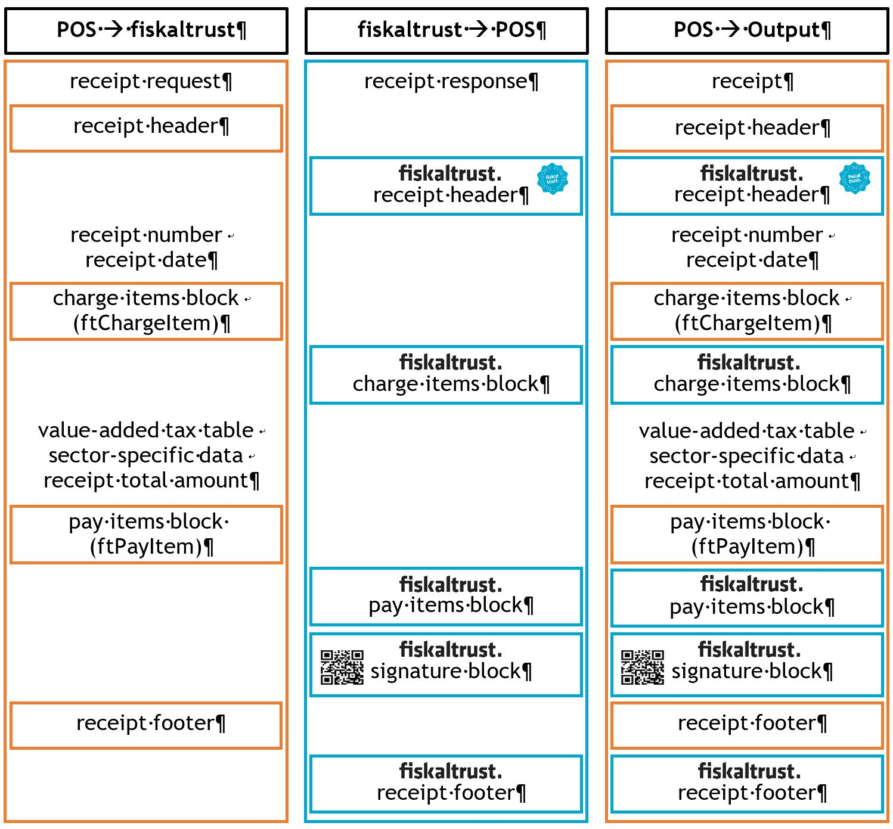

# Appendix: FR - BOI-TVA-DECL 30-10-30
This appendix expands on the information provided in the [General Part](../general/general.md) by adding details specific to the French market. This additional information is provided only where applicable. The remaining chapters, for which there is no additional information required, were omitted. The link to the relevant paragraph in the French law regarding the secured cash desk software: [http://bofip.impots.gouv.fr/bofip/10693-PGP?branch=2](http://bofip.impots.gouv.fr/bofip/10693-PGP?branch=2)

## Version History
Please refer to the [General Part](../general/general.md)

## Terminology
This table expands on the descriptions of all general terms and abbreviations provided in Table 2 of the General Part with information specific to the French market.

| Term             | Description |
|----------------- |------------ | 
|fiskaltrust.Queue | Guarantees independent control of the cumulative counters and totals of periods: shift, daily, monthly, yearly and perpetual. These compo-nents become an integral part of all processed receipts.
| DGFiP            | General Directorate of Public Finance of the French government. (Di-rection générale des Finances publiques)
| JCD              | Journal which holds all technical information sent by a cash register. (Journal de capture de données)
| BOFIP            | Official tax bulletin of French tax authorities. (Bulletin Officiel des Finances Publiques-Impôts)
| CGI              | General Tax Code (Code général des impôts) |

[Table 0.] Defintion of Terms and Abbreviations (FR – BOI-TVA-DECL 30-10-30)

## Cash Register Integration
This chapter describes the cash register integration in accordance with the French law. The general rules for cash register integration are described the [General Part](../general/general.md).

### Receipt creation process
#### The fiskaltrust.SecurityMechanism
The regular workflow of the fiskaltrust.SecurityMechanism in the French market defines the steps required for creation of a receipt as follows:
- get the data from the POS-System
- determine the receipt type
- assign a sequential number depending on the type
- increase the daily and perpetual sales counter
- create a signature for the receipt
- chain the receipt in the general and the journal of the receipt type
- create machine readable code
- create additional receipt data
- save all the send and generated data
- return the whole data to the POS system

### Receipt for special functions
This section expands on the descriptions from *Receipts for special functions* in the [General Part](../general/general.md) and describes the receipt types used for special functions on the French market.

In accordance with the Official Bulletin BOI-CF-COM-10-80-20160803 from August 3, 2016 and paragraph 3 bis of Article 286 of the French Tax Code, the proof of payment of a non-taxable person to a taxable person for a sale or service must be signed electronically and chained to ensure unalterability. There are additional requirements specified by law, which can be fulfilled by creating the following special receipts.

#### Zero Receipt
#### Start Receipt (Initial Receipt)
##### Stop Receipt (Closing Receipt)
##### End of Failure Receipt (Collective Failure Report)
#### Daily Receipt
Before the start of a new day, previous results of the cumulative sales counter (daily counter) have to be recorded. A cash register can request this daily receipt from a fiskaltrust.SecurityMechanism for this purpose.

A daily closing exports counters and summary data that are recorded for the period of the current day. When a daily closing is executed, the sums of the day are added to the totals of the month and all amounts for the day are then reset back to zero. The totals and the summary data of the day are written into the journal.

#### Monthly Receipt
Before the beginning of a new monthly period, previous results of the cumulative sales counter (monthly counter) have to be recorded. A cash register can request this monthly receipt from a fiskaltrust.SecurityMechanism for this purpose.

A monthly closing exports counters and summary data that are recorded for the period of the last month. When a monthly closing is executed, the sums of the month are add-ed to the year’s totals and the amounts for the month are then reset back to zero. A monthly closing includes a daily closing. That means that a daily closing will be executed first, and the monthly closing follows. The totals and the summary data of the month are written into the journal.

#### Annual Receipt
Before the beginning of a new year, the previous results of the cumulative sales counter (yearly counter) have to be recorded. A cash register can request this yearly receipt from a fiskaltrust.SecurityMechanism for this purpose.

A yearly closing exports the counters and summary data that are recorded for the period of the last year. When a yearly closing is executed, the totals of the year are written into the Journal. A yearly closing includes a daily and a monthly closing. That means first a daily, then a monthly closing and finally the yearly closing will be executed. The totals and the summary data of the year are written into the journal.

#### Shift Receipt
Before the beginning of a new customized period (i.e. when the financial year is differ-ent from the calendar year), the preliminary result of the cumulative sales counter (shift counter) has to be recorded. A cash register can request this shift receipt from a fiskaltrust.SecurityMechanism for this purpose. 

A shift closing exports the counters and the summary data recorded for the last custom period. When a shift closing is executed, the totals of the shift are written into the Journal.

#### Archive Receipt
Archive receipts are the official requests to initiate the archiving procedure sent by the POS-System. This receipt will be enqueued and uploaded to the fiskaltrust.Portal which will proceed to process the archiving procedure. The results will be shown and the content will be available for download on a dedicated page (Tools -> Exports).

The procedure archives the requested period. An archive can contain a maximum of 12 months from the start of the Queue or from the date of the last archive, up to the re-ceipt's date. If the period for archiving is longer than 12 months, multiple archive re-ceipts have to be send with the start date of each consecutive receipt beginning right after the end date of the previous one.

### Receipt structure
This chapter describes the receipt structure applicable ot the French market.

[Illustration 0.] Receipt Structure (FR)

#### Receipt Header
#### Charge Items Block
#### Pay Items Block
#### Signature Block
A signature block is generated if a cryptographic signature is required. A JSON Web Token (JWT) is used for this process and its structure contains three parts: header, payload and signature. This process signs all information provided in the header and in the payload. The type of hashing algorithm and encryption of the JSON-object are defined in the header, and their content is “ES256”. The payload is a serialized receipt information which additionally contains the hash value of the previous receipt. Payload-fields identify the company which emits the receipt and the receipt itself, and contain all con-tent of the receipt. In order to create a chain, the signature of the previous receipt produced by JWT has to be incorporated in the end of the next one. Both header and payload are processed as Base64URL strings and are signed with the private key of the Queue using SHA-256 with ECDSA.

#### Receipt Footer
The receipt footer contains further information regarding the issuing company. The footer provided by the cash register can for example contain the SIRET and/or VAT number of the issuning enterprise.

There is no legal requirement for the content of the footer, but if the fiskaltrust.Service sends any additional information for this section, it has to be printed/stored by the cash register.

### Data Collection Log
The Data Collection Log consists of a localised set of information stored using JWT algorithm. The content of the payload is a set of the meaningful information related to the type of receipt.

#### Receipt Journal
Receipt journals are JSON exports of internal structured data related to receipts handled by the service. For each receipt type a journal is created and maintained.

#### Action Journal
Action journals are JSON exports of internal structured data related to special actions traced by the service. There are journals related to different actions, e.g: a journal for the periodical counters, a journal for archiving, or a journal for a technical action log.

## Data Structures
This chapter expands on the descriptions of the data structures covered in *Data structure* of the [General Part](../general/general.md), with country specific information applicable to the French market.

### Receipt Request
There are no special requirements or laws for the French market.

### Receipt Response
This table describes additional fields of the Receipt Response applicable to the French market.

| Field name | Data type | Default Value | Mandatory Field | Description | Version |
|----------- |---------- |-------------- |---------------- |------------ | --------|
| ftCashBoxIdentification | string | | mandatory | Cash register identification | 0- |
| ftReceiptIdentification | string | | mandatory | Allocated through fiskaltrust.SecurityMechanism upcounting receipt number depending on the receipt type. | 0-|

[Table 0.] Receipt Response

### Charge Items Entry
Charge Items entriy is defined accordingly to the French law. This entry determines which counter will be used to sum up the value of the sales tax field (normal, discount-ed-1, discounted-2, zero or special) for the individual services. It is required for signature creation. This table describes additional fields of the Charge Items Entry applicable to the French market.

| Field name | Data type | Default Value | Mandatory Field | Description | Version |
|----------- |---------- |-------------- |---------------- |------------ | --------|
| Description | string | empty-string | mandatory | Name or description of customary indication or type of other service. | 0- |

[Table 0.] Charge Items Entry (ftChargeItems)

### Pay Items Entry
There are no special requirements or laws for the French market.

### Signature Entry
A Signature Entry can include an electronic signature for printing on the receipt but also some further information regarding the operational state of the fiskaltrust.SecurityMechanism.

Furthermore, but only in the case when receipts with special functions are used, the previous state of the totalizers (in case of a temporal closure), can also be sent back in this block. This table describes additional fields of the Signature Entry applicable to the French market.

| Field name | Data type | Default Value | Mandatory Field | Description | Version |
|----------- |---------- |-------------- |---------------- |------------ | --------|
| ftSignatureFormat | Int64 | 0 | mandatory | Format for displaying signature data according to the [reference table](#app_fr_reference_tables). | 0- |
| ftSignatureType | Int64 | 0 |mandatory | Type of signature according to the reference table in the appendix, for example signature according to the RKSV or FinanzOnline notification. | 0- |

[Table 0.] Signature Entry

## Function Structures
### iPOS Interface
#### Echo Function
There are no special requirements or laws for the French market.

#### Sign Function
If fiskaltrust.SecurityMechanism is run in FR (0x4652…) mode, then the sign function meets the BOI-TVA-DECL 30-10-30 requirements.

#### Journal Function
With this function, a variety of information can be retrieved from a fiskaltrust.SecurityMechanism. 
C# call iPos Journal:

<pre>Stream stream = proxy.Journal(ftJournalType, 0, DateTime.UtcNow.Ticks);</pre>
[Code 0.] Call of iPos Journal (FR – BOI-TVA-DECL 30-10-30)

A list with various possibilities for the request parameter ftJournalType is included in the [reference table](#app_fr_reference_tables).

## Communication
### WCF Web Service
### REST Service
A fiskaltrust.Service which directly implements the REST communication protocol is a product called fiskaltrust.ChaîneCloud. Communication with this service is implemented via the URL https://signaturcloud.fiskaltrust.fr/ followed by xml/ or json/ depending on the content serialisation type, and then followed by the method name in lowercase let-ters (echo, sign, journal).

Depending on the serialisation type, the content-type will be “<code>application/json;charset=utf-8</code>” (for JSON) and “<code>application/xml;charset=utf-8</code>” (for XML). The method is POST and the headers must contain the "cashboxid" and the "accesstoken" with the corresponding value related to the configured cashbox on the fiskaltrust.Portal.

“Echo” call will contain the serialised message in the request content. The “sign” call will contain the serialised ReceiptRequest class in the request content. The “journal” call will have the following url query for posting the values “<code>?type={1}&from={2}&to={3}</code>” where type is the journal type and the other two values are limits of the timestamp values for extracting the data.

#### REST Helper
The REST helper implements the same REST interface as the REST service. Additionally, it includes the balancing feature of a Balancer Helper. The URL used to reach the REST Helper can be set in the fiskaltrust.Portal on the configuration page of the REST helper.

In addition to the two values for the balancing parameter, there is another value called “deactivated” which bypasses the balancing feature (only if there is one fiskaltrust.Service configured inside the cashbox, if there is more than one, this option will be ignored and used the “least active”). This new option will let the REST helper behave exactly like the REST Service for the journal calls.

### Stream for Serial Interface over TCP

## Operation Modes
### Components of fiskaltrust.Service
#### Launcher
#### Queue Nutshell
### Configuration of the fiskaltrust.Service
#### Online Portal
All configuration settings, as well as relevant extensions are managed via fiskaltrust.Portal, which for Austrian market is available at:
https://portal.fiskaltrust.fr. 

#### Queue
#### Journal

## Installation
## Receipt Case Definitions

### Voucher (Service/Product)
An issuance of a voucher is a process with the requirement of Article 88 of the law n ° 2015-1785 of December 29, 2015 of finances for 2016 and determines the time of sale. 

#### Voucher (Value)
A voucher with a certain value constitutes a means of payment and its issuance is thus a process without a requirement of Article 88 of the law n ° 2015-1785 from December 29, 2015 of finances for 2016. Once a business transaction is made and is paid for by redeeming a voucher, it constitutes a process with the mentioned requirement - thus, (value) voucher can usually be found in the pay items block. If however, it is for tech-nical reasons necessary to enter a (value) voucher obligations in the pay items block, then respective obligations should be transferred as ftChargeItemCase. 

#### Agency Business
An agency business can be displayed with the ftChargeItemCase (<code>0x4652000000000007</code>). 

#### Delivery Note
#### Tips

## Reference Tables

### Type of Receipt: ftReceiptCase
The ftReceiptCase defines the type of receipt and hence how fiskaltrust.SecurityMechanisms should process receipts according to the French law.
For France (FR) the country code is <code>0x4652</code>. Thus, the value for an unknown ftRe-ceiptCase in France is <code>0x4652000000000000</code>.

| Value              | Description             | Service-Version |
|------------------- |------------------------ | ----------------|
| 0x4652000000000000 | Unknown receipt for FR Processed like a ticket | 1.2 |
| 0x4652000000000001 | Ticket Legal document; has to be signed. Sign: Yes Chain and national numbering: T Details: GT counters are raised | 1.2 |
| 0x4652000000000002 | Payment Prove Payment without knowledge what was paid. Legal document; has to be signed.  Sign: Yes Chain and national numbering: P No ChargeItems on payment-prove, the total amount is always zero, a negative payitem of type 0x4652000000000011 is used to get the sum of payitems to zero. Details: GT counters are not raised | 1.2 |
| 0x4652000000000003 | Invoice Legal document; has to be signed. Sign: Yes Chain and national numbering: I A reference to the ticket can be created by using the cbPreviousReceiptNumber in the request. Detail: GT counters are raised | 1.2 |
| 0x4652000000000004 |Shift Receipt / Grand Total Ticket / Grand Total Invoice: Shift Sign: Yes Chain and national numbering: G Details: Resets shift counter, keeps all other counters | 1.2 |
| 0x4652000000000005 | Daily Receipt / Grand Total Ticket / Grand Total Invoice: Daily Sign: Yes Chain and national numbering: G Details:<ul><li>Adds daily counter to month-counter an then resets daily counter</li><li>keeps shift counter</li></ul> | 1.2 ||
| 0x4652000000000006 | Monthly Receipt / Grand Total Ticket / Grand Total Invoice: Month Sign: Yes Chain and national numbering: G Details:<ul><li>Adds daily counter to month-counter an then resets daily counter</li><li>Adds monthly counter to yearly counter and then resets monthly counter</li><li>keeps shift counter</li></ul> | 1.2 |
| 0x4652000000000007 | Yearly Receipt / Grand Total Ticket  / Grand Total Invoice: Year Sign: Yes Chain and national numbering: G Details:<ul><li>Adds daily counter to month-counter an then resets daily counter</li><li>Adds monthly counter to yearly counter and then resets monthly counter</li><li>Resets yearly counter</li><li>keeps shift counter</li></ul> | 1.2 |
| 0x4652000000000008 | Bill List of ChargeItems to be payed. Used to inform customers about their open ChargeItems. payitemtype 4652000000000011 is used Sign: Yes Chain and national numbering: B Details: GT counters are not raised. If bill and payment prove are created, this does not replace a ticket creation. A ticket or an invoice have to be issued to raise turnover and raise the GT counters as well ReceiptIdentification e.g. fta12b#B02 | 1.2 |
| 0x4652000000000009 | Delivery Note Sign: no Chain and national numbering: no | 1.2 |
| 0x465200000000000A | Cash Deposit Same handling as payment prove Chain and national numbering: P | 1.2 |
| 0x465200000000000B | Pay out Same handling as payment prove Chain and national numbering: P | 1.2 |
| 0x465200000000000C | Payment transfer Switch between Payment method, e.g. from cash to credit card Sign: Yes Chain and national numbering: P | 1.2 |
| 0x465200000000000D | Internal / Material Sign: No Chain and national numbering: no | 1.2 |
| 0x465200000000000E | Foreign sales Same handling as bill ??? Sign: Yes Chain und national numbering: B | 1.2 |
| 0x465200000000000F | Zero-Receipt Sign: Yes Chain and national numbering: G Details: A receipt with empty charge items block (ftChargeItem) and empty payment block (ftPayItem) which amounts to a total of „0“. | 1.2 |
| 0x4652000000000010 | Start-Receipt Sign: Yes Chain and national numbering: G | 1.2 |
| 0x4652000000000011 | Stop-Receipt Sign: Yes Chain and national numbering: G | 1.2 |
| 0x4652000000000012 | Protocol / Technical Event Log Has to be signed Sign: Yes Chain and national numbering: L ReceiptIdentification e.g. fta12b#L03 Details Can be used by the POS system to log custom data. | 1.2 |
| 0x4652000000000013 | Protocol / Accounting / Audit | Has to be signed Sign: Yes Chain and national numbering: L ReceiptIdentification e.g. fta12b#L02 Details: Can be used by the POS system to log custom data. | 1.2 |
| 0x4652000000000014 |Protocol / Custom Does not need to be signed Sign: No Chain and national numbering: No ReceiptIdentification e.g. fta12b# Details: Can be used by the POS system to log custom data. | 1.2 |
| 0x4652000000000015 | Archive Has to be Signed Sign: Yes Chain and national numbering: A Details: Will trigger automatically a daily closing. | 1.2 |
| 0x4652000000000016 | Copy Has to be Signed Sign: Yes Chain and national numbering: C Details: In a request the cbPrevi-ousReceiptReference is mandatory. It contains the receiptnumber of the cash register which was handed out as a copy. | | 1.2 |

[Table 0.] Type of Receipt: ftReceiptCase (FR – BOI-TVA-DECL 30-10-30)

#### ftReceiptCaseFlag
Diverse business transactions according to the French law and regulations can result in certain combinations of types of receipts. For this, bytes 6, 5, 4 and 3 are used as com-binable codes. These codes can be added with the help of the logic operator „OR“.

| Value              | Description             | Service-Version |
|------------------- |------------------------ | ----------------|
| 0x0000000000010000 | „out of service“ The transferred receipt contains data which has been cre-ated during an outage of the connection between the POS System and the fiskaltrust.Service. The original receipts are avaiable in handwritten or digital format and are now transferred and subsequently consolidated and signed via zero receipt. This can be necessary for example after a power or server outage. | 1.2 |
| 0x0000000000020000 | „training receipt“ All requests issued with this flag are chained and signed in a separate chain. For national numbering “X” is used. GT counters are not raised. | 1.2 |
| 0x0000000000040000 | „reverse receipt“ or “voided receipt”  Common behaviour | 1.2 | 
| 0x0000800000000000 | “receipt request” Common behaviour | 1.2 |

[Table 0.] Type of Receipt: ftReceiptCase Flags (FR – BOI-TVA-DECL 30-10-30)

### Type of Service: ftChargeItemCase
The ftChargeItemCase defines the type of service in charge item blocks and thus how fiskaltrust.SecurityMechanism processes individual receipts with regards to receipt gen-eration and the accordance to the French law. 
For France (FR) the country code is 0x4652. Thus, the value for an unknown ftChargeI-temCase in France is 0x4652000000000000.

| Value             | Description             | Service-Version |
------------------- |------------------------ | ----------------|
| 0x4652000000000000 | „unknown type of service for FR“ With help of the VAT-rates table saved within fiskaltrust.SecurityMechanisms, an allocation to standard /reduced-1 /reduced-2 / super-reduced/zero is attempted. | 1.2 |
| 0x4652000000000001 | „undefined type of service for FR reduced-1“ (as of 1.1.2017, this is calculated with 5,5%). | 1.2 |
| 0x4652000000000002 | „undefined type of service for FR reduced-2“ (as of 1.1.2016, this is calculated with 10% Loi n° 2015-1786 du 29 décembre 2015, art. 79). | 1.2 |
| 0x4652000000000003 | „undefined type of service for FR normal“ (as of 1.1.2014, this is 20%, Loi n° 2012-1510 du 29 décembre 2012, art. 68-III-B). | 1.2 |
| 0x4652000000000004 | „undefined type of service for FR special“ (super-reduced) Includes all rates hat are not contained in the previous ones (as of 1.1.2017, this can be for example 2,1%). | 1.2 |
0x4652000000000005 | „undefined type of service for FR zero“ Includes data which are indicated with 0% sales tax and also data where the sales tax is unknown, for example in a ref-erence to an outgoing invoice. Also in cases where the sales tax should not be apparent, for example in the case of dif-ferential taxation, the data can be issued with this code. | 1.2 |
| 0x4652000000000006 | „reverse charge“ Reversal of tax liability. | 1.2 |
| 0x4652000000000007 | „not own sales“ In the data, a VAT-rate can be indicated. | 1.2 |
| 0x4652000000000008 | „delivery reduced-1“ For processing, see (0x4652000000000001) | 1.2 |
| 0x4652000000000009 | „delivery reduced-2“ For processing, see (0x4652000000000002) | 1.2 |
| 0x465200000000000A | „delivery normal“ For processing, see (0x4652000000000003) | 1.2 |
| 0x465200000000000B | „delivery special“ For processing, see (0x4652000000000004) | 1.2 |
| 0x465200000000000C | „delivery zero“ For processing, see (0x4652000000000005) | 1.2 |
| 0x465200000000000D | „other services reduced-1“ For processing, see (0x4652000000000001) | 1.2 |
| 0x465200000000000E | „other services reduced-2“ For processing, see (0x4652000000000002) | 1.2 |
| 0x465200000000000F | „other services normal“ For processing, see (0x4652000000000003) | 1.2 |
| 0x4652000000000010 | „other services special“ For processing, see (0x4652000000000004) | 1.2 |
| 0x4652000000000011 | „other services zero“ For processing, see (0x4652000000000005) | 1.2 |
| 0x4652000000000012 | „catalogue services reduced-1“ For processing, see (0x4652000000000001) | 1.2 |
| 0x4652000000000013 | „catalogue services reduced-2“ For processing, see (0x4652000000000002) | 1.2 |
| 0x4652000000000014 | „catalogue services normal“ For processing, see (0x4652000000000003) | 1.2 |
| 0x4652000000000015 | „catalogue services special“ For processing, see (0x4652000000000004) | 1.2 |
| 0x4652000000000016 | „catalogue services zero“ For processing, see (0x4652000000000005) | 1.2 |
| 0x4652000000000017 | „own consumption reduced-1“ For processing, see (0x4652000000000001) | 1.2 |
| 0x4652000000000018 | „own consumption reduced-2“ For processing, see (0x4652000000000002) | 1.2 |
| 0x4652000000000019 | „own consumption normal“ For processing, see (0x4652000000000003) | 1.2 |
| 0x465200000000001A | „own consumption special“ For processing, see (0x4652000000000004) | 1.2 |
| 0x465200000000001B | „own consumption zero“ For processing, see (0x4652000000000005) | 1.2 |
| 0x465200000000001C | „prepayment reduced-1“ For processing, see (0x4652000000000001) | 1.2 |
| 0x465200000000001D | „prepayment reduced-2“ For processing, see (0x4652000000000002) | 1.2 |
| 0x465200000000001E | „prepayment normal“ For processing, see (0x4652000000000003) | 1.2 |
| 0x465200000000001F | „prepayment special“ For processing, see (0x4652000000000004) | 1.2 |
| 0x4652000000000020 | „prepayment zero“ For processing, see (0x4652000000000005) | 1.2 |
| 0x4652000000000021 | „account of a third party/ third party name/ collection“ For processing, see (0x4652000000000007) | 1.2 |
| 0x4652000000000022 | Obligation ??? | 1.2 |

[Table 0.]Type of Service: ftChargeItemCase (FR – BOI-TVA-DECL 30-10-30)

In the following there are further guidelines for using ftChargeItemCase.

### Type of Payment: ftPayItemCase
The ftPayItemCase defines the type of payment within the pay items block and thus how the fiskaltrust.SecurityMechanism processes the individual payment in terms of the receipt.

| Value              | Description             | Service-Version |
|------------------- |------------------------ | ----------------|
| 0x4652000000000000 | „default value“ unknown payment type: automatic processing through the fiskaltrust.SecurityMechanisms settings is attempted.  | 1.2 |
| 0x4652000000000000 | „unknown payment type for FR“ This is handled like a cash payment in national currency. | 1.2 |
| 0x4652000000000001 | „cash payment in national currency“ cash | 1.2 |
| 0x4652000000000002 | „cash payment in foreign currency“ cash | 1.2 |
| 0x4652000000000003 | „crossed cheque“ cash | 1.2 |
| 0x4652000000000004 | „debit card payment“ noncash | 1.2 |
| 0x4652000000000005 | „credit card payment“ cash | 1.2 |
| 0x4652000000000006 | „voucher payment (coupon)“ voucher by money value cash | 1.2 |
| 0x4652000000000007 | „online payment“ noncash | 1.2 |
| 0x4652000000000008 | „customer card payment“ noncash | 1.2 |
| 0x4652000000000009 | „other debit card“ noncash | 1.2 |
| 0x465200000000000A | „other credit card“ cash | 1.2 |
| 0x465200000000000B | „account receivable“ delivery note/ settlement in foreign currency internal | 1.2 |
| 0x465200000000000C | „SEPA transfer“ noncash | 1.2 |
| 0x465200000000000D | „other transfer“ noncash | 1.2 |
| 0x465200000000000E | „cash book expense“ internal | 1.2 |
| 0x465200000000000F | „cash book contribution“ internal | 1.2 |
| 0x4652000000000010 | „levy“ ?? internal | 1.2 |
| 0x4652000000000011 | „internal/ material consumption“ Can be used for bill
internal | 1.2 |
| 0x4652000000000012 | „change“ tip cash | 1.2 |

[Table 0.] Type of Payment: ftPayItemCase (FR - BOI-TVA-DECL 30-10-30)

### Type of Signature: ftSignatureType
The ftSignatureType indicates type and origin of the signature.

|              Value | Description             | Version         |
|------------------- |------------------------ | ----------------|
| 0x4652000000000000 | unknown FR              | 1.2             |
| 0x4652000000000001 | JWT                     | 1.2             |
| 0x4652000000000002 | Shift Closing Sum       | 1.2             |
| 0x4652000000000003 | Day Closing Sum         | 1.2             |
| 0x4652000000000004 | Month Closing Sum       | 1.2             |
| 0x4652000000000005 | Year Closing Sum        | 1.2             |
| 0x4652000000000006 | Archive Totals Sum      | 1.2             |
| 0x465200000000000X | TBD in future by certification |          | 

[Table 0.] Type of Signature: ftSignatureType (FR - BOI-TVA-DECL 30-10-30)

### Type of Journal: ftJournalType
The ftJournalType is used in connection with the journal function and defines the journal stream in accordance to the French law which is given back. In In the ftJournalType, the ISO-3166-1-ALPHA-2 from ASCII value is converted into hex and used as byte 8 and 7. For France (FR) this is <code>0x4652</code>.

|              Value | Description                      | Version |
|------------------- |--------------------------------- | --------|
| 0x4652000000000000 | Status information for QueueFR   | 1.2     |
| 0x4652000000000001 | Ticket (“T” group) export        | 1.2     |
| 0x4652000000000002 | Payment Prove (“P” group) export | 1.2     |
| 0x4652000000000003 | Invoice (“I” group) export       | 1.2     |
| 0x4652000000000004 | Grand Total (“G” group) export   | 1.2     |
| 0x4652000000000007 | Bill (“B” group) export          | 1.2     |
| 0x4652000000000008 | Archive (“A” group) export       | 1.2     |
| 0x4652000000000009 | Log (“L” group) export           | 1.2     |
| 0x465200000000000A | Copy (“C” group) export          | 1.2     |
| 0x465200000000000B | Training (“X” group) export      | 1.2     |

[Table 0.] Type of Journal: ftJournalType (FR - BOI-TVA-DECL 30-10-30)
