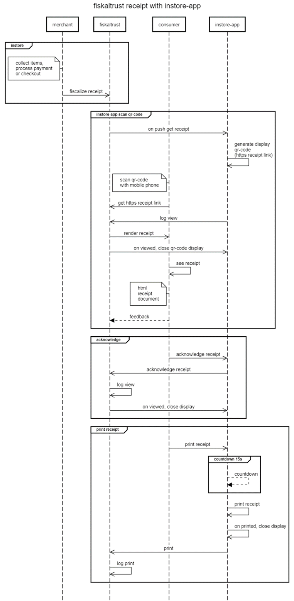

# Receive receipts 

There are various ways receipts are provided and transported towards the consumer. When a merchant uses digital receipts, it is important to teach the staff on how to use the system and to provide information on the availability of the different methods used. Not all available methods should be implemented, only the most efficient way related to the business should be used. 

## With customer facing display/device 

This sequence diagram describes the process of generating a digital receipt with a customer display, handheld or self-checkout device using the fiskaltrust digital receipt solution. The participants in the process are the merchant, fiskaltrust and the consumer. 

In store, the merchant collects the items and processes the checkout. Then the merchant sends a sign message to fiskaltrust for fiscalization purposes. The merchant then shows a QR-Code on a customer-facing display/device, which can be scanned by the consumer using their mobile phone. 

The consumer accesses the receipt by scanning the QR-Code displayed on the customer-facing display/device with their mobile phone. The consumer requests the receipt from fiskaltrust and receives an HTML document as the receipt. The consumer can then provide feedback regarding the receipt. 

Overall, this diagram illustrates the process of generating a digital receipt with customer display, handheld or self-checkout devices, where the receipt is accessed by the consumer through a QR-Code displayed on the customer-facing display/device. 

## With Give-Away (QR-Label)

This sequence diagram describes the process of generating a digital receipt with Give-Away (QR-Labels) using the fiskaltrust digital receipt solution. The participants in the process are the merchant, fiskaltrust and the consumer. 

In store, the cashier can flexibly scan the QR-Code label on the Give-Away during the production process or during the payment process and thus establish the connection to the receipt created. Then the merchant sends a sign message to fiskaltrust for fiscalization purposes. The merchant then hands over the Give-Away or the item with the QR-Label to the consumer.

The consumer accesses the receipt by scanning the QR-Label on the Give-Away with their mobile phone. The consumer requests the receipt from fiskaltrust and receives an HTML document as the receipt. The consumer can then provide feedback regarding the receipt. 

From the fiskaltrust.Portal, prefabricated adhesive labels can be purchased to be resold, which then serve as carriers of a QR-Code for the digital receipt. There are no delays due to the interaction of the cash register or the operating staff with the consumer, because the consumer only receives a QR-Label on a Give-Away and can retrieve the digital receipt later, regardless of time and location.

The merchants PosDealer can participate by means of placing orders and intermediary in support and billing for each transaction of the POS operator. This applies to every single receipt issued, as the giveaway is issued regardless of how it is viewed and used by the consumer. Since the cost of a QR-Code label for the digital receipt is less than one third of an 80/80/12 thermal roll at an average length of 20cm per receipt, the margin to be achieved for the PosDealer is higher than for thermal paper (if the PosDealer does not want to contribute an additional investment for giveaways in consumer satisfaction).

## With InStore App

This sequence diagram describes the process of generating a digital receipt with the InStore App. The participants in the process are the merchant, fiskaltrust, consumer and the InStore App. 

The InStore App offers three options: scan QR-Code to receive digital receipt on mobile phone, accept button to manually acknowledge received receipt and print receipt on thermal paper.

In store, the merchant collects items and processes the payment or checkout. Then the merchant sends a sign message to fiskaltrust for fiscalization purposes. 

**Scan QR-Code:** The InStore App constantly listening to the fiskaltrust receipt backend, if there is an receipt push command. Once the InStore App received an https receipt link, the QR-Code gets visualized on the InStore App device. The consumer scans the QR-Code with his mobile phone. He receives the https receipt link, the InStore App sends an log that the receipt got scanned by consumer. The fiskaltrust backend renders the receipt, the QR-Code display on the InStore App device closes. The consumer can now accesses the HTML receipt document. The consumer can then provide feedback regarding the receipt. 

**Acknowledge:** The consumer manually accepts the he received the receipt, by pressing the accept button on the InStore App. The InStore App send to fiskaltrust backend and log, that the receipt got acknowledged manually. The InStore App gets a response from fiskaltrust, to close the display. 

**Print receipt:** Consumers can manually initiate paper receipt printing on the InStore App device by clicking the print button. Additionally, in the absence of user interaction, a paper receipt will be automatically printed after a default countdown of 15 seconds. Once the receipt is printed, the display will close and the print command will be logged.
