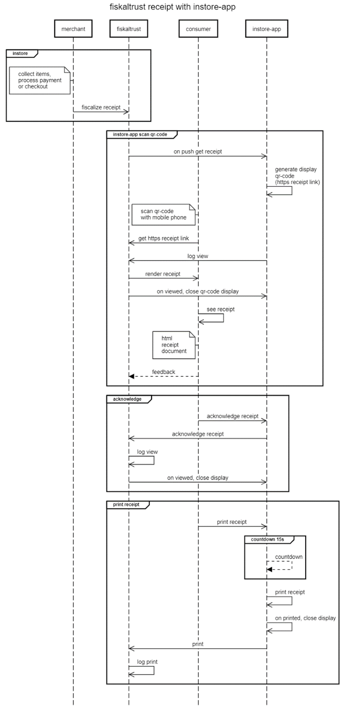
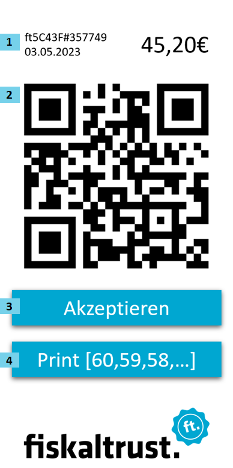
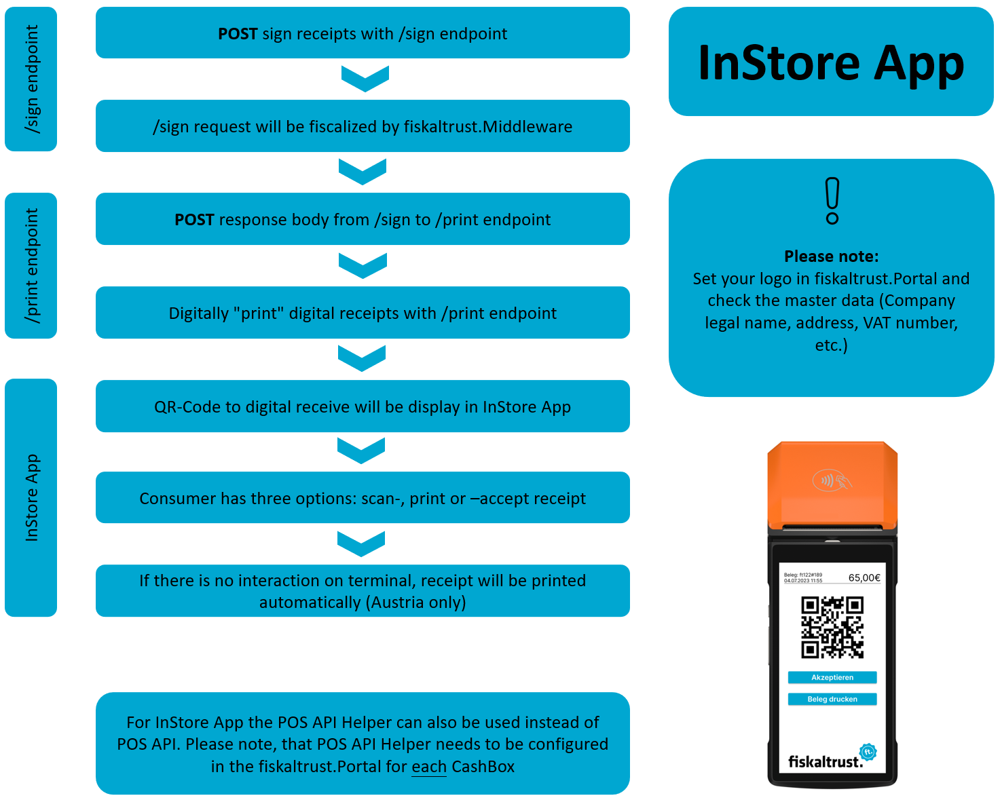
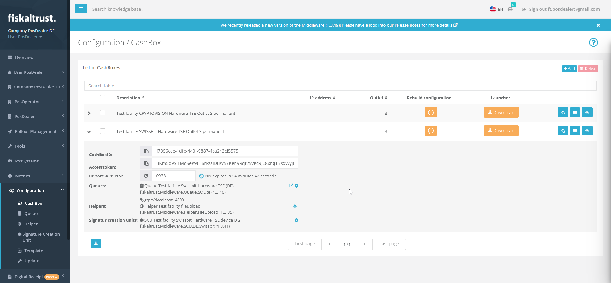
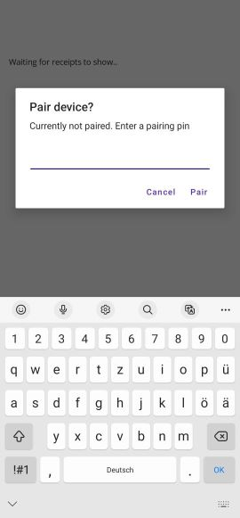

# InStore App

:::info summary

After reading this, you understand the concept of the InStore App, the configuration- and implementation steps of the InStore App.

:::


## Supported Stores
- [PAX GP](https://www.whatspos.com)
- [PAX Italia](https://paxitalia.whatspos.com)
- [Orderman](https://next.orderman.com) <!-- markdown-link-check-disable-line -->
- [Sunmi](https://partner.sunmi.com)

## Introduction

The fiskaltrust InStore app can be used on a touch-enabled devices with an integrated thermal printer. The fiskaltrust InStore App can listen to receipt issuing of multiple CashBoxes filtered by provided terminal-identification by each CashBox. Each time a related CashBox issues a receipt, the fiskaltrust InStore App pops up on the consumer facing touch screen and shows the following elements: 

* Number, moment of creation and total amount of the receipt 
* QR-Code with the https-receipt-link to hand over receipt to the consumer 
* Accept button to manually acknowledge received receipt 
* Print button with a countdown to print receipt

When the QR-Code is scanned and the https-receipt-link is used to download the https-receipt-document, then in the background there is an acknowledgement logged for receiving the receipt by the consumer and the current receipt display is closed. 

When the accept button is pressed by the consumer, then a manual acknowledgement for receiving the receipt is logged and the current receipt display is closed. 

When the print button is pressed by the consumer, or when the timeout/countdown is exceeded, then a paper receipt is printed and printing is logged for analytics. The current receipt display is closed after successful printing.

Setting up the InStore App requires no implementation into the Point of Sale software.

Since all operations within the app (Including QR-Code scanning, accepting and printing) are meticulously logged in the fiskaltrust.Portal, the InStore App attains complete compliance with Austria's obligation to issue receipts ("Belegausgabepflicht") and the obligation to accept receipts ("Belegannahmepflicht"), as well as Germany's obligation to issue receipts ("Belegausgabepflicht"). Furthermore, the app ensures that the receipt will always be issued to the consumer. 

fiskaltrust appointed Dr. Markus Knasmüller from BMD to create an external assessment about the conformity of the digital receipt in Austria. The final assessment can be requested here: https://forms.office.com/e/0PcMDYWC2B  

## Receiving receipts with InStore App

This sequence diagram describes the process of generating a digital receipt with the InStore App. The participants in the process are the merchant, fiskaltrust, consumer and the InStore App. 



The InStore App offers three options: scan QR-Code to receive digital receipt on mobile phone, accept button to manually acknowledge received receipt and print receipt on thermal paper.

In store, the merchant collects items and processes the payment or checkout. Then the merchant sends a sign message to fiskaltrust for fiscalization purposes. 

**Scan QR-Code:** The InStore App constantly listening to the fiskaltrust receipt backend, if there is an receipt push command. Once the InStore App received an https receipt link, the QR-Code gets visualized on the InStore App device. The consumer scans the QR-Code with his mobile phone. He receives the https receipt link, the InStore App sends an log that the receipt got scanned by consumer. The fiskaltrust backend renders the receipt, the QR-Code display on the InStore App device closes. The consumer can now accesses the HTML receipt document. The consumer can then provide feedback regarding the receipt. 

**Acknowledge:** The consumer manually accepts the he received the receipt, by pressing the accept button on the InStore App. The InStore App send to fiskaltrust backend and log, that the receipt got acknowledged manually. The InStore App gets a response from fiskaltrust, to close the display. 

**Print receipt:** Consumers can manually initiate paper receipt printing on the InStore App device by clicking the print button. Additionally, in the absence of user interaction, a paper receipt will be automatically printed after a default countdown of 15 seconds. Once the receipt is printed, the display will close and the print command will be logged.

## InStore App visualization
<br/>



| Number  | Description |
| ------------- | ------------- |
| 1  | Receipt number (ft5C43F#357749), date and receipt amount |
| 2  | QR-Code to https digital receipt document |
| 3  | `Accept button` |
| 4  | `Print button` |

## Download the InStore App 

The fiskaltrust InStore App is now available on the following app stores. It necessitates a minimum of Android 7 to run the application. 
Search for "fiskaltrust InStore App" at following app stores, to download the production release app:

* SUNMI App Store Approved and available for: P2 PRO, P2, V1, V2, & V2 PRO
* Google Play Store - soon
* MAXSTORE (PAX) Approved and available for: A35, A80 & A920Pro
* APK - https://install.appcenter.ms/orgs/fiskaltrust/apps/in-store/distribution_groups/stable (Microsoft App Center)

* APK (Sandbox) - https://install.appcenter.ms/orgs/fiskaltrust/apps/in-store/distribution_groups/preview (Microsoft App Center)

## Configuration 

This high level overview shows you the steps on how to implement and configure the InStore App into your Point of Sales software.

<br/>



## Configure master data

Please visit following link to see the configuration steps for the master data:

https://docs.fiskaltrust.cloud/de/docs/posdealers/buy-resell/products/digital-receipt#introduction

# Implementation 

fiskaltrust provides for the InStore App two implemenation methods. The first approach is via the POS API Helper, which is recommended for testing/sandbox environments and for small installations. Configuring the POS API Helper within the fiskaltrust.Portal requires no implementation effort in your Point of Sale software.

The POS API is the latest addition to the digital receipt ecosystem. The POS API is a superset of the Middleware's "original" IPOS interface, and uses the same models for /sign, /journal and /echo. The core features of this API provides a variety of different functionalities for Point of Sales software and is the central entry point to the fiskaltrust.Middleware. For the InStore App the /print endpoint is required, to digitally print digital receipts.

This means that existing implementations can very easily be reused by adjusting them to the asynchronous flow. The IPOS interface will continue to be fully supported by the Middleware.

As most operations especially /print requests may take an extended amount of time, this API is designed in a completely asynchronous way. After sending a request to the /print endpoint, the InStore App immediately visualizes the QR-Code. Please note: The /sign operation does not necessary needs to be implemented for the InStore App. 

A general sample of this process flow is illustrated in the picture below:


:::warning

The fiskaltrust InStore App requires a permanent and stable connection to the internet.

:::

## Availability

The production API can be reached at https://pos-api.fiskaltrust.cloud as for all fiskaltrust services, the sandbox instance should be used for development and testing: https://pos-api-sandbox.fiskaltrust.cloud.

The exact same endpoints will also be added to the on-premise Launcher (natively in version 2.0, and via additional Helper packages for the versions below).

:::info

- **Sign** endpoint is only available in Austria with the Cloud CashBox
- **Print** Endpoint is available in Austria and Germany

:::

## Authentication

Authentication is handled via the headers CashBoxID and Accesstoken, which are mandatory for each request. Those values can be obtained by creating a CashBox in the one of the country-specific fiskaltrust.Portal.

## Operation flow (digital receipt)

Typically, a full receipt flow when using digital receipt (sign, print and response) would look like this:

1. Call the /sign endpoint and asynchronously wait for the result
2. If the signing was successful, call the /print endpoint and the InStore App will visualize the QR-Code to the digital receipt 

## Asynchronously sign a receipt according to local regulations (Sign endpoint)

This method can be used to sign different types of receipts according to the local fiscalization regulations. After signing the receipt according to the fiscal law, this method asynchronously returns the data that will be visualized on the digital receipt. The format of the receipt request is documented in the Middleware API docs, and the exact behavior of the method is determined by the cases sent within the properties (e.g. ftReceiptCase, ftChargeItemCase and ftPayItemCase).

**POST:**

https://pos-api.fiskaltrust.cloud/v0/sign (Production)

https://pos-api-sandbox.fiskaltrust.cloud/v0/sign (Sandbox) 

**Header parameters:**

cashboxid (required): string <br/>
accesstoken (required): string

<details>
<summary>Request body schema (JSON):</summary>


```json
{
  "ftCashBoxID": "string",
  "ftQueueID": "string",
  "ftPosSystemId": "string",
  "cbTerminalID": "string",
  "cbReceiptReference": "string",
  "cbReceiptMoment": "2019-08-24T14:15:22Z",
  "cbChargeItems": [
    {
      "position": 0,
      "quantity": 0,
      "description": "string",
      "amount": 0,
      "vatRate": 0,
      "ftChargeItemCase": 0,
      "ftChargeItemCaseData": "string",
      "vatAmount": 0,
      "accountNumber": "string",
      "costCenter": "string",
      "productGroup": "string",
      "productNumber": "string",
      "productBarcode": "string",
      "unit": "string",
      "unitQuantity": 0,
      "unitPrice": 0,
      "moment": "2019-08-24T14:15:22Z"
    }
  ],
  "cbPayItems": [
    {
      "position": 0,
      "quantity": 0,
      "description": "string",
      "amount": 0,
      "ftPayItemCase": 0,
      "ftPayItemCaseData": "string",
      "accountNumber": "string",
      "costCenter": "string",
      "moneyGroup": "string",
      "moneyNumber": "string",
      "moment": "2019-08-24T14:15:22Z"
    }
  ],
  "ftReceiptCase": 0,
  "ftReceiptCaseData": "string",
  "cbReceiptAmount": 0,
  "cbUser": "string",
  "cbArea": "string",
  "cbCustomer": "string",
  "cbSettlement": "string",
  "cbPreviousReceiptReference": "string"
}
```


</details>

**Responses:**

200 - Returns a unique identifier, which can be used to obtain the result of the operation via the response endpoint.

<details>
<summary>Response sample (JSON):</summary>


```json
{
  "type": "sign",
  "identifier": "fdf2a983-0c30-4d40-bda3-e4e339551e5e"
}
```


</details>

400 - Bad request (Please check the request)

401 - Unauthorized (No or wrong Accesstoken or CashBoxID in header)

## Asynchronously create a digital receipt (Print endpoint) 

This method is used to "print" a digital receipt, based on the receipt request and response pair from signing a receipt via the sign endpoint. The asynchronously created response contains the URL to the digital receipt. 

**POST:**

https://pos-api.fiskaltrust.cloud/v0/print (Production)

https://pos-api-sandbox.fiskaltrust.cloud/v0/print (Sandbox)

**Header parameters:**

cashboxid (required): string <br/>
accesstoken (required): string 

<details>
<summary>Request body schema (JSON):</summary>


```json
{
  "request": {
    "ftCashBoxID": "string",
    "ftQueueID": "string",
    "ftPosSystemId": "string",
    "cbTerminalID": "string",
    "cbReceiptReference": "string",
    "cbReceiptMoment": "2019-08-24T14:15:22Z",
    "cbChargeItems": [
      {
        "position": 0,
        "quantity": 0,
        "description": "string",
        "amount": 0,
        "vatRate": 0,
        "ftChargeItemCase": 0,
        "ftChargeItemCaseData": "string",
        "vatAmount": 0,
        "accountNumber": "string",
        "costCenter": "string",
        "productGroup": "string",
        "productNumber": "string",
        "productBarcode": "string",
        "unit": "string",
        "unitQuantity": 0,
        "unitPrice": 0,
        "moment": "2019-08-24T14:15:22Z"
      }
    ],
    "cbPayItems": [
      {
        "position": 0,
        "quantity": 0,
        "description": "string",
        "amount": 0,
        "ftPayItemCase": 0,
        "ftPayItemCaseData": "string",
        "accountNumber": "string",
        "costCenter": "string",
        "moneyGroup": "string",
        "moneyNumber": "string",
        "moment": "2019-08-24T14:15:22Z"
      }
    ],
    "ftReceiptCase": 0,
    "ftReceiptCaseData": "string",
    "cbReceiptAmount": 0,
    "cbUser": "string",
    "cbArea": "string",
    "cbCustomer": "string",
    "cbSettlement": "string",
    "cbPreviousReceiptReference": "string"
  },
  "response": {
    "ftCashBoxID": "string",
    "ftQueueID": "string",
    "ftQueueItemID": "string",
    "ftQueueRow": 0,
    "cbTerminalID": "string",
    "cbReceiptReference": "string",
    "ftCashBoxIdentification": "string",
    "ftReceiptIdentification": "string",
    "ftReceiptMoment": "2019-08-24T14:15:22Z",
    "ftReceiptHeader": [
      "string"
    ],
    "ftChargeItems": [
      {
        "position": 0,
        "quantity": 0,
        "description": "string",
        "amount": 0,
        "vatRate": 0,
        "ftChargeItemCase": 0,
        "ftChargeItemCaseData": "string",
        "vatAmount": 0,
        "accountNumber": "string",
        "costCenter": "string",
        "productGroup": "string",
        "productNumber": "string",
        "productBarcode": "string",
        "unit": "string",
        "unitQuantity": 0,
        "unitPrice": 0,
        "moment": "2019-08-24T14:15:22Z"
      }
    ],
    "ftChargeLines": [
      "string"
    ],
    "ftPayItems": [
      {
        "position": 0,
        "quantity": 0,
        "description": "string",
        "amount": 0,
        "ftPayItemCase": 0,
        "ftPayItemCaseData": "string",
        "accountNumber": "string",
        "costCenter": "string",
        "moneyGroup": "string",
        "moneyNumber": "string",
        "moment": "2019-08-24T14:15:22Z"
      }
    ],
    "ftPayLines": [
      "string"
    ],
    "ftSignatures": [
      {
        "ftSignatureFormat": 0,
        "ftSignatureType": 0,
        "caption": "string",
        "data": "string"
      }
    ],
    "ftReceiptFooter": [
      "string"
    ],
    "ftState": 0,
    "ftStateData": "string"
  }
}
```


</details>

**Responses:**

200 - Returns a unique identifier, which can be used to obtain the result of the operation via the response endpoint.

<details>
<summary>Response sample (JSON):</summary>


```json
{
    "type": "print",
    "identifier": "0ccf5ada-7d0d-4531-bc2c-9c602d26e4fe"
}
```


</details>

400 - Bad request "not supported" (Please check the request) 

401 – Unauthorized (No or wrong Accesstoken or CashBoxID in header)

## Configure POS API Helper 

The POS API Helper is available in all countries. This Helper is responsible for uploading data from the local Queue to the digital receipt endpoint. This Helper is configured in the fiskaltrust.Portal and assigned to each CashBox that uses digital receipts. The POS API Helper changes to an direct upload behavior of the digital receipts.

To proceed with the configuration, login to your fiskaltrust.Portal account first. 

### Queue 

| Step  | Description |
| ------------- | ------------- |
| 1  | Navigate to the configuration section and go to Queue  |
| 2  | Configure Queue  |
| 3  | Copy the URLs to your local machine (Required for CashBox configuration later)   |
| 4  | For all countries: Change port to the next free port (+1) and <br/> a.	if no suffix exists after the port: add the suffix "/name_queue" to the URL ("name" can be freely chosen) <br/> b.	if suffix already exists: add the suffix "_queue" to the URL  |
| 5  | Germany & France only: Change grpc port to the next free port (if port is free no need to go up to the next free port) and add the suffix "/name_queue" to the URL ("name" can be freely chosen)  |
| 6  | Save changes  |

### Helper 

| Step  | Description |
| ------------- | ------------- |
| 1  | Navigate to Helper  |
| 2  | Create new helper  |
| 3  | Add description  |
| 4  | Select  package name "fiskaltrust.service.helper.posapi"   |
| 5  | Select latest package version   |
| 6  | Select the outlet of CashBox    |
| 7  | Save configuration   |
| 8  | Klick configure helper   |
| 9  | All Counties: Insert the previously saved Queue URLs to the Helper URLs and add the suffix "/name" to the URL (analogue to the naming in queue configuration). Germany & France only: Add also GRPC URL with next free port and add the suffix "/name" to the URL (analogue to the naming in queue configuration).   |
| 10  | Save configuration and close   |

### CashBox 

| Step  | Description |
| ------------- | ------------- |
| 1  | Navigate to CashBox   |
| 2  | Select your CashBox and click edit by list  |
| 3  | Navigate to Helpers  |
| 4  | Activate the POS API Helper  |
| 5  | Save configuration  |
| 6  | Klick rebuild configuration  |

### Restart

Restart the fiskaltrust.Middleware to apply the changes. 

## Pair InStore App

After installing the InStore App on your Android device, establishing a connection with your preferred CashBox is essential. Here's how:

| Step  | Description |
| ------------- | ------------- |
| 1  | Log in to your fiskaltrust.Portal account and proceed to the CashBox you want to pair with the InStore App.  |
| 2  | Extend the overview of the CashBox. Klick `unhide` to generate a new, temporary pairing pin.<br/> The pairing pin is valid for five minutes. After the pin expired, you need to generate a new pin, by clicking `unhide` to generate a new pin.   |
| 3  |  <br/> Enter the four-digit pin into your InStore App, confirm the connection by clicking `Pair`. You can pair multiple InStore App installations with one CashBox. To open the paring to CashBox mask or to pair with a different CashBox, press the touchscreen one second.   |
