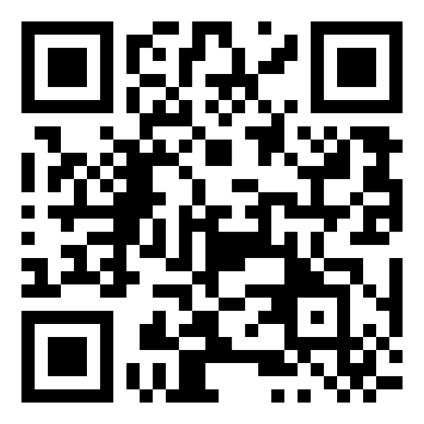
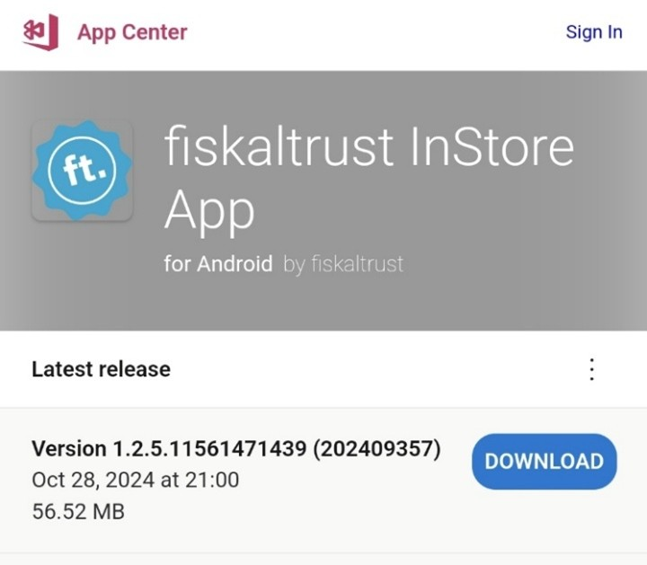
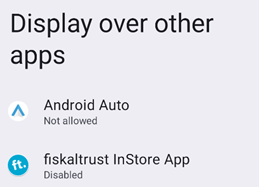
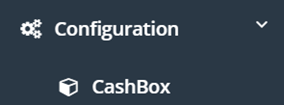
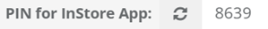
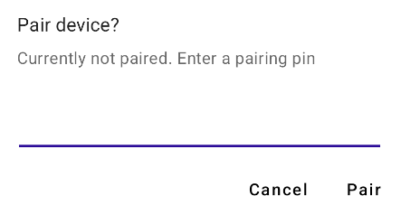

# Getting Started Guide

**Step-by-Step Installation and Setup Instructions**

This guide explains how to install the Fiskaltrust app and connect it to your cash register.
Please follow the steps below in the given order.

**1. Download the App**
- Open **Web Explorer** or any other web browser on your device.
- Visit the following website to download the latest version of the Fiskaltrust app:
    - [Download the App](https://install.appcenter.ms/orgs/fiskaltrust/apps/in-store/distribution_groups/stable)
 
    

           
       

- It should look like this:
    

           
       

- Download the LATEST RELEASE

**2. Install the App**
- After the download is complete, open the downloaded file to start the installation.
- Follow the on-screen instructions to complete the installation.
    
**3. Open the App and Grant Permissions**
- Once installed, launch the app.
- If prompted, enable the option **"Display over other apps"** (this allows the app to stay in the foreground while you work in other apps).
    - _Tip:_ If this option is disabled, a prompt will appear asking you to enable it.
             Please confirm this setting.
             

           
       

             
**4. Access the Fiskaltrust Portal**
- If you want to **test** your setup in the **Sandbox environment** , open the **Fiskaltrust Sandbox Portal** for your country in your web browser:
    - [**Open Fiskaltrust Sandbox Portal**](https://portal-sandbox.fiskaltrust.at/)
- If you’re ready to go live in **production** , make sure to use the **production link** for
       your country:
    - [**Open Fiskaltrust Production Portal**](https://portal.fiskaltrust.at/Account/Login?returnUrl=%2fCashBox#/)

Make sure to select the correct country within the portal to match your region.

**5. Select Your Cashbox**
- Once in the portal, select your **Cashbox**. This is the virtual cash register you will connect to the app.
       

           
       

**6. Copy the PAIR CODE**
- In the Cashbox overview, you will find your **PAIR CODE**. This code is used to pair your app with the Cashbox.
    - **Example PAIR CODE:** 8639
      
Copy this code.

           
       

**7. Enter the PAIR CODE in the App**
- Now, open the Fiskaltrust app on your device and paste the previously copied **PAIR CODE** into the designated field.
- Click **"Pair"** to connect the app with your Cashbox.

           
       

       
---

**You Are Ready to Go!**

Once the pairing is successful, your app is now connected to your Cashbox, and you can
start using it. If you need further assistance, please do not hesitate to contact us.

---

If you have any questions or encounter issues during installation, please first check the
FAQ section for possible solutions. If you still need assistance, feel free to reach out to
our support team.

---

**Fiskaltrust Team**

[Support Website](https://www.fiskaltrust.at/support)

---

**Frequently Asked Questions (FAQ)**

**Q: The printer is not showing up. What should I do?**

- **A:** Please ensure that **Bluetooth** is enabled on your device. The app requires
    Bluetooth to connect to the printer. You can check the Bluetooth settings in your
    device’s settings menu.

**Q: How can I reconnect the app to my Cashbox?**

- **A:** If the connection between the app and the Cashbox is lost, simply open the
    Fiskaltrust Portal again, copy the **PAIR CODE** , and re-enter it in the app. This will
    re-establish the connection.

**Q: The app isn't opening after installation. What do I do?**

- **A:** Make sure that your device has sufficient storage and that all necessary
    permissions (e.g., storage access, Bluetooth access) are granted. Try restarting
    your device and reinstalling the app if necessary.

**Q: I received an error message when pairing. What does it mean?**

- **A:** This could indicate an issue with the PAIR CODE. Please double-check the
    PAIR CODE you entered to ensure it is correct. You can also try copying and
    pasting the code again from the Fiskaltrust Portal.

**Q: How can I update the Fiskaltrust app?**

- **A:** To ensure you have the latest version of the app, revisit the **download page**
    and download the newest version. The app will automatically update when a new
    version is available.

**Q: Can I use the app without an internet connection?**

- **A:** The app requires an internet connection for initial setup and communication
    with the Fiskaltrust portal. However, once set up, the app can function offline for
    day-to-day use, provided it was previously paired with the Cashbox.

**Q: The app is not responding or freezing. What should I do?**

- **A:** If the app freezes or becomes unresponsive, try restarting the app or your
    device. If the issue persists, check for available updates or reinstall the app to
    ensure it's running the latest version.

