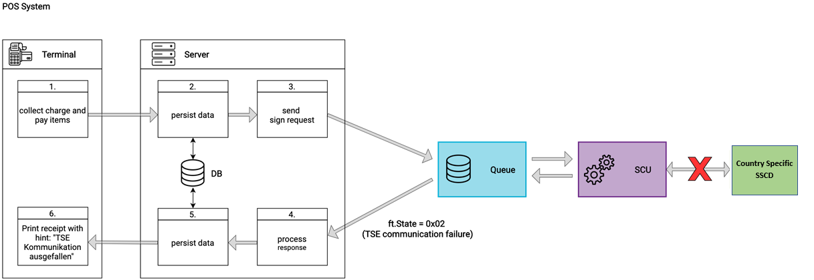
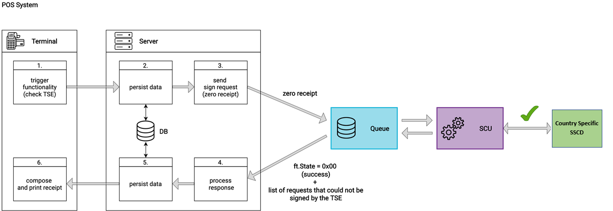

### Failure Scenarios
This Chapter describes the different scenarios of failure when using the fiskaltrust.Middleware and how to handle them.

#### Failure of the fiskaltrust.Middleware
If a cash register cannot communicate with the fiskaltrust.Middleware it is most likely due to a failure of the network connection, the Middleware host, or the Middleware itself. Such a failure means that the electronic recording system is not operational and there is no access to the appropriate journal.

In this case, the following steps must be taken:

  - The cash register or input station must automatically produce a receipt and its copy.
  - The receipt must be marked with the identification "electronic recording system failed" and with the current failure counter.
  - This copy needs to be kept until the failure is resolved. The creation and storing of the receipt copy can also be done electronically by the cash register or terminal.
  - After re-establishing the communication to fiskaltrust.Middleware, the cash register or the input station must send all receipts marked with the identification "receipt copy, electronic recording system failed" to fiskaltrust.Middleware. The ReceiptCase must be flagged with the code "failed receipt" in order to indicate the failure to fiskaltrust.Middleware, which will then issue a receipt response with the the ftState "Late Signing Mode".

An alternative way of handling such situation is the generation of a handwritten receipt. A carbon copy (or another copy, e.g. electronic copy) must be created and archived. After re-establishing communication with fikaltrust.Middleware, these copies are subsequently to be recorded as receipts. The receipt code has to be combined with the "failed receipt" code in order to notify fiskaltrust.Middleware of the failure.

After fiskaltrust.Middleware has received an "end of failure receipt", the status of failure is terminated by receiving a response with normal state code.

#### Failure of the Signature Creation Unit
If the communication to the SCU fails (e.g. when the secure Signature Creation Device is not reachable), the POS System can continue to operate until the SCU is accessible again. Receipts created in a state where no communication is possible with the SCU are protected by the security mechanism of fiskaltrust. The fiskaltrust.Middleware will respond with the ftState = `0x02` "SCU communication failed". The POS System receives the response and processes the data it contains. For following Requests no more communication attempts are done to avoid long waiting times for each Receipt request/Receipt response sequence.

  
When the SSCD is reachable again, a Zero-Receipt must be sent, which forces a communication retry towards the SSCD device. If the fiskaltrust.Middleware is able to connect to the SSCD again, the ftState = 0x00 (ok) is returned to the POS system via the response and the fiskaltrust.Middleware is ready for normal operation again. Furthermore, the response contains a listing of the requests that were not signed by the TSE. The requests affected by the failure of the communication with the SCU do not have to be sent to the Queue again after the problem has been resolved.
 
:::tip
We recommend to make the zero-receipt after a failure a manual operation, and not automatically send it it via the POS system as soon as a failure state is returned. In most scenarios, only operators can determine if the connection to the SSCD can be re-established, e.g. when the internet or the device is reconnected. Automatically sending zero-receipts might lead to unnecessary wait times if the connection can't be established at this point in time.
:::

