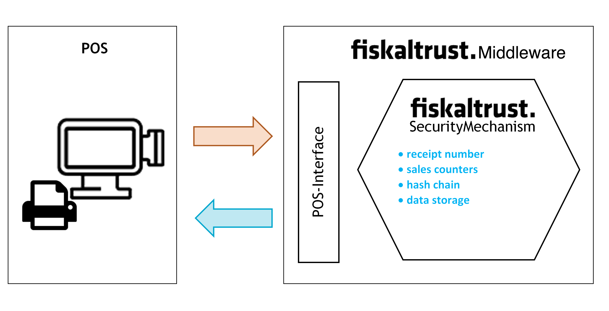
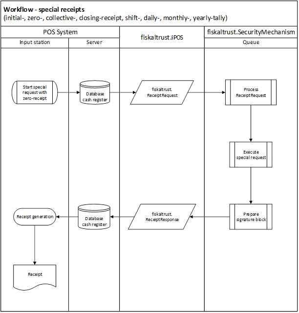
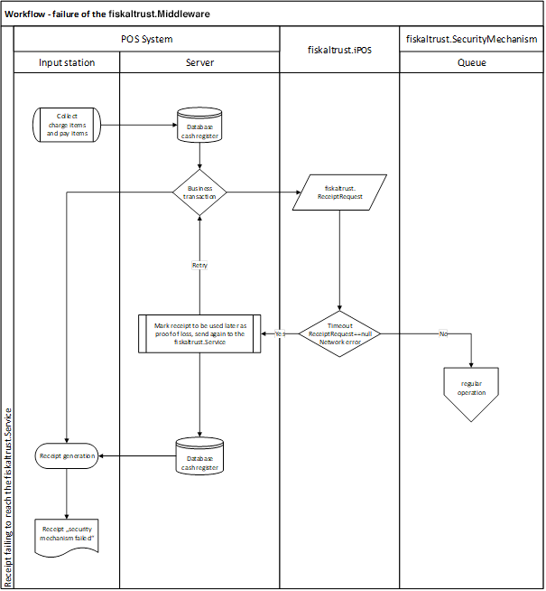
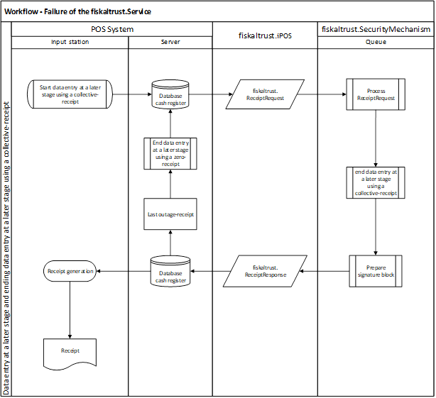

## Cash Register Integration

While designing the integration of fiskaltrust.Service into Cash Register Systems, our goal was to minimize the impact to the existing workflow as much as possible. With that in mind we've developed the following implementation suggestion.

The best time for the integration is right after all services and payments have been gathered and the receipt has been created in the system, but before it is being printed (response created electronically). Right at that point the receipt data will be transferred to the fiskaltrust.SecurityMechanism via fiskaltrust.iPOS.

### Receipt creation process

This chapter describes the general process and workflow of creating receipts with fiskaltrust.Service.

#### The fiskaltrust.SecurityMechanism

The regular workflow of the fiskaltrust.SecurityMechanism defines the steps required for creation of a receipt as follows:

  - assign a sequential receipt number
  - increase sales counters
  - chain receipts
  - save all data.

This additional receipt data, generated by fiskaltrust.SecurityMechanism, is sent back to the cash register and has to be stored in the POS. After storage is completed, the entire receipt - featuring both the cash register and the fiskaltrust.SecurityMechanism data - can be handed out printed on paper or as an electronic receipt.

*Illustration 1. Process of the cash register integration with fiskaltrust.SecurityMechanism*

#### Workflow - regular operation

The following diagram illustrates the regular creation of a receipt with fiskaltrust.Service. The implementation of a fiskaltrust.SecurityMechanism may differ between countries and derive from their national laws – for details please refer to the appropriate appendix.

*Illustration 2. Workflow - regular operation*

#### Workflow - special receipts

The following diagram illustrates the creation of a special receipt with fiskaltrust.Service. For a general description of special receipts, please refer to Receipt for special functions chapter, on page 23. For national laws on receipts, refer to the appropriate appendix.

*Illustration 3. Workflow - special receipts*

#### Workflow - failure of communication or failure of the fiskaltrust.Service (timeout)

The following diagram illustrates the workflow of a failure of fiskaltrust.Service. For a description of recovering, please refer to the appropriate appendix.

*Illustration 4. Workflow - failure of the fiskaltrust.Service (timeout)*

*Illustration 5. Workflow - failure of the fiskaltrust.Service*

### Receipt for special functions

There are several receipt requirements fulfilled by the fiskaltrust.Service in addition to the usual receipts produced by business transactions. Those special receipts can support the process of collecting additional information.

This section describes the receipt types used for those special functions. For further information on how to fulfil the requirements of national laws, please refer to the appropriate appendix.

#### Zero Receipt

A zero receipt is a universal data carrier and storage. The cash register sends a receipt with an empty charge items block (ftChargeItem) and an empty pay items block (ftPayItem) which logically contain a total amount of "0".

The fiskaltrust.SecurityMechanism sends the necessary blocks, such as the receipt header, the charge item block, and the signature block in the response. This response is either printed or issued electronically and has to be archived.

Further you can find examples of special cases of zero receipts.

##### Start Receipt (Initial Receipt)

The start receipt has to be sent before the security mechanism is used for the first time. This receipt receives a meaningful response from fiskaltrust.SecurityMechanism only the first time: in order to start operative calculations.

##### Stop Receipt (Closing Receipt)

The stop receipt is required for scheduled decommissioning of security mechanisms and/or cash registers. The stop receipt is used to switch off: the receipt chaining, the counter up-counting, and the totalizer storing. It also concludes the data collection log.

This receipt has a meaningful response from fiskaltrust.SecurityMechanism only the first time: in order to stop operative calculations and the operation of a queue. After receiving a stop receipt the queue will be closed. There will be no positive response from the cash register when a receipt is send to a closed queue.

A closed queue can’t be reopened with a start receipt. Instead, a new queue has to be generated and initialized with a start receipt.

##### End of Failure Receipt (Collective Failure Report)

If the fiskaltrust.Service stopped responding, if the response does not comply with the interface description, or if a cash register cannot communicate with fiskaltrust.Service anymore, it is most likely due to a failure of fiskaltrust.Service. Such a failure means that the electronic recording system is not operational and there is no access to the appropriate journal. In such case, the following steps must be taken:

  - The cash register or input station must automatically produce a receipt and its copy.
  - The receipt must be marked with the identification "electronic recording system failed" and with the current failure counter.
  - This copy needs to be kept until the failure is resolved. The creation and storing of the receipt copy can also be done electronically by the cash register or terminal.
  - After re-establishing the communication to fiskaltrust.Service, the cash register or the input station must send all receipts marked with the identification "receipt copy, electronic recording system failed" to fiskaltrust.Service. The ReceiptCase must be flagged with the code "failed receipt" in order to indicate the failure to fiskaltrust.Service, which will then issue a receipt response with the identification "electronic recording system failed" for each receipt.

An alternative way of handling such situation is the generation of a handwritten receipt. A carbon copy (or another copy, e.g. electronic copy) must be created and archived. After re-establishing communication with fikaltrust.Service, these copies are subsequently to be recorded as receipts. The receipt code has to be combined with the "failed receipt" code in order to notify fiskaltrust.Service of the failure.

After fiskaltrust.Service has received an "end of failure receipt", the status of failure is terminated by receiving a response with normal state code.

### Receipt structure

This chapter describes the receipt structure.

*Illustration* *6. Receipt Structure - general; cash register-receipt data (header, charge items, pay items, footer) and fiskaltrust-receipt data (header, charge items, pay items, signature, footer)*

#### Receipt Header

The receipt header can be branded with label and/or logo of the issuing company (see figure above) which is usually done already at the cash register. If required, receipt header can be further extended through fiskaltrust.Service.

#### Charge Items Block

The charge items block on the cash register receipt contains the details of services or items sold. In addition, a tax on sales code or other item specific data (such as e.g. the serial number) can be included.

If required, the charge items block can be extended through fiskaltrust.Service. This should be done by setting the quantity or the amount due to "0" to keep the amount unchanged (e.g. a cash transactions amount).

#### Pay Items Block

The pay items block of the cash register receipt contains the details of payments of business transactions received (these include payments with bank or credit card, or other comparable electronic means of payments, cash cheques as well as vouchers, coupons, token coins or similar means of payment) in local currency.

If required, the pay item block can be extended through fiskaltrust.Service. As with the charge items block, this should only be done by setting the quantity or the amount due to "0" in order not to change cash and cash equivalents.

#### Signature Block

The fiskaltrust.SecurityMechanism generates signature blocks, which include security features defined by national laws (see appropriate appendix for further definition). They may also include some optional additional information, such as references to training or reverse posting, or an information about an operating failure of the signature creation device. Cash registers should add the signature block to the receipt output between the pay item block and the receipt footer.

#### Receipt Footer

The receipt footer contains messages or announcements for the customer. It can be extended through fiskaltrust.Service. The cash register can display additional rows before or after the receipt footer. The rows of the receipt footer of the fiskaltrust.Service should be included in any case, as they can contain important directions for the company or customer regarding the handling of receipts.

### Data Collection Log

The Data Collection Log is generally defined by national laws. For further, country-specific information, please refer to the appropriate appendix.

### Receipt Journal

The ReceiptJournal is used to record, hash, and chain all requests to the fiskaltrust.Service and the resulting responses. The first part of the returned ReceiptIdentification is an upcounting number generated by ReceiptJournal.

### Action Journal

The ActionJournal collects all operational incidents. This can be the date and time of start or failure of the service, as well as any other information related to fiskaltrust.Service and fiskaltrust.SecurityMechanism.
