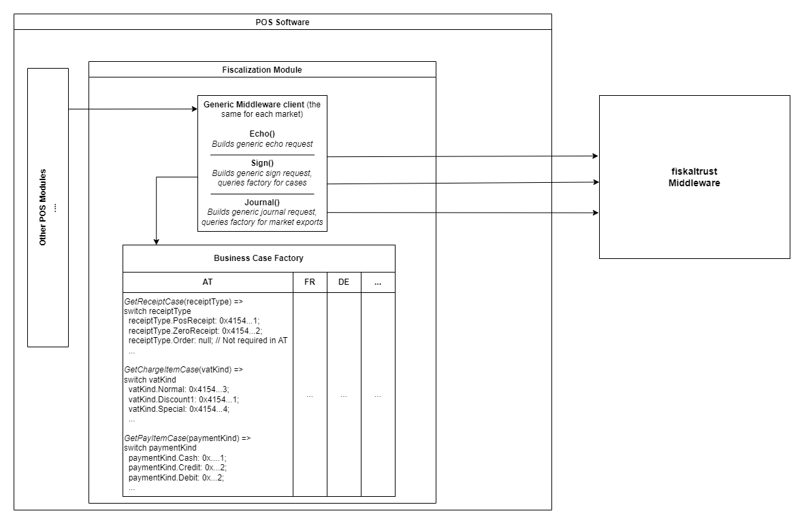

### Multi-market integration
This guide provides a guideline of which business cases should be implemented in which market.
For business cases which are only differing by the Country Code we recommend to use a mapping table in your POS Software.  

#### Typical sign flow
- generate generic receipt requests
- depending on the market, set the chargeitem-, payitem- and receiptcases (not every operation may have an e.g. receiptcase in each market -> in that case, do nothing. example: order in AT and FR)

#### Mapping Table
The table below shows a comparison of common business cases (e.g. ftReceiptcases, ftChargeItemcases and ftPayItemcases) for every market.
More details for ftReceiptcases, ftPayItemcases and ft ChargeItemcases can be found for each market on the appropriate country specific appendix.

|**business cases** | **AT** | **DE** |**FR** |**ME**|
|----------------------|-----------|-----------------------|--------------------------------------|-----------------------------|
|**ftReceiptcase**||||||
|Cash sales / POS-receipt / Ticket|`0x4154000000000001`|`0x4445000100000001`|`0x4652000000000001`||
|Zero receipt|`0x4154000000000002`|`0x4445000000000002`|`0x465200000000000F`|`0x4D45000000000002`|
|Initial operation/start receipt|`0x415400000000000`|`0x4445000000000003`|`0x4652000000000010`|`0x4D45000000000003`|
|Out of operation/stop receipt|`0x4154000000000004`|`0x4445000000000004`|`0x4652000000000011`|`0x4D45000000000004`|
|Monthly closing|`0x4154000000000005`|*optional* `0x4445000000000005`|`0x4652000000000006`|`0x4D45000000000005`|
|Yearly closing|`0x4154000000000006`|*optional* `0x4445000000000006`|`0x4652000000000007`|`0x4D45000000000006`|
|Daily closing|| `0x4445000000000007`|`0x4652000000000005`||
|Opening balance||||`0x4D45000000000007`|
|Cash withdrawal||||`0x4D45000000000008`|
|Start-transaction Receipt||`0x4445000000000008`|||
|Update-transaction Receipt||`0x4445000000000009)`||
|Fail transaction Receipt||`0x444500000000000B` (single) `0x444500010000000B` (multiple) ||||
|Initiate SCU switch||`0x4445000000000017`|||
|Finish SCU switch||`0x4445000000000018`|||
|Archives|||`0x4652000000000015`||
|**ftChargeItemcase**| | | | |
|Unknown type of service/product normal|`0x4154000000000003`|`0x4445000000000001`|`0x465200000000003`|`0x4D45000000000001`|
|Unknown type of service/product discounted-1|`0x4154000000000001`|`0x4445000000000002`|`0x465200000000001`|`0x4D45000000000002`|
|Unknown type of service/product discounted-2|`0x4154000000000002`||`0x465200000000002`||
|**ftPayItemcase** |||||
|Cash payment in national currency|`0x4154000000000001`|`0x4445000000000001`|`0x4652000000000001`|`0x4D45000000000001`|
|Cash payment in foreign currency|`0x4154000000000002`|`0x4445000000000002`|`0x4652000000000002`|`0x4D45000000000002`|
|Crossed cheque|`0x4154000000000003`|`0x4445000000000003`|`0x4652000000000003`|`0x4D45000000000003`|
|Debit card payment|`0x4154000000000004`|`0x4445000000000004`|`0x4652000000000004`|`0x4D45000000000004`|
|Credit card payment|`0x4154000000000005`|`0x4445000000000005`|`0x4652000000000005`|`0x4D45000000000005`|
|Online payment|`0x4154000000000007`|`0x4445000000000006`|`0x4652000000000007`|`0x4D45000000000008`|
|Customer card payment|`0x4154000000000008`|`0x4445000000000007`|`0x4652000000000008`|`0x4D45000000000009`|
|Sepa transfer|`0x415400000000000C`|`0x4445000000000008`|`0x465200000000000C`|`0x4D4500000000000A`|
|Internal material consumption|`0x4154000000000011`|`0x444500000000000A`|`0x4652000000000011`|`0x4D4500000000000C`|
