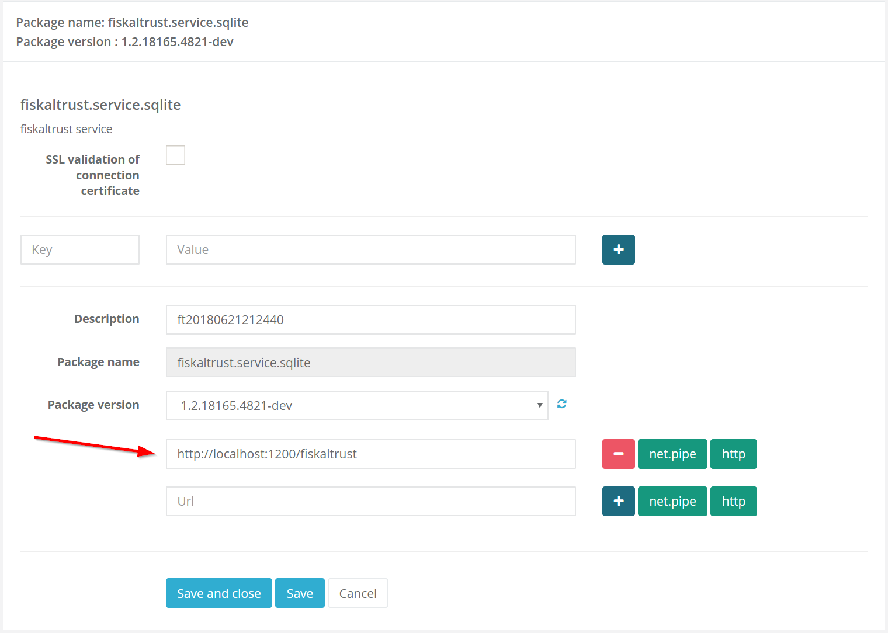

## Communication

This chapter describes the ways to communicate with the fiskaltrust.Middleware via different network communication protocols. A fiskaltrust.Middleware exposes a WCF (Windows Communication Foundation) service to let POS-Systems interact with fiskaltrust.SecurityMechanism using fiskaltrust.Interface. Fiskaltrust also provides helpers to expand the communication interface for REST and serial/TCP protocols as well. This helpers can be activated and configured with the fiskaltrust.Portal.

### WCF Web Service

The Windows Communication Foundation (WCF) is used to access the fiskaltrust.Middleware via network. This technology is not only suitable for Windows platforms, as the name might imply, but can be used with all operating systems and applications through standards such as SOAP and REST. Further information on this subject can be found on:

<https://docs.microsoft.com/en-us/dotnet/framework/wcf/bindings>.

The WCF service will be hosted under the URL, which can be set in the fiskaltrust.Portal on the configuration page of fiskaltrust.Middleware.



<span id="_Toc527986808" class="anchor">

*Illustration 7. Configuration page of a fiskaltrust.Middleware*

</span>

Supported protocols are: http, https, net.tcp, net.pipe. For configuring a custom message size and a custom time out, it is possible to specify the parameter "messagesize" (in bytes) and the parameter "timeout" (in seconds) on the configuration page.

Fiskaltrust provides a specific helper (balancer) to manage more than one fiskaltrust.Middleware in order to create a load balancing of the calls. The reason for using this helper is usually a flow of calls that could overload a single fiskaltrust.Middleware. The configuration page requires a specific parameter for choosing the way the balancing will be managed (least active, round robin).

The journal stream bill is composed by a concatenation of streams of all instances of the fiskaltrust.Middleware managed by the Balancer helper, separated by a '\\0' (zero) character.

Usually, a proxy class should be created and used to execute the function calls.

**C# call for proxy class:**
```cs
//local SOAP service
BasicHttpBinding binding = new BasicHttpBinding(BasicHttpSecurityMode.None);
//configure endpoint 
EndpointAddress endpoint = new EndpointAddress(wcf_http_url);
//create proxy 
ChannelFactory<fiskaltrust.ifPOS.v0.IPOS> factory = 
    new ChannelFactory<fiskaltrust.ifPOS.v0.IPOS>(binding, endpoint);

var proxy = factory.CreateChannel();
```

<span id="_Toc527986833" class="anchor">

*Code 9. Call of proxy class*

</span>

#### SOAP

Simple Object Access Protocol (SOAP) is a network protocol which can exchange data across systems and can execute RPC calls.

With [`<basicHttpBinding>`](https://msdn.microsoft.com/en-us/library/system.servicemodel.basichttpbinding\(v=vs.110\).aspx), [`<netNamedPipeBinding>`](https://msdn.microsoft.com/en-us/library/system.servicemodel.netnamedpipebinding\(v=vs.110\).aspx) and [`<netTcpBinding>`](https://msdn.microsoft.com/en-us/library/system.servicemodel.nettcpbinding\(v=vs.110\).aspx), fiskaltrust.Middleware makes its functionality available on the local network.

A WSDL file which describes the fiskaltrust.Middleware is available at [dist/WSDL](https://github.com/fiskaltrust/interface-doc/tree/master/dist/WSDL).

**C# call for signing with SOAP:**
```cs
//create proxy and establish authentification
throw new NotImplementedException();
//call for signing receipt
ifPOS.v0.ReceiptRequest req;
fiskaltrust.ifPOS.v0.ReceiptResponse resp = proxy.Sign(req);
```

<span id="_Toc527986834" class="anchor">

*Code 10. Example call for signing with SOAP*

</span>

#### *Balancer Helper*

fiskaltrust provides a helper (balancer) to facilitate the workload management of multiple fiskaltrust.Queues by balancing the distribution of requests. It is used to prevent overloading of a single fiskaltrust.Queue. The configuration page allows the selection of a specific parameter indicating the way the balancing will be managed (least active, round robin).

The journal stream bill be composed by a concatenation of the streams of all instances of the fiskaltrust.Middleware managed by the Balancer helper. The concatenated streams must be separated by a ‘\\0’ (zero) character.

### REST Web Service

Representational State Transfer architecture uses the classic http methods GET, PUT, POST and DELETE to communicate with fiskaltrust.SecurityMechanisms. The currently accepted data formats are XML and JSON. There are various implementations for REST which are all provided via Helper.

The functions accept POST requests and use the endpoint set via the parameter "host" as basis. The URL is extended by `/[xml | json]/[echo | sign | journal]` in order to call the respective functions.

XSD files are available which describes the fiskaltrust.Middleware at [dist/XSD](https://github.com/fiskaltrust/interface-doc/tree/master/dist/XSD).

#### *Balancer Helper*

The Balancer helper uses the standard calls from .net WCF WebInvoke for the implementation of REST. There are a few particular characteristics, stemming from the REST specification, e.g.: the dates have to be indicated in "wire format", details about these conventions can be found at:

<https://docs.microsoft.com/en-us/dotnet/framework/wcf/feature-details/stand-alone-json-serialization>.

#### REST Helper

The REST Helper uses [NancyFX](http://nancyfx.org) as REST server which is significantly more flexible with regards to serialization than a standard WCF call.

**JS/jQuery Example:**
```js
function sign() {
  var url = $("#serviceurl").val();
  url += "/json/sign";
  var reqdata = JSON.parse($("#reqdata").val());

  $.ajax({
    url:         url,
    type:        "POST",
    contentType: "application/json;encoding=utf-8",
    crossDomain: true,
    data:        reqdata,
    success:     success,
    error:       error
  });
}

function success(data, textStatus, jqXHR) {
  $("#respdata").val(JSON.stringify(data));
}
```

<span id="_Toc527986835" class="anchor">

*Code 11. JS/jQuery Example calling the REST Web Service*

</span>

### Serial-stream or TCP-stream protocol

The serial interface is still very common - especially for type-2 cash registers and non PC-based devices. In order to address these devices with fiskaltrust.Middleware, there is a particular communication protocol via stream which contains functions and uses data encoded into JSON.

In case when a cash register or an input station are not able to address SOAP or REST services, this stream-based protocol can also be addressed via a TCP stream.

As a special extension, device-specifically, the data stream can also be sent directly to the printer and analysed. A new receipt with signature can be generated on the basis of this data. During this process, the generated receipt data are also stored in the ReceiptJournal.

The Stream helper implements a serial communication using TCP or serial ports. On this helper’s configuration page the main parameter is the "connection" which provides the information to reach fiskaltrust.Middleware .

The data must have the following sequence of bytes to be sent:

  - (byte) 2
  - ASCII encoded command ("echo", "sign", "journal")
  - (byte) 9
  - ASCII encoded data
    - In case of "echo" call, the data is simply the text
    - In case of "sign" call, the data is the JSON serialisation of the ReceiptRequest class
    - In case of "journal" call, the data is a string composed by the following long typed values separated by ; (semicolon)
      - type of journal
      - timestamp from
      - timestamp to
  - (byte) 3
  - one byte CRC7 calculation of the previous bytes.

The received response will be:

  - (byte) 2
  - ASCII encoded command ("echo", "sign", "journal")
  - (byte) 9
  - ASCII encoded data
    - In case of "echo" call, the result string
    - In case of "sign" call, the ReceiptResponse
    - In case of "journal" call, the output sequence depending on the type of the journal requested
  - (byte) 3

one byte CRC7 calculation of the previous bytes except the first (byte) 2.

#### Data structure for call and response

**Request:**
```
<STX (0x02)>Command["Echo"|"Sign"]<TAB (0x09)>Data[JSON-ReceiptRequest]<ETX (0x03)><CRC7>
```

**Response:**
```
<STX (0x02)>Command["Echo"|"Sign"]<TAB (0x09)>Data[JSON-ReceiptRequest]<ETX (0x03)><CRC7>
```

<span id="_Toc527986836" class="anchor">

*Code 12. Data Structure for call and response*

</span>
