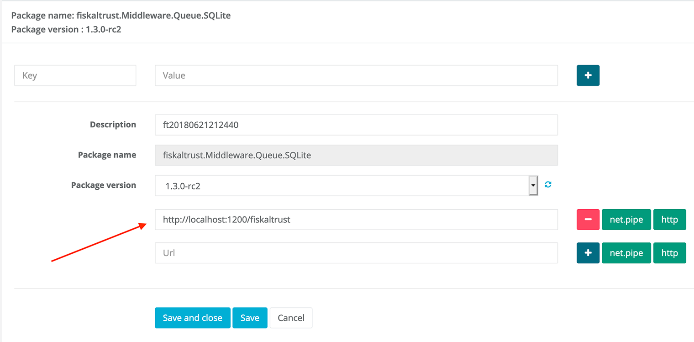
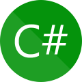

## Communication
The fiskaltrust.Middleware supports different communication protocols, effectively giving our users the possibility to use it on all currently available platforms and implement the interface in all state-of-the-art programming languages. This enables our users to choose the communication type that suits their scenario best.

The communication protocol is specified by setting the respective URL in the package configuration of the fiskaltrust.Portal. The buttons to the right of the URL field can be used to quickly insert the respective URL:

_Buttons for other URL options (like gRPC) may be available as well, depending on the country._

:::info

Depending on the version of the Middleware, different protocols are supported (for a summarized overview, please see the table at the end of this section). We're currently working on unifying the Middleware experience for all markets to provide the same communication protocols for all markets and operating system.

:::

### gRPC
The gRPC protocol is currently only available in the Middleware for Germany, please see the [German appendix](../../middleware-de-kassensichv/communication/communication.md) for further information.

We recommend using gRPC for new implementations, as it has several advantages (including performance, reliability, asynchronous streams, and static message contracts) and is supported by most programming frameworks.

### REST web service
When selecting REST (_Representational State Transfer_), the Middleware hosts a HTTP service that can be used like any commonly used web service. Messages can either be encoded with _JSON_ or _XML_, depending on the user's preference.

The offered REST functions accept POST request, the URL is composed like this: `http://[specified-url]/[xml|json]/[v0|v1]/[echo|sign|journal]`.

For sample requests of the most commonly used receipt cases and journals, please have a look at our [Postman Collection](https://github.com/fiskaltrust/middleware-demo-postman).

XSD files which describe the REST interface of the fiskaltrust.Middleware are available at [dist/XSD](https://github.com/fiskaltrust/interface-doc/tree/master/dist/XSD).

We recommend using REST in case you're already familiar with its principles and don't want to use gRPC for any reasons.

#### Country specifics
In Austria and France, REST can currently only be used by adding a _helper_ package provided by fiskaltrust. Please refer to the [Austrian appendix](../../middleware-at-rksv/communication/communication.md) for more details. In Germany, the Middleware natively supports REST without using a helper.

### WCF Web Service
The _Windows Communication Foundation_ (WCF) is used to access the fiskaltrust.Middleware with SOAP calls, either via a network or a pipes based communication approach. Further information on this subject can be found in the [official Microsoft docs](https://docs.microsoft.com/en-us/dotnet/framework/wcf/bindings).

WCF supports different underlying protocols: _http, https, net.tcp_ and _net.pipe_ (which is most interesting in cases where the system's configuration prevents opening TCP ports). For configuring a custom message size and a custom time out, it is possible to specify the parameter `messagesize` (in bytes) and the parameter `timeout` (in seconds) on the configuration page.

A WSDL file which describes the WCF interface of the fiskaltrust.Middleware is available at [dist/WSDL](https://github.com/fiskaltrust/interface-doc/tree/master/dist/WSDL).

### User specific protocols
With the Middleware's _helper_ topology, it is possible to connect the Middleware to POS-Systems in every scenario, as it can be easily extended to support any other protocol as well. Please contact our support if you require assistance for a special case.

### Summary
The following table displays which protocols are currently available in which country:

| Communication service | AT                         | DE            | FR                         | IT            |
|-----------------------|----------------------------|---------------|----------------------------|---------------|
| **gRPC**              | not yet supported          | **supported** | not yet supported          | **supported** |
| **REST**              | **supported (via helper)** | **supported** | **supported (via helper)** | **supported** |
| **WCF**               | **supported**              | **supported** | **supported**              | **supported** |
| **serial/TCP**        | **supported (via helper)** | not supported | not supported              | not supported |

As mentioned above, the Middleware versions will be unified in the upcoming version 2.0. 

### Sample implementations
Our latest samples, which demonstrate the communication protocols we recommend for the respective languages, are available here:

| C#                                                                                                | Java                                                                                      | Node.js                                                                                          | Android                                                                                              | Postman                                                                                         |
|---------------------------------------------------------------------------------------------------|-------------------------------------------------------------------------------------------|--------------------------------------------------------------------------------------------------|------------------------------------------------------------------------------------------------------|-------------------------------------------------------------------------------------------------|
| :--:                                                                                              | :----:                                                                                    | :-------:                                                                                        | :-------:                                                                                            | :-------:                                                                                       |
|  |  |  |  |  |

Additionally, other samples (including legacy ones) can be found in our [demo repository](https://github.com/fiskaltrust/demo).
