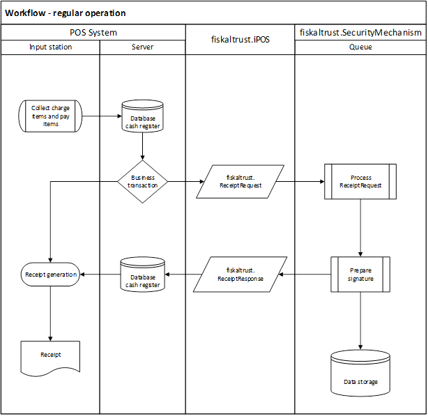
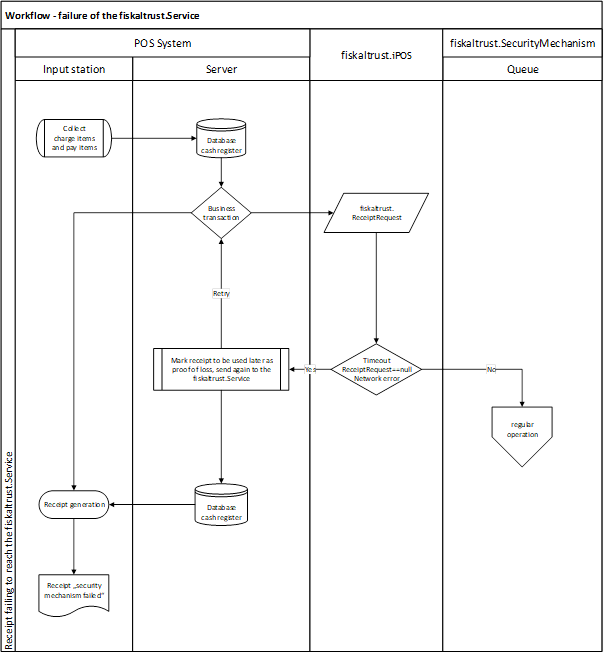
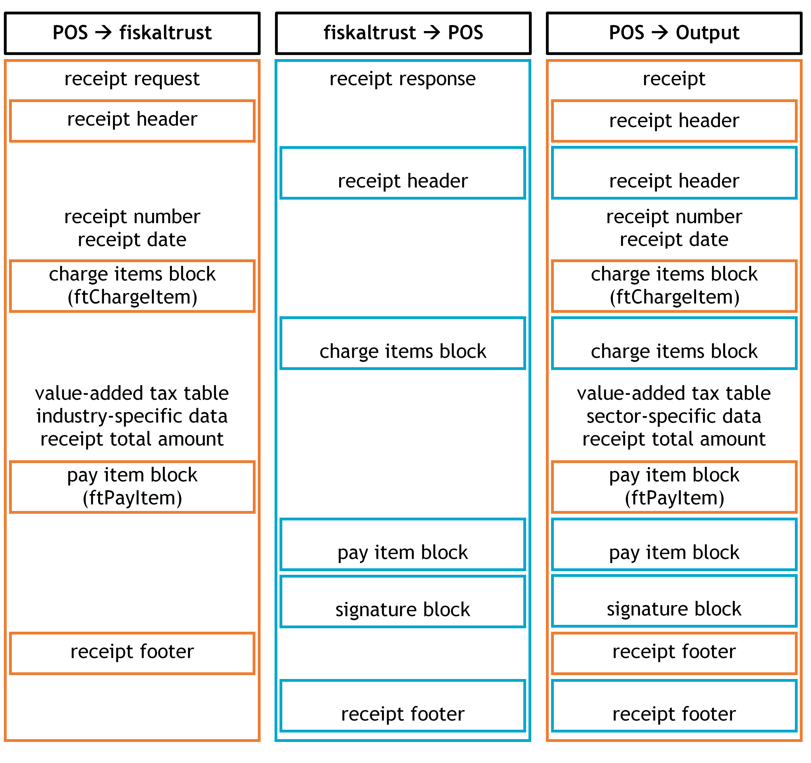

# General Part

The technical specification of the data interface described in this document provides information regarding the following areas:

1. Access to the fiskaltrust.Service
2. Integration into the receipt based cash register workflow
3. The data structure
4. Function structure of the interface
5. Types of communication with fiskaltrust.Service
6. Operating categories

Interface specification is provided by fiskaltrust.Interface nuget package, which can be found at <https://www.nuget.org/packages/fiskaltrust.interface>

For specifications or provisions of national law, please refer to the appropriate appendix.

## Version History

| **Date**   | **Task**                                                                              | **Version** | **Person** |
|------------|---------------------------------------------------------------------------------------|-------------|------------|
| 18.10.2015 | V0 first draft                                                                        |             | TS         |
| 26.10.2015 | Revision                                                                              |             | AK         |
| 01.11.2015 | Property descriptions in English                                                      |             | TS         |
| 14.02.2016 | ReceiptRequest/cbPreviousReceiptID field added                                        |             | TS         |
| 18.04.2016 | Interface definitions extended                                                        |             | TS         |
| 12.05.2016 | Appendix tables updated                                                               |             | TS         |
| 13.05.2016 | Chapter operating modes added                                                         |             | TS         |
| 13.05.2016 | Revision                                                                              |             | AK         |
| 13.05.2016 | Workflows                                                                             |             | TS         |
| 14.05.2016 | Revision                                                                              |             | AK         |
| 25.05.2016 | Definition of terms extended                                                          |             | AK, TS     |
| 31.05.2016 | Definition of terms applied in text                                                   |             | AK         |
| 01.06.2016 | Additions REST and configuration                                                      |             | TS, AK     |
| 26.07.2016 | Revision                                                                              |             | FH         |
| 16.06.2017 | Revision                                                                              |             | LFI        |
| 22.03.2018 | Internationalization                                                                  |             | CGU        |
| 04.05.2018 | Precising usage with multiple markets                                                 | 0.96        | TST        |
| 22.10.2018 | Update of document structure, content, and phrasing of the general, AT, and FR parts. | 1           | MMD        |

*Table 1. Version History*

## Terminology

Table 2 contains descriptions and explanations of all general terms and abbreviations used in this document. For specifications or provisions of national law, please refer to the appropriate appendix.

| **Term**                      | **Description**                                                                                                                                                                                                                                          |
|-------------------------------|----------------------------------------------------------------------------------------------------------------------------------------------------------------------------------------------------------------------------------------------------------|
| fiskaltrust.SecurityMechanism | Security mechanisms developed by fiskaltrust to meet legal national requirements for the fiscalization of POS systems. This security equipment is included in our products.                                                                              |
| fiskaltrust.iPOS              | Standardized interface for connecting cash registers with the fiskaltrust.SecurityMechanism                                                                                                                                                              |
| fiskaltrust.Journal           | Facility for electronic storage of receipts on a storage device. The internal storage is done in a high-accuracy data format. A wide range of national provisions are managed in parallel.                                                               |
| fiskaltrust.Queue             | Receipt processing equipment to guarantee required serial recording of receipts internally using continuous numbering of receipts and independent control of the cumulative counter. These components become an integral part of all processed receipts. |
| fiskaltrust.Service           | Market independent, deployment independent, and communication technology independent configured set of fiskaltrust products.                                                                                                                             |
| fiskaltrust.Helipad           | API for configuration purposes and data upload, accessible on https://helipad.fiskaltrust.cloud.                                                                                                                                                         |
| fiskaltrust.Packages          | API for versioned and packaged components, accessible on https://packages.fiskaltrust.cloud.                                                                                                                                                             |
| fiskaltrust.Portal            | Market dependent portal where all configuration settings and the relevant extensions are managed.                                                                                                                                                        |
| AccountID                     | API access credential ID for the account. Can be found on the Account overview page in the portal.                                                                                                                                                       |
| Account AccessToken           | API access credential Token for the account. Can be found on the Account overview page in the portal.                                                                                                                                                    |
| CashBoxId                     | API access credential ID for the CashBox. Can be found on the CashBox Configuration page in the portal.                                                                                                                                                  |
| CashBox AccessToken           | API access credential Token for the CashBox. Can be found on the CashBox Configuration page in the portal.                                                                                                                                               |
| CashBoxIdentification         | Value to identify the Queue. Can be found on the Queue Configuration page in the portal.                                                                                                                                                                 |

<span id="_Ref527824596" class="anchor"></span>*Table 2. Definition of Terms and Abbreviations (general)*

## Cash Register Integration

While designing the integration of fiskaltrust.Service into Cash Register Systems, our goal was to minimize the impact to the existing workflow as much as possible. With that in mind we've developed the following implementation suggestion.

The best time for the integration is right after all services and payments have been gathered and the receipt has been created in the system, but before it is being printed (response created electronically). Right at that point the receipt data will be transferred to the fiskaltrust.SecurityMechanism via fiskaltrust.iPOS.

### Receipt creation process

This chapter describes the general process and workflow of creating receipts with fiskaltrust.Service.

#### The fiskaltrust.SecurityMechanism

The regular workflow of the fiskaltrust.SecurityMechanism defines the steps required for creation of a receipt as follows:

  - assign a sequential receipt number
  - increase sales counters
  - chain receipts
  - save all data.

This additional receipt data, generated by fiskaltrust.SecurityMechanism, is sent back to the cash register and has to be stored in the POS. After storage is completed, the entire receipt - featuring both the cash register and the fiskaltrust.SecurityMechanism data - can be handed out printed on paper or as an electronic receipt.


<span id="_Toc527986801" class="anchor"></span>*Illustration 1. Process of the cash register integration with fiskaltrust.SecurityMechanism*

#### Workflow - regular operation

The following diagram illustrates the regular creation of a receipt with fiskaltrust.Service. The implementation of a fiskaltrust.SecurityMechanism may differ between countries and derive from their national laws – for details please refer to the appropriate appendix.



<span id="_Toc527986802" class="anchor"></span>*Illustration 2. Workflow - regular operation*

#### Workflow - special receipts

The following diagram illustrates the creation of a special receipt with fiskaltrust.Service. For a general description of special receipts, please refer to Receipt for special functions chapter, on page 23. For national laws on receipts, refer to the appropriate appendix.


<span id="_1597121563" class="anchor"></span>*Illustration 3. Workflow - special receipts*

#### Workflow - failure of communication or failure of the fiskaltrust.Service (timeout)

The following diagram illustrates the workflow of a failure of fiskaltrust.Service. For a description of recovering, please refer to the appropriate appendix.



<span id="_Toc527986805" class="anchor"></span>*Illustration 4. Workflow - failure of the fiskaltrust.Service (timeout)*


<span id="_Toc527986806" class="anchor"></span>*Illustration 5. Workflow - failure of the fiskaltrust.Service*

### Receipt for special functions

There are several receipt requirements fulfilled by the fiskaltrust.Service in addition to the usual receipts produced by business transactions. Those special receipts can support the process of collecting additional information.

This section describes the receipt types used for those special functions. For further information on how to fulfil the requirements of national laws, please refer to the appropriate appendix.

#### Zero Receipt

A zero receipt is a universal data carrier and storage. The cash register sends a receipt with an empty charge items block (ftChargeItem) and an empty pay items block (ftPayItem) which logically contain a total amount of "0".

The fiskaltrust.SecurityMechanism sends the necessary blocks, such as the receipt header, the charge item block, and the signature block in the response. This response is either printed or issued electronically and has to be archived.

Further you can find examples of special cases of zero receipts.

##### Start Receipt (Initial Receipt)

The start receipt has to be sent before the security mechanism is used for the first time. This receipt receives a meaningful response from fiskaltrust.SecurityMechanism only the first time: in order to start operative calculations.

##### Stop Receipt (Closing Receipt)

The stop receipt is required for scheduled decommissioning of security mechanisms and/or cash registers. The stop receipt is used to switch off: the receipt chaining, the counter up-counting, and the totalizer storing. It also concludes the data collection log.

This receipt has a meaningful response from fiskaltrust.SecurityMechanism only the first time: in order to stop operative calculations and the operation of a queue. After receiving a stop receipt the queue will be closed. There will be no positive response from the cash register when a receipt is send to a closed queue.

A closed queue can’t be reopened with a start receipt. Instead, a new queue has to be generated and initialized with a start receipt.

##### End of Failure Receipt (Collective Failure Report)

If the fiskaltrust.Service stopped responding, if the response does not comply with the interface description, or if a cash register cannot communicate with fiskaltrust.Service anymore, it is most likely due to a failure of fiskaltrust.Service. Such a failure means that the electronic recording system is not operational and there is no access to the appropriate journal. In such case, the following steps must be taken:

  - The cash register or input station must automatically produce a receipt and its copy.
  - The receipt must be marked with the identification "electronic recording system failed" and with the current failure counter.
  - This copy needs to be kept until the failure is resolved. The creation and storing of the receipt copy can also be done electronically by the cash register or terminal.
  - After re-establishing the communication to fiskaltrust.Service, the cash register or the input station must send all receipts marked with the identification "receipt copy, electronic recording system failed" to fiskaltrust.Service. The ReceiptCase must be flagged with the code "failed receipt" in order to indicate the failure to fiskaltrust.Service, which will then issue a receipt response with the identification "electronic recording system failed" for each receipt.

An alternative way of handling such situation is the generation of a handwritten receipt. A carbon copy (or another copy, e.g. electronic copy) must be created and archived. After re-establishing communication with fikaltrust.Service, these copies are subsequently to be recorded as receipts. The receipt code has to be combined with the "failed receipt" code in order to notify fiskaltrust.Service of the failure.

After fiskaltrust.Service has received an "end of failure receipt", the status of failure is terminated by receiving a response with normal state code.

### Receipt structure

This chapter describes the receipt structure.



<span id="_Toc527986807" class="anchor"></span>*Illustration* *6. Receipt Structure - general; cash register-receipt data (header, charge items, pay items, footer) and fiskaltrust-receipt data (header, charge items, pay items, signature, footer)*

#### Receipt Header

The receipt header can be branded with label and/or logo of the issuing company (see figure above) which is usually done already at the cash register. If required, receipt header can be further extended through fiskaltrust.Service.

#### Charge Items Block

The charge items block on the cash register receipt contains the details of services or items sold. In addition, a tax on sales code or other item specific data (such as e.g. the serial number) can be included.

If required, the charge items block can be extended through fiskaltrust.Service. This should be done by setting the quantity or the amount due to "0" to keep the amount unchanged (e.g. a cash transactions amount).

#### Pay Items Block

The pay items block of the cash register receipt contains the details of payments of business transactions received (these include payments with bank or credit card, or other comparable electronic means of payments, cash cheques as well as vouchers, coupons, token coins or similar means of payment) in local currency.

If required, the pay item block can be extended through fiskaltrust.Service. As with the charge items block, this should only be done by setting the quantity or the amount due to "0" in order not to change cash and cash equivalents.

#### Signature Block

The fiskaltrust.SecurityMechanism generates signature blocks, which include security features defined by national laws (see appropriate appendix for further definition). They may also include some optional additional information, such as references to training or reverse posting, or an information about an operating failure of the signature creation device. Cash registers should add the signature block to the receipt output between the pay item block and the receipt footer.

#### Receipt Footer

The receipt footer contains messages or announcements for the customer. It can be extended through fiskaltrust.Service. The cash register can display additional rows before or after the receipt footer. The rows of the receipt footer of the fiskaltrust.Service should be included in any case, as they can contain important directions for the company or customer regarding the handling of receipts.

### Data Collection Log

The Data Collection Log is generally defined by national laws. For further, country-specific information, please refer to the appropriate appendix.

### Receipt Journal

The ReceiptJournal is used to record, hash, and chain all requests to the fiskaltrust.Service and the resulting responses. The first part of the returned ReceiptIdentification is an upcounting number generated by ReceiptJournal.

### Action Journal

The ActionJournal collects all operational incidents. This can be the date and time of start or failure of the service, as well as any other information related to fiskaltrust.Service and fiskaltrust.SecurityMechanism.

## Data structures

This chapter outlines several data structures, which are used in the communication with the fiskaltrust.Service.

### Receipt Request

The cash register transfers the data of an entire receipt request to the fiskaltrust.Service using the ReceiptRequest data structure.

The details of fields supported by this data structure are outlined in <span class="underline">Table 3</span> below. The field fiskaltrust receipt case (ftReceiptCase) is of the highest importance for the correct processing of the receipt. This field defines the receipt type, determines if the receipt has to be secured accordingly to the national law, and establishes the way to calculate the correct values for each national counter.

The information necessary for processing of a receipt is provided through the configuration of fiskaltrust.SecurityMechanism.

| **Field name**               | **Data type**         | **Default Value**<br />**Mandatory Field** | **Description**                                                                                                                                                                                                                                                                                                                                    | **IF-Version** |
|------------------------------|-----------------------|--------------------------------------------|----------------------------------------------------------------------------------------------------------------------------------------------------------------------------------------------------------------------------------------------------------------------------------------------------------------------------------------------------|----------------|
| `ftCashBoxID`                | `guid/string`         | empty-string<br />mandatory                | This ID is assigned by the fiskaltrust-user portal and is a part of the authentication of the cash register.                                                                                                                                                                                                                                       | 0-             |
| `ftQueueID`                  | `guid/string`         | null<br />optional                         | The QueueID is required only when a load balancer is used. The value of the ftQueueID allows the load balancer to find the correct route to the corresponding Queue.                                                                                                                                                                               | 0-             |
| `ftPosSystemId`              | `guid/string`         | null<br />optional                         | This field identifies and documents the type and software version of the PosSystem sending the request. It is used for audits and as a base for commission calculation. The PosSystem itself has to be created in the portal and its ID can be implemented as a constant value by the PosCreator.                                                  | 0-             |
| `cbTerminalID`               | `String`<br />Max 1k  | empty-string<br />mandatory                | The unique identification of the input station/ cash register within a ftCashBoxID                                                                                                                                                                                                                                                                 | 0-             |
| `cbReceiptReference`         | `String`<br />Max 1k  | empty-string<br />mandatory                | Reference number returned by the cash register. Ideally, this value would be a unique receipt number for the cash register, to allow saving of the return value to the cash register data set.                                                                                                                                                     | 0-             |
| `cbReceiptMoment`            | `DateTime`            | null<br />mandatory                        | The time of receipt creation. Must be provided in UTC.                                                                                                                                                                                                                                                                                             | 0-             |
| `cbChargeItems`              | `ChargeItem[]`        | null<br />mandatory                        | List of services or items sold.                                                                                                                                                                                                                                                                                                                    | 0-             |
| `cbPayItems`                 | `PayItem[]`           | null<br />mandatory                        | List of payment received.                                                                                                                                                                                                                                                                                                                          | 0-             |
| `ftReceiptCase`              | `Int64`               | 0<br />mandatory                           | Type of business transaction ac-cording to the [reference table](#_Type_of_Receipt:) in the appendix. It is used to choose the right processing logic.                                                                                                                                                                                             | 0-             |
| `ftReceiptCaseData`          | `String`<br />Max 64k | empty-string<br />optional                 | Additional data for the business transaction, currently accepted only in JSON format. Although all string values are supported, we suggest using data structures serialized into JSON format.                                                                                                                                                      | 0-             |
| `cbReceiptAmount`            | `Decimal`?            | null<br />optional                         | Total receipt amount incl. taxes (gross receipt amount). If it is not provided, it can be calculated with the sum of the amounts of the cbChargeItems. It can be useful and important for systems working with net amounts, as it helps to apply different methods of calculation and rounding.                                                    | 0-             |
| `cbUser`                     | `String`<br />Max 1k  | empty-string<br />optional                 | Identification of the user, who creates the receipt. Although all string values are supported, we suggest using data structures serialized into JSON format.                                                                                                                                                                                       | 0-             |
| `cbArea`                     | `String`<br />Max 1k  | empty-string<br />optional                 | Identification of the section/field, in which the receipt is created. Although all string values are supported, we suggest using data structures serialized into JSON format.<br /><span class="underline">Examples:<br /></span>Table number of a gastronomic business; a department of a commercial establishment; the vehicle of a taxi company | 0-             |
| `cbCustomer`                 | `String`<br />Max 1k  | empty-string<br />optional                 | Identification of the client, for whom the receipt is created. Although all string values are supported, we suggest using data structures serialized into JSON format.<br /><span class="underline">Example:<br /></span>Email address                                                                                                             | 0-             |
| `cbSettlement`               | `String`<br />Max 1k  | empty-string<br />optional                 | Settlement identification where this receipt will be added.                                                                                                                                                                                                                                                                                        | 0-             |
| `cbPreviousReceiptReference` | `String`<br />Max 1k  | null<br />optional                         | cbReceiptReference of the previous receipt. Used to connect multiple requests for a single Business Case.                                                                                                                                                                                                                                          | 0-             |
<!-- PVO: "Decimal?" is this a mistake? -->

<span id="_Ref527915361" class="anchor"></span>*Table 3. Receipt Request*

**C# class ReceiptRequest:**
```cs
namespace fiskaltrust.ifPOS.v0
{
  public class ReceiptRequest
  {
    public string ftCashBoxID { get; set; }
    public string ftQueueID { get; set; }
    public string ftPosSystemId { get; set; }
    public string cbTerminalID { get; set; }
    public string cbReceiptReference { get; set; }
    public DateTime cbReceiptMoment { get; set; }
    public ChargeItem[] cbChargeItems { get; set; }
    public PayItem[] cbPayItems { get; set; }
    public long ftReceiptCase { get; set; }
    public string ftReceiptCaseData { get; set; }
    public decimal? cbReceiptAmount { get; set; }
    public string cbUser { get; set; }
    public string cbArea { get; set; }
    public string cbCustomer { get; set; }
    public string cbSettlement { get; set; }
    public string cbPreviousReceiptReference { get; set; }
  }
}
```

<span id="_Toc527986825" class="anchor"></span>*Code 1. Definition of class ReceiptRequest*

### Receipt response

The fiskaltrust.Service sends back the processed data to the cash register through the receipt response.

The data included in the request, such as header, service, pay items, and footer, will not be sent back. The returned data is added to the receipt as supplement to the data of the receipt request.

| **Field name**            | **Data type**     | **Default Value Mandatory Field** | **Description**                                                                                                                                                                                                          | **Version** |
|---------------------------|-------------------|-----------------------------------|--------------------------------------------------------------------------------------------------------------------------------------------------------------------------------------------------------------------------|-------------|
| `ftCashBoxID`             | `guid/string`     | mandatory                         | Allocated from request to response.                                                                                                                                                                                      | 0-          |
| `ftQueueID`               | `guid/string`     | mandatory                         | QueueId used for processing.                                                                                                                                                                                             | 0-          |
| `ftQueueItemID`           | `guid/string`     | mandatory                         | QueueItemId used for processing.                                                                                                                                                                                         | 0-          |
| `ftQueueRow`              | `long`            | mandatory                         | QueueRow used for processing.                                                                                                                                                                                            | 0-          |
| `cbTerminalID`            | `string`          | mandatory                         | Allocated from request to response.                                                                                                                                                                                      | 0-          |
| `cbReceiptReference`      | `string`          | mandatory                         | Allocated from request to response.                                                                                                                                                                                      | 0-          |
| `ftCashBoxIdentification` | `string`          | mandatory                         | Cash register identification number.                                                                                                                                                                                     | 0-          |
| `ftReceiptIdentification` | `string`          | mandatory                         | Upcounting receipt number allocated through fiskaltrust.SecurityMechanisms.                                                                                                                                              | 0-          |
| `ftReceiptMoment`         | `DateTime`        | mandatory                         | Time of receipt processing through fiskaltrust.Service, provided in UTC.                                                                                                                                                 | 0-          |
| `ftReceiptHeader`         | `string[]`        | null<br />optional                | Additional header for the receipt. Each row can contain up to 4096 characters. Line breaks should be inserted by the cash register independently.                                                                        | 0-          |
| `ftChargeItems`           | `ChargeItem[]`    | null<br />optional                | Additional data sets in the charge items block which the cash register has to print onto the receipt. By default no additional data is provided. If additional data is provided, these data sets state an amount of "0". | 0-          |
| `ftChargeLines`           | `string[]`        | null<br />optional                | Additional text line for the charge items block which the cash register has to print onto the receipt. Each row can contain up to 4096 characters, line breaks should be inserted by the cash register independently.    | 0-          |
| `ftPayItems`              | `PayItem[]`       | null<br />optional                | Additional data set in the pay items block which the cash register has to print onto the receipt. By default no additional data is provided. If additional data is provided, these data sets state an amount of "0".     | 0-          |
| `ftPayLines`              | `string[]`        | null<br />optional                | Additional text line for the pay items block which the cash register has to print onto the receipt. Each row can contain up to 4096 characters, line breaks should be inserted by the cash register independently.       | 0-          |
| `ftSignatures`            | `SignatureItem[]` | empty-array<br />mandatory        | Signature block, which the cash register has to print onto the receipt.                                                                                                                                                  | 0-          |
| `ftReceiptFooter`         | `string[]`        | null<br />optional                | Additional footer for the receipt. Each row can contain up to 4096 characters, line breaks should be inserted by the cash register independently.                                                                        | 0-          |
| `ftState`                 | `Int64`           | 0<br />mandatory                  | Flag indicating the status of the fiskaltrust.Service; set accordingly to the reference table in the appendix.                                                                                | 0-          |
| `ftStateData`             | `string`          | empty-string<br />optional        | Additional information regarding the status of the fiskaltrust.Service, currently accepted only in JSON format.                                                                                                          | 0-          |

<span id="_Toc510009092" class="anchor"></span>*Table 4. Receipt Response*

**C\# class ReceiptResponse:**
```cs
namespace fiskaltrust.ifPOS.v0
{
  public partial class ReceiptResponse
  {
    public string ftCashBoxID { get; set; }
    public string ftQueueID { get; set; }
    public string ftQueueItemID { get; set; }
    public long ftQueueRow { get; set; }
    public string cbTerminalID { get; set; }
    public string cbReceiptReference { get; set; }
    public string ftCashBoxIdentification { get; set; }
    public string ftReceiptIdentification { get; set; }
    public DateTime ftReceiptMoment { get; set; }
    public string[] ftReceiptHeader { get; set; }
    public ChargeItem[] ftChargeItems { get; set; }
    public string[] ftChargeLines { get; set; }
    public PayItem[] ftPayItems { get; set; }
    public string[] ftPayLines { get; set; }
    public SignaturItem[] ftSignatures { get; set; }
    public string[] ftReceiptFooter { get; set; }
    public long ftState { get; set; }
    public string ftStateData { get; set; }
  }
}
```

<span id="_Toc527986826" class="anchor"></span>*Code 2. Definition of class ReceiptResponse*

### Charge Items Entry

Charge items entries are used for receipt requests as well as for receipt responses.

The details of fields supported by this data structure are outlined in Table 5 below. The ftChargeItemCase field is particularly important for the correct processing of the receipt. A reference table for the supported values can be found in the appendix.

| **Field Name**         | **Data Type**         | **Default Value **<br />**Mandatory Field** | **Description**                                                                                                                                                                      | **Version** |
|------------------------|-----------------------|---------------------------------------------|--------------------------------------------------------------------------------------------------------------------------------------------------------------------------------------|-------------|
| `Position`             | `long`                | 0<br />optional                             | Line number or position number on the Receipt. Used to preserve the order of lines on the receipt.                                                                                   | 0-          |
| `Quantity`             | `Decimal`             | 1.0<br />mandatory                          | Amount or volume (number) of service(s) or items of the entry.                                                                                                                       | 0-          |
| `Description`          | `String`<br />Max 1k  | empty-string<br />mandatory                 | Name, description of customary indication, or type of the service or item.                                                                                                           | 0-          |
| `Amount`               | `Decimal`             | 0.0<br />mandatory                          | Gross total price of service(s). The gross individual price, net total price, and net individual price, have to be calculated using the amount and either VAT rate or VAT amount.    | 0-          |
| `VATRate`              | `Decimal`             | 0.0<br />mandatory                          | VAT rate as percentage.                                                                                                                                                              | 0-          |
| `ftChargeItemCase`     | `Int64`               | 0<br />mandatory                            | Type of service or item according to the refer-ence table in the appendix. It is used in order to determine the processing logic for the cor-resopnding business transaction         | 0-          |
| `ftChargeItemCaseData` | `String`<br />Max 64k | empty-string<br />optional                  | Additional data about the service, currently accepted only in JSON format.                                                                                                           | 0-          |
| `VATAmount`            | `Decimal`?            | 0.0<br />optional                           | If the VAT amount is indicated, it can be used to calculate the net amount in order to avoid rounding errors which are especially likely to appear in row-based net price additions. | 0-          |
| `AccountNumber`        | `String`<br />Max 1k  | empty-string<br />optional                  | Account number for transfer into bookkeeping                                                                                                                                         | 0-          |
| `CostCenter`           | `String`<br />Max 1k  | empty-string<br />optional                  | Indicator for transfer into cost accounting (type, center, and payer)                                                                                                                | 0-          |
| `ProductGroup`         | `String`<br />Max 1k  | empty-string<br />optional                  | This value allows the customer the logical grouping of products.                                                                                                                     | 0-          |
| `ProductNumber`        | `String`<br />Max 1k  | empty-string<br />optional                  | Value used to identify the product.                                                                                                                                                  | 0-          |
| `ProductBarcode`       | `String`<br />Max 1k  | empty-string<br />optional                  | Product’s barcode                                                                                                                                                                    | 0-          |
| `Unit`                 | `String`<br />Max 1k  | empty-string<br />optional                  | Unit of measurement                                                                                                                                                                  | 0-          |
| `UnitQuantity`         | `Decimal`?            | null<br />optional                          | Quantity of the service(s) of receipt entry, displayed in indicated units.                                                                                                           | 0-          |
| `UnitPrice`            | `Decimal`?            | null<br />optional                          | Gross price per indicated unit.                                                                                                                                                      | 0-          |
| `Moment`               | `DateTime`            | null<br />optional                          | Time of service (year, month, day, hour, minute, second)                                                                                                                             | 0-          |

<span id="_Ref527915365" class="anchor"></span>*Table 5. Charge Items Entry (ftChargeItems)*

**C# class ChargeItem:**
```cs
namespace fiskaltrust.ifPOS.v0
{
  public class ChargeItem
  {
    public long Position { get; set; }
    public decimal Quantity { get; set; }
    public string Description { get; set; }
    public decimal Amount { get; set; }
    public decimal VATRate { get; set; }
    public long ftChargeItemCase { get; set; }
    public string ftChargeItemCaseData { get; set; }
    public decimal? VATAmount { get; set; }
    public string AccountNumber { get; set; }
    public string CostCenter { get; set; }
    public string ProductGroup { get; set; }
    public string ProductNumber { get; set; }
    public string ProductBarcode { get; set; }
    public string Unit { get; set; }
    public decimal? UnitQuantity { get; set; }
    public decimal? UnitPrice { get; set; }
    public DateTime? Moment { get; set; }
  }
}
```

<span id="_Toc527986827" class="anchor"></span>*Code 3. Definition of class ChargeItem*

### Pay Items Entry

Payment entries are used for receipt requests as well as for receipt responses.

The ftPayItemCase field is particularly important for the correct processing of the receipt. This field can help to decide if the receipt has to be signed and the sum counter adjusted. A reference table for the supported values can be found in the appendix.

| Field Name          | Data Type             | Default Value<br />Mandatory Field | Description                                                                                                                                               | Version |
|---------------------|-----------------------|------------------------------------|-----------------------------------------------------------------------------------------------------------------------------------------------------------|---------|
| `Position`          | `long`                | 0<br />optional                    | Line number or positionnumber on the Receipt. Used to preserve the order of lines on the receipt                                                          |         |
| `Quantity`          | `Decimal`             | 1.0<br />mandatory                 | Number of payments. This value will be set to 1 in most of the cases. It can be greater then 1 e.g. when paying with multiple vouchers of the same value. | 0-      |
| `Description`       | `String`<br />Max 1k  | empty-string<br />mandatory        | Name or description of payment                                                                                                                            | 0-      |
| `Amount`            | `Decimal`             | 0.0<br />mandatory                 | Total amount of payment                                                                                                                                   | 0-      |
| `ftPayItemCase`     | `Int64`               | 0<br />mandatory                   | Type of payment according to the reference table in the appendix. It is used in order to determine the processing logic                | 0-      |
| `ftPayItemCaseData` | `String`<br />Max 64k | empty-string<br />optional         | Additional data about the payment, currently accepted only in JSON format                                                                                 | 0-      |
| `AccountNumber`     | `String`<br />Max 1k  | empty-string<br />optional         | Account number for transfer into bookkeeping                                                                                                              | 0-      |
| `CostCenter`        | `String`<br />Max 1k  | empty-string<br />optional         | Indicator for transfer into cost accounting (type, centre and payer)                                                                                      | 0-      |
| `MoneyGroup`        | `String`<br />Max 1k  | empty-string<br />optional         | This value allows the logical grouping of payment types                                                                                                   | 0-      |
| `MoneyNumber`       | `String`<br />Max 1k  | empty-string<br />optional         | This value identifies the payment type                                                                                                                    | 0-      |
| `Moment`            | `DateTime`?           | now<br />optional                  | Time of payment                                                                                                                                           | 0-      |

<span id="_Toc510009094" class="anchor"></span>*Table 6. Pay Items Entry*

**C# class PayItem:**
```cs
namespace fiskaltrust.ifPOS.v0
{
  public class PayItem
  {
    public long Position { get; set; }
    public decimal Quantity { get; set; }
    public string Description { get; set; }
    public decimal Amount { get; set; }
    public long ftPayItemCase { get; set; }
    public string ftPayItemCaseData { get; set; }
    public string AccountNumber { get; set; }
    public string CostCenter { get; set; }
    public string MoneyGroup { get; set; }
    public string MoneyNumber { get; set; }
    public DateTime? Moment { get; set; }
  }
}
```

<span id="_Toc527986828" class="anchor"></span>*Code 4. Definition of class PayItem*

### Signature Entry

The signature entry is only used for the receipt response.

The signature of the receipt must comply with the national law. The signature data returned in the response should be visualized on the receipt in the correct format, which is further described in the Appendix section of this document. The signature entries can also be used to visualize hints and messages related to the fiskaltrust.SecurityMechanism.

A reference text regarding the operating state of the fiskaltrust.SecurityMechanism can be sent back depending on the operating mode. This is in particular the case for receipts with special functions.

| Field Name          | Data Type             | Default Value<br />Mandatory Field | Description                                                                                                                                                 | Version |
|---------------------|-----------------------|------------------------------------|-------------------------------------------------------------------------------------------------------------------------------------------------------------|---------|
| `ftSignatureFormat` | `Int64`               | 0<br />mandatory                   | Format for displaying signature data according to the reference table in the appendix.                            | 0-      |
| `ftSignatureType`   | `Int64`               | 0<br />mandatory                   | Type of signature according to the reference table in the appendix, e.g.: signature indicating a failure notification | 0-      |
| `Caption`           | `String`<br />Max 1k  | empty-string<br />optional         | Heading, which has to be displayed as text above the signature data.                                                                                        | 0-      |
| `Data`              | `String`<br />Max 64k | empty-string<br />mandatory        | Signature content which has to be displayed in the specified format.                                                                                        |         |

<span id="_Toc510009095" class="anchor"></span>*Table 7. Signature Entry*

**C# class SignatureItem:**
```cs
namespace fiskaltrust.ifPOS.v0
{
  public class SignaturItem
  {
    public long ftSignatureFormat { get; set; }
    public long ftSignatureType { get; set; }
    public string Caption { get; set; }
    public string Data { get; set; }
  }
}
```

<span id="_Toc527986829" class="anchor"></span>*Code 5. Definition of class SigantureItem*

## Function structures

### iPOS Interface

This interface is a communication channel for interacting with the fiskaltrust.Service. It provides three basic functions: "echo", "sign", and "journal". The functions "echo" and "sign" return bare-objects, the function "journal" returns a wrapped-object.

#### Echo Function

This function provides fast and easy communication checks. The transferred message is sent back directly.

**C# call iPos Echo:**
```cs
string result = proxy.Echo("Message");
```

<span id="_Toc527986830" class="anchor"></span>*Code 6. Call to iPos Echo*

#### Sign Function

This is the key function of the fiskaltrust.Service. Once the sign function is called, the receipt data is transferred for processing. The result of the processing is then sent back as receipt response.

**C# call iPos Sign:**
```cs
fiskaltrust.ifPOS.v0.ReceiptRequest req;
//fill the properties of this request
fiskaltrust.ifPOS.v0.ReceiptResponse resp = proxy.Sign(req);
```

<span id="_Toc527986831" class="anchor"></span>*Code 7. Call to iPos Sign*

#### Journal Function

With this function, a variety of information can be retrieved from the fiskaltrust.Service, ranging from the status information to a general notifications protocol.

**C# call iPos Journal:**
```cs
Stream stream = proxy.Journal(ftJournalType, 0, DateTime.UtcNow.Ticks);
```

<span id="_Toc527986832" class="anchor"></span>*Code 8. Call to iPos Journal*

A list with possible values for the request parameter ftJournalType is provided in the reference table on page 54. The journal depends on national requirements and therefore the function has to run in the appropriate mode: exporting data in chunks, or as a whole.

## Communication

This chapter describes the ways to communicate with the fiskaltrust.Service via different network communication protocols. A fiskaltrust.Service exposes a WCF (Windows Communication Foundation) service to let POS-Systems interact with fiskaltrust.SecurityMechanism using fiskaltrust.Interface. Fiskaltrust also provides helpers to expand the communication interface for REST and serial/TCP protocols as well. This helpers can be activated and configured with the fiskaltrust.Portal.

### WCF Web Service

The Windows Communication Foundation (WCF) is used to access the fiskaltrust.Service via network. This technology is not only suitable for Windows platforms, as the name might imply, but can be used with all operating systems and applications through standards such as SOAP and REST. Further information on this subject can be found on:

<https://docs.microsoft.com/en-us/dotnet/framework/wcf/bindings>.

The WCF service will be hosted under the URL, which can be set in the fiskaltrust.Portal on the configuration page of fiskaltrust.Service.


<span id="_Toc527986808" class="anchor"></span>*Illustration 7. Configuration page of a fiskaltrust.Service*

Supported protocols are: http, https, net.tcp, net.pipe. For configuring a custom message size and a custom time out, it is possible to specify the parameter "messagesize" (in bytes) and the parameter "timeout" (in seconds) on the configuration page.

Fiskaltrust provides a specific helper (balancer) to manage more than one fiskaltrust.Service in order to create a load balancing of the calls. The reason for using this helper is usually a flow of calls that could overload a single fiskaltrust.Service. The configuration page requires a specific parameter for choosing the way the balancing will be managed (least active, round robin).

The journal stream bill is composed by a concatenation of streams of all fiskaltrust.Services managed by the Balancer helper, separated by a '\\0' (zero) character.

Usually, a proxy class should be created and used to execute the function calls.

**C# call for proxy class:**
```cs
//local SOAP service
BasicHttpBinding binding = new BasicHttpBinding(BasicHttpSecurityMode.None);
//configure endpoint 
EndpointAddress endpoint = new EndpointAddress(wcf_http_url);
//create proxy 
ChannelFactory<fiskaltrust.ifPOS.v0.IPOS> factory = 
    new ChannelFactory<fiskaltrust.ifPOS.v0.IPOS>(binding, endpoint);

var proxy = factory.CreateChannel();
```

<span id="_Toc527986833" class="anchor"></span>*Code 9. Call of proxy class*

#### SOAP

Simple Object Access Protocol (SOAP) is a network protocol which can exchange data across systems and can execute RPC calls.

With [`<basicHttpBinding>`](https://msdn.microsoft.com/en-us/library/system.servicemodel.basichttpbinding\(v=vs.110\).aspx), [`<netNamedPipeBinding>`](https://msdn.microsoft.com/en-us/library/system.servicemodel.netnamedpipebinding\(v=vs.110\).aspx) and [`<netTcpBinding>`](https://msdn.microsoft.com/en-us/library/system.servicemodel.nettcpbinding\(v=vs.110\).aspx), fiskaltrust.Service makes its functionality available on the local network.

**C# call for signing with SOAP:**
```cs
//create proxy and establish authentification
throw new NotImplementedException();
//call for signing receipt
ifPOS.v0.ReceiptRequest req;
fiskaltrust.ifPOS.v0.ReceiptResponse resp = proxy.Sign(req);
```

<span id="_Toc527986834" class="anchor"></span>*Code 10. Example call for signing with SOAP*

#### *Balancer Helper*

fiskaltrust provides a helper (balancer) to facilitate the workload management of multiple fiskaltrust.Queues by balancing the distribution of requests. It is used to prevent overloading of a single fiskaltrust.Queue. The configuration page allows the selection of a specific parameter indicating the way the balancing will be managed (least active, round robin).

The journal stream bill be composed by a concatenation of the streams of all the fiskaltrust.Services managed by the Balancer helper. The concatenated streams must be separated by a ‘\\0’ (zero) character.

### REST Web Service

Representational State Transfer architecture uses the classic http methods GET, PUT, POST and DELETE to communicate with fiskaltrust.SecurityMechanisms. The currently accepted data formats are XML and JSON. There are various implementations for REST which are all provided via Helper.

The functions accept POST requests and use the endpoint set via the parameter "host" as basis. The URL is extended by `/[xml | json]/[echo | sign | journal]` in order to call the respective functions.

#### *Balancer Helper*

The Balancer helper uses the standard calls from .net WCF WebInvoke for the implementation of REST. There are a few particular characteristics, stemming from the REST specification, e.g.: the dates have to be indicated in "wire format", details about these conventions can be found at:

<https://docs.microsoft.com/en-us/dotnet/framework/wcf/feature-details/stand-alone-json-serialization>.

#### REST Helper

The REST Helper uses [NancyFX](http://nancyfx.org) as REST server which is significantly more flexible with regards to serialization than a standard WCF call.

**JS/jQuery Example:**
```js
function sign() {
  var url = $("#serviceurl").val();
  url += "/json/sign";
  var reqdata = JSON.parse($("#reqdata").val());

  $.ajax({
    url:         url,
    type:        "POST",
    contentType: "application/json;encoding=utf-8",
    crossDomain: true,
    data:        reqdata,
    success:     success,
    error:       error
  });
}

function success(data, textStatus, jqXHR) {
  $("#respdata").val(JSON.stringify(data));
}
```

<span id="_Toc527986835" class="anchor"></span>*Code 11. JS/jQuery Example calling the REST Web Service*

### Serial-stream or TCP-stream protocol

The serial interface is still very common - especially for type-2 cash registers and non PC-based devices. In order to address these devices with fiskaltrust.Service, there is a particular communication protocol via stream which contains functions and uses data encoded into JSON.

In case when a cash register or an input station are not able to address SOAP or REST services, this stream-based protocol can also be addressed via a TCP stream.

As a special extension, device-specifically, the data stream can also be sent directly to the printer and analysed. A new receipt with signature can be generated on the basis of this data. During this process, the generated receipt data are also stored in the ReceiptJournal.

The Stream helper implements a serial communication using TCP or serial ports. On this helper’s configuration page the main parameter is the "connection" which provides the information to reach fiskaltrust.Service .

The data must have the following sequence of bytes to be sent:

  - (byte) 2
  - ASCII encoded command ("echo", "sign", "journal")
  - (byte) 9
  - ASCII encoded data
    - In case of "echo" call, the data is simply the text
    - In case of "sign" call, the data is the JSON serialisation of the ReceiptRequest class
    - In case of "journal" call, the data is a string composed by the following long typed values separated by ; (semicolon)
      - type of journal
      - timestamp from
      - timestamp to
  - (byte) 3
  - one byte CRC7 calculation of the previous bytes.

The received response will be:

  - (byte) 2
  - ASCII encoded command ("echo", "sign", "journal")
  - (byte) 9
  - ASCII encoded data
    - In case of "echo" call, the result string
    - In case of "sign" call, the ReceiptResponse
    - In case of "journal" call, the output sequence depending on the type of the journal requested
  - (byte) 3

one byte CRC7 calculation of the previous bytes except the first (byte) 2.

#### Data structure for call and response

**Request:**
```
<STX (0x02)>Command["Echo"|"Sign"]<TAB (0x09)>Data[JSON-ReceiptRequest]<ETX (0x03)><CRC7>
```

**Response:**
```
<STX (0x02)>Command["Echo"|"Sign"]<TAB (0x09)>Data[JSON-ReceiptRequest]<ETX (0x03)><CRC7>
```

<span id="_Toc527986836" class="anchor"></span>*Code 12. Data Structure for call and response*

## Operation Modes

### Components of the fiskaltrust.Service

Regardless of the characteristics of the product, fiskaltrust.Service consists of several logical components. This chapter provides an overview on these components.

#### Launcher

The Launcher is a software (file) named `fiskaltrust.exe`, which is used only for the on-premise installed products (e.g. AT products fiskaltrust.SignatureCard or fiskaltrust.SignatureBox). For Windows, it is a .NET command-line application and a .NET Windows service. For Linux and Mac, the launcher can be executed via Mono, version 3.2.8 or higher, or used as daemon.

The main tasks of the launcher are:

  - providing basic configuration settings such as ftCashBoxId and access token
  - comparing the configuration data retrieved from fiskaltrust.Helipad with the local configuration
  - updating nutshells accordingly to the configuration
  - execution of configured nutshells
  - load balancing of multiple queues

The executable file `fiskaltrust.exe` and the corresponding DLLs can be distributed via copy-paste and then configured and installed with the help of a command-line parameter. It can be downloaded (incl. configuration) from the Portal’s configuration-\>cashbox page, or found on nuget.org and configured manually.

#### ASP.<span></span>net 5/Core Web App

An ASP.<span></span>NET application provides the functionality of a queue via the REST service. This service is provided only on selected markets. For details, please refer to country specific appendix.

#### SSCD Nutshell

The SSCD (Secure Signature Creation Device) nutshell serves to encapsulate the communication with a signature creation device. The respective signature creation device can be accessed via different channels: directly, locally, or via network. This service is provided only on selected markets. For details, please refer to country specific appendix.

#### Queue Nutshell

The queue nutshell serves to encapsulate the functionality of a receipt chain for various platforms and localisations. In accordance with the interface description, the queues can be addressed individually or via a load balanced channel of the launcher.

#### Helper Nutshell

The Helper nutshell is used to support updates and configurations.

### Configuration of the fiskaltrust.Service

#### Online Portal

All configuration settings, as well as the relevant extensions, are managed via the online fiskaltrust.Portal. For further information, refer to the appropriate appendix.

#### Queue

A Queue is a part of communication line between the POS-System and the fiskaltrust.Service. All regular receipts created by the POS-System are sent to the fiskaltrust.Service to get secured and stored in the Queue, and the response of the fiskaltrust.SecurityMechanism is sent back. All special receipts (for example the periodical closings) are sent as "requests to execute a special function" to the fiskaltrust.Service and get answered by it. At least one Queue must be created for each POS-System.

#### Journal

A journal is an export of internal structured data of the receipts from the Queue(s). There are three types of journals: a protocol journal saving all requests, a journal which records all events happening in the queue (starts, stops, failures), and localized journals depeding on the national laws. For more details please refer to the appropriate appendix. The format of a common journal export is JSON.

#### Notifications

The information for notifications is extracted from the processing protocol and stored internally in the action journal. Helipad retrieves this information and processes it in accordance with country specific law. Special events have a localized reporting requirement. In online mode, notifications can be uploaded, automated and transported further at fiskaltrust.SecurityMechanism. If in offline mode, notifications are transported via zero receipts within the signature block.

#### Configuration Scenarios

The POS System connects to the fiskaltrust.Service to process the receipt chaining calculation. A Cash register means an individual fiskaltrust.SecurityMechanism - in the fiskaltrust.Portal it is called "CashBox" and represents the real CashRegister and its configuration with the SecurityMechanism. The cash register is identified via the ftCashBoxId. This is unique worldwide and also the first part of the authentication on the fiskaltrust.Helipad. The second part is an authentication token.

#### Single Queue scenario

The most common scenario uses a connection to a single fiskaltrust.Queue, which takes care of performing all the requested operations in accordance to the national law and requlations.


<span id="_Toc527986809" class="anchor"></span>*Illustration* *8. Use of an individual queue.*

#### Scenario with several queues for performance improvement

The POS System can require special operating conditions, e.g. a when a big flow of receipts is requested, the fiskaltrust.Service will ensure a high level of reliability by using multiple parallel Queues.

In this scenario, the fiskaltrust.Service hosts several Queues to optimize the performance of the service by distributing the workload evenly between the Queues. Each individual queue is reachable by the fiskaltrust.IPOS. This direct connection can be necessary in case of receipts with special functions and also in in case of special chunked Journals (Journals for specific range). The queues can be operated in a load balancing mode or in a backup mode via the balancer interface.


<span id="_Toc527986810" class="anchor"></span>*Illustration 9. fiskaltrust.Service in a configuration for performance optimization*

## Installation

### fiskaltrust.Service

#### Windows, Linux, Mac

The mentioned platforms use the launcher `fiskaltrust.exe` to execute the fiskaltrust.SecurityMechanism. For Linux and Mac, the launcher can be executed via Mono, version 3.2.8 or higher. For Windows the launcher can be executed via the .NET framework, version 4.0 or higher, or via Mono, version 3.2.8 or higher.

The following call parameters are available with the launcher `fiskaltrust.exe`:

| **Parameter**                  | **Description**                                                                                                                                                 |
|--------------------------------|-----------------------------------------------------------------------------------------------------------------------------------------------------------------|
| `-cashboxid`                   | Sets the CashBoxId into the static configuration (`fiskaltrust.exe.config`). The value is a GUID in format `00000000-0000-0000-0000-000000000000`.              |
| `-accesstoken`                 | Sets the AccessToken in the static configuration (`fiskaltrust.exe.config`) for online communication                                                            |
| `-useoffline`                  | Sets the offline mode in the static configuration (`fiskaltrust.exe.config`). The value is a boolean: true \| false                                             |
| `-test`                        | Executing as command line program. Basic information is provided in the console. Should be indicated as last parameter, if it is set in connection with others. |
| `-i`                           | Install Windows service                                                                                                                                         |
| `-u`                           | Uninstall Windows service                                                                                                                                       |
| `-servicename=[myservicename]` | Sets the service name in connection with -i and -u                                                                                                              |
| `-displayname=[mydisplayname]` | Sets the service display name within the system control in connection with -i                                                                                   |
| `-description=[mydescription]` | Sets the service description within the system control in connection with -i                                                                                    |
| `-servicefolder`               | Sets folder containing the service files in the static configuration (`fiskaltrust.exe.config`)                                                                 |
| `-sslvalidation`               | Sets the certificate validation when connecting through SSL in the static configuration (`fiskaltrust.exe.config`). The value is a boolean: true \| false       |
| `-sandbox`                     | Sets the environment to be used in the static configuration (`fiskaltrust.exe.config`). The value is a boolean: true (sandbox) \| false (production)            |
| `-packagesurl`                 | Sets the url of the package server used to download the packages in the static configuration (`fiskaltrust.exe.config`)                                         |
| `-logfile`                     | Sets the file used to log the output messages in the static configuration (`fiskaltrust.exe.config`)                                                            |
| `-connectiontimeout`           | Sets the timeout (in seconds) for the HTTP/HTTPS call to download the configuration in the static configuration (`fiskaltrust.exe.config`)                      |
| `-connectionretry`             | Sets the number of trials to download the configuration in the static configuration (`fiskaltrust.exe.config`)                                                  |
| `-proxy`                       | Sets the proxy server to be used to connect to internet in the static configuration (`fiskaltrust.exe.config`)                                                  |

<span id="_Toc527986661" class="anchor"></span>*Table 8. fiskaltrust.exe launch parameters*

#### Test Environment

In Windows, it is necessary to run the `cmd.exe` as administrator. The launcher `fiskaltrust.exe` can be then executed as a command line program through the call parameter `–test`.

In Linux, the following command should be used:

```sudo mono fiskaltrust.exe -test```.

A static configuration can be enforced via the configuration.json file in the `fiskaltrust.exe` folder in connection with `-useoffline=true`.

In Windows, all data is saved per default in `C:\ProgramData\fiskaltrust\service`. In Linux, the data is saved under `/usr/share/fiskaltrust/service`. The deletion of this folder results in a loss of data, and a loss in functionality of the fiskaltrust.SecurityMechanism. In case of an active online connection, the fiskaltrust.SecurityMechanism can restore its functionality without this folder, however the data which was lost cannot be restored.


<span id="_Toc527986811" class="anchor"></span>*Illustration 10. Screen Shot console in test mode*

#### Windows Service

The Windows service can be installed and uninstalled via the call parameters -i and –u.


<span id="_Toc527986812" class="anchor"></span>*Illustration 11. Screen Shot Windows services fiskaltrust service*

Once successfully completed, the service will appear in the list of running services.

#### Mono Service

For Linux, the fiskaltrust.SecurityMechanism can be installed as Daemon.

Mono is the prerequisite, and can be installed following the manual of the [mono-project](http://www.mono-project.com/download/#download-lin) (install complete).

Once the installation is completed, a file named `fiskaltrust` with the following content has to be saved in the index `/etc/init.d`:

```sh
#! /bin/sh
### BEGIN INIT INFO
# Provides:     fiskaltrust
# Required-Start:  $local_fs $network
# Required-Stop:   $local_fs $network
# Default-Start:   2 3 4 5
# Default-Stop:   0 1 6
# Short-Description: fiskaltrust.Sicherheitseinrichtung 
### END INIT INFO
# /etc/init.d/fiskaltrust
#
#
#rechte: sudo chmod +x /etc/init.d/fiskaltrust
#rechte: sudo chmod +x /etc/fiskaltrust/fiskaltrust.exe
#installieren: sudo update-rc.d fiskaltrust defaults
#deinstalllieren: sudo update-rc.d -f dispenser1 remove
#
#
#
#

# Some things that run always
# Load the VERBOSE setting and other rcS variables
. /lib/init/vars.sh

# Define LSB log_* functions.
# Depend on lsb-base (>= 3.2-14) to ensure that this file is present
# and status_of_proc is working.
. /lib/lsb/init-functions

# Carry out specific functions when asked to by the system
case "$1" in
 start)
  log_daemon_msg "Starting fiskaltrust.Sicherheitseinrichtung " "fiskaltrust"
  mono-service -l:/tmp/fiskaltrust.Sicherheitseinrichtung .lock -d:/etc/fiskaltrust/ /etc/fiskaltrust/fiskaltrust.exe
  log_end_msg $?
  ;;
 stop)
  log_daemon_msg "Stopping fiskaltrust.Sicherheitseinrichtung " "fiskaltrust"
  kill `cat /tmp/fiskaltrust.Sicherheitseinrichtung .lock`
  log_end_msg $?
  ;;
 *)
  echo "Usage: /etc/init.d/fiskaltrust {start|stop}"
  exit 1
  ;;
esac

exit 0
```

<span id="_Toc527986837" class="anchor"></span>*Code 13. Initializing the mono service*

Next, the folders have to be created and assigned the required permissions. In order to do that, the following commands have to be executed via the SSH-console:

> `sudo mkdir /etc/fiskaltrust`

> `sudo chmod 777 /etc/fiskaltrust`

Once the folders are set, the `fiskaltrust.exe` and the associated DLLs must be copied into the index "/etc/fiskaltrust", and the rights to execute the file have to be set as follows:

> `sudo chmod +x /etc/init.d/fiskaltrust`

> `sudo chmod +x /etc/fiskaltrust/fiskaltrust.exe`

Finally, the daemon can be installed with the following command:

> `sudo update-rc.d fiskaltrust defaults`

Once completed, the service should appear in the running daemon list.

#### iOS-Devices, Android-Devices, Windows Universal App (XBox, Windows Phone, …)

A background app for each respective platform is in planning.

The scope of operation will be limited to one queue and the update ability will be realised via the platform store. The support nutshell will not be available.

The main features of the data and function structure however, will be the same, and the communication will be adapted to the platform specific standard.

## Receipt Case Definitions

The below list is provided to ensure the common understanding of different types of business cases and to facilitate the implementation of their correct handling by the fiskaltrust.Service.

### POS Sales Receipt

A POS Sales Receipt can contain multiple and different types of services, items, and payments. POS sales receipt can generate turnover depending on the type of the receipt. A POS sales receipt can optionally, depending on the country's law, support the sum-up for a daily, monthly, yearly, and/or periodically closing, before it is transferred to bookkeeping/accounting.

### Invoice

An Invoice can contain multiple and different types of services, items, and payments. Usually, an invoice includes a detailed information about the customer.

### Voucher for single usage

A voucher for single use is usually a voucher for a single product. The turnover is created and VAT is already known and owed right in the moment of voucher’s sale.

There is no turnover created when the voucher is redeemed. This action is also not relevant to VAT. It is a kind of a hand-out or a delivery note.

### Voucher for multiple usage

A voucher for multiple use is usually a voucher with a value. There is no turnover created when the voucher is handed out.

Turnover is created in the moment when the voucher is redeemed. This is usually done by a POS Sales Receipt using the voucher as a payitem.

### Agency Business

Agency businesses are not own sales but sales made on behalf of a 3<sup>rd</sup> party. Thus, no own sales can be processed on the same receipt as an agency business.

For further information, refer to the appropriate Appendix for the specific country.

### Delivery Note

A delivery note can not be processed mixed with cash transaction receipts. Delivery notes are indicated with the ftReceiptCase "delivery note" and the individual positions can be annotated with the respective ftChargeItemCase data.

For further information, refer to the appropriate Appendix for the specific country.

### Tips

Tips are to be divided into two categories:

  - Tips that go to the company are normal sales.
  - Tips that do not go to the company, are to be treated like obligations or not own sales in the charge items block

For further information, refer to the appropriate Appendix for the specific country.

## Reference tables

### Service Status: ftState

The ftState is returned with every receipt response. Through this status, fiskaltrust.Service can signal its operability or request processing logic.

The value `0xXXXX000000000000` indicates that the fiskaltrust.Service is available without reporting problems or notifications - it’s a kind of a "ready" state. The XXXX contains the country specific code for which the service has been configured. The country specific code, is made of the country’s code value following the ISO-3166-1-ALPHA-2 standard, converted from ASCII into hex.

The table below describes supported statuses for the ftState field. Those codes can be combined by using the logic operator `OR`.

| **Value**            | **Description**                                                                                     | **Service Version** |
|----------------------|-----------------------------------------------------------------------------------------------------|---------------------|
| `0xXXXX000000000001` | "out of service"<br />The security mechanism has not yet been activated or was already deactivated. | 1.0                 |
| `0xXXXX000000000002` | Reserved                                                                                            |                     |
| `0xXXXX000000000004` | Reserved                                                                                            |                     |
| `0xXXXX000000000008` | Late Signing Mode<br />End of Fail Receipt required                                                 | 1.0                 |
| `0xXXXX000000000010` | Reserved                                                                                            |                     |
| `0xXXXX000000000020` | Reserved                                                                                            |                     |
| `0xXXXX000000000040` | Message Pending<br />Use Zero-Receipt to show Message on Receipt                                    | 1.0                 |
| `0xXXXX000000000080` | Reserved                                                                                            |                     |

<span id="_Ref510009131" class="anchor"></span>*Table 9. Service Status: ftState*

<span id="_Type_of_Receipt:" class="anchor"></span>Example of reading ftState parameter

The following example shows how to extract the value of a flag into the ftState property.

```cs
if ((ReceiptResponse.ftState & 0x0000000000000001) != 0)
{
  //your code in case of out of service condition
}
else if ((ReceiptResponse.ftState & 0x0000000000000008) != 0)
{
  //your code in case of Late Signing condition
}
```

<span id="_Toc527986838" class="anchor"></span>*Code 14. Extracting the flag value into the ftState property*

### Type of Receipt: ftReceiptCase

The ftReceiptCase indicates the receipt type and defines how it should be processed by the fiskaltrust.SecurityMechanism. The data type is `Int64` and contains the country specific code, which is a value following the ISO-3166-1-ALPHA-2 standard converted from ASCII into hex and used as byte 8 and 7. For definitions regarding national laws, please refer to the appropriate appendix.

| **Value**            | **Description**                                                                                                                                   | **Service Version** |
|----------------------|---------------------------------------------------------------------------------------------------------------------------------------------------|---------------------|
| `0x0000000000000000` | "default value"<br />Unknown type of receipt.<br />Automatic processing through the localization setting of the fiskaltrust.Service is attempted. | 1.1                 |

<span id="_Toc510009097" class="anchor"></span>*Table 10. Type of Receipt: ftReceiptCase*

#### ftReceiptCaseFlag

Business transactions can result in combinations of receipt types, which would be indicated using codes in bytes 6, 5, 4 and 3. These codes can be combined using the logic operator `OR`.

| **Value**            | **Description**                                                                                                                                                                                                                                                                                                                                                                                                                                                                                                                                                                                                                                                                                                                                        | **Service Version** |
|----------------------|--------------------------------------------------------------------------------------------------------------------------------------------------------------------------------------------------------------------------------------------------------------------------------------------------------------------------------------------------------------------------------------------------------------------------------------------------------------------------------------------------------------------------------------------------------------------------------------------------------------------------------------------------------------------------------------------------------------------------------------------------------|---------------------|
| `0x0000000000010000` | "failed receipt"<br />Receipt was created and handed out in a moment when the communication between the fiskaltrust.Service and the cash register terminal was not possible.<br />The transferred receipt contains data, which has been created during an outage of the fiskaltrust.Service. The original receipts are available in handwritten or digital format and are to be transferred. The first ReceiptRequest including this flag sets the fiskaltrust.Service in a "late signing mode". In order to leave this mode, an "end of failure" Receipt Request has to be made by the cash register terminal using a Zero Receipt. This can be necessary e.g. after a power or server outage.<br />Zero Receipt section on page 23. | 1.0                 |
| `0x0000000000020000` | "training receipt"<br />Used to separate the normal usage of the cash register system from the training mode. This flag can be added to each Receipt Request when training/testing is performed. This receipt will not produce any tax relevant changes.                                                                                                                                                                                                                                                                                                                                                                                                                                                                                               | 1.0                 |
| `0x0000000000040000` | "reverse receipt" or "voided receipt"<br />Used to separate regular receipts from the receipts which were voided by setting the negative values for Amount and Quantity in Chargeitems and Payitems of the receipt. The cbPreviousReceiptReference should be set to the ReceiptReference of the Receipt which should be voided.                                                                                                                                                                                                                                                                                                                                                                                                                        | 1.0                 |
| `0x0000000000080000` | "handwritten receipt "<br />The transferred receipt contains data which has been collected in a handwritten receipt. There is no requirement for a precise time annotation on a handwritten receipt; we recommend using 12:00 for this purpose.                                                                                                                                                                                                                                                                                                                                                                                                                                                                                                        | 1.0                 |
| `0x0000800000000000` | "receipt request".<br />Used to retrieve an already processed receipt from the fiskaltrust.Service using the cbReceiptReference field. The cbTerminalID can also be included in this request. Chargeitems and payitems have to be exactly the same as in the requested receipt. If a matching receipt is found, its content will be returned. If nothing is found a null value is returned. This can be nescessary if a communication problem occurs while fiskaltrust.Service processes a request.                                                                                                                                                                                                                                                    | 1.1                 |
|                      | To prevent a duplication of requested receipt, the cash register terminal can place an additional parameter inside the queue to influence the behavior of this "receipt request" when no receipt is found.<br />Parameter name: "receiptrequestmode"<br />Parameter values:<br />0 (default) … null is returned<br />1 … request is handled in the same way as new request. If processing is successful, the created ReceiptResponse is returned.                                                                                                                                                                                                                                                                                                      | 1.2                 |

<span id="_Toc527986664" class="anchor"></span>*Table 11. Type of Receipt: ftReceiptCaseFlag*

These flags are based on national laws and regulations, for further information please refer to the appropriate country specific appendix.

### Type of Service: ftChargeItemCase

The ftChargeItemCase defines the type of service or item in the charge item block and thus how the fiskaltrust.SecurityMechanism processes the individual receipts with regards to receipt generation. The data type is `Int64` and contains a country specific code which is a value following the ISO-3166-1-ALPHA-2 standard, converted from ASCII into hex and used as byte 8 and 7.

For definitions regarding national laws, please refer to the appropriate country specific appendix.

| **Value**            | **Description**                                                                                                                              | **Service-Version** |
|----------------------|----------------------------------------------------------------------------------------------------------------------------------------------|---------------------|
| `0xXXXX000000000000` | "default value"<br />Unknown type of service: Automatic processing through the localization setting of the fiskaltrust.Service is attempted. | 1.0                 |

Table 12, Type of Service: ftChargeItemCase

### Type of Payment: ftPayItemCase

The ftPayItemCase indicates the type of payment within the pay items block and defines how the fiskaltrust.SecurityMechanism processes the individual payment in terms of the receipt. The data type is `Int64` and contains a country specific code which is a value following the ISO-3166-1-ALPHA-2 standard, converted from ASCII into hex and used as byte 8 and 7.

For definitions regarding national laws, please refer to the appropriate appendix.

| **Value**            | **Description**                                                                                                                           | **Service Version** |
|----------------------|-------------------------------------------------------------------------------------------------------------------------------------------|---------------------|
| `0xXXXX000000000000` | "default value"<br />unknown payment type: Automatic processing through the localization setting of the fiskaltrust.Service is attempted. | 1.0                 |

<span id="_Ref527917002" class="anchor"></span>*Table 13. Type of Payment: ftPayItemCase*

### Format of Signature: ftSignatureFormat

The ftSignatureFormat tells the cash register or input station which display format is required for the signature block section on the receipt.

| **Value** | **Description**                                                 | **Service Version** |
|-----------|-----------------------------------------------------------------|---------------------|
| `0x00`    | Unknown / no format defined                                     | 1.0                 |
| `0x01`    | Text                                                            | 1.0                 |
| `0x02`    | Link                                                            | 1.0                 |
| `0x03`    | QR-Code (2D Code)                                               | 1.0                 |
| `0x04`    | Code128 (Barcode)                                               | 1.0                 |
| `0x05`    | OCR-A (optical character recognition, possible for Base32 data) | 1.0                 |
| `0x06`    | PDF417-(2D Code)                                                | 1.0                 |
| `0x07`    | DATAMATRIX-(2D Code)                                            | 1.0                 |
| `0x08`    | AZTEC-(2D Code)                                                 | 1.0                 |
| `0x09`    | EAN-8 (Barcode)                                                 | 1.0                 |
| `0x0A`    | EAN-13 (Barcode)                                                | 1.0                 |
| `0x0B`    | UPC-A (Barcode)                                                 | 1.0                 |
| `0x0C`    | Code39 (Barcode, possible for Base32 data)                      | 1.0                 |

<span id="_Ref527917004" class="anchor"></span>*Table 14. Format of Signature: ftSignatureFormat*

### Type of Signature: ftSignatureType

The ftSignatureType indicates type and origin of the signature. The data type is `Int64` and can contain a country specific code which is a value following the ISO-3166-1-ALPHA-2 standard, converted from ASCII into hex and used as byte 8 and 7.

For definitions regarding national laws, please refer to the appropriate appendix.

| **Value**            | **Description**          | **Service-Version** |
|----------------------|--------------------------|---------------------|
| `0x000000000000000`  | unknown                  | 1.0                 |
| `0x0000000000001000` | information notification | 1.0                 |
| `0x0000000000002000` | alert notification       | 1.0                 |
| `0x0000000000003000` | failure notification     | 1.0                 |

<span id="_Toc527986667" class="anchor"></span>*Table 15. Type of Signature: ftSignatureType*

### Type of Journal: ftJournalType

The ftJournalType is used with the journal function and specifies the content and format of the returned journal stream. The data type is `Int64` and contains a country specific code which is a value following the ISO-3166-1-ALPHA-2 standard, converted from ASCII into hex and used as byte 8 and 7.

For definitions regarding national laws, please refer to the appropriate appendix.

| **Value**            | **Description**                     | **Service-Version** |
|----------------------|-------------------------------------|---------------------|
| `0x000000000000000`  | Version information                 | 1.1                 |
| `0x0000000000000001` | ActionJournal in internal format    | 1.1                 |
| `0x0000000000000002` | ReceiptJournal in internal format   | 1.1                 |
| `0x0000000000000003` | QueueItemJournal in internal format | 1.1                 |

<span id="_Ref522604996" class="anchor"></span>*Table 16. Type of Journal: ftJournalType*

