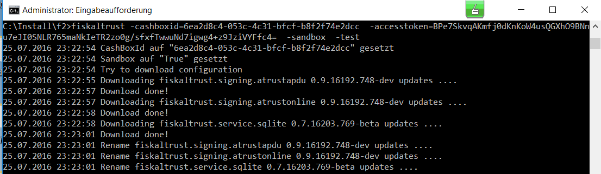
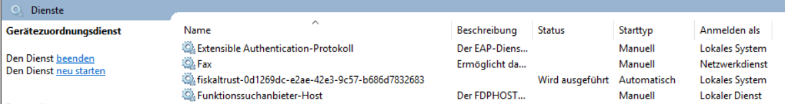

# Installation

For operating the fiskaltrust.Middleware on-premise or off-premise, the components of the fiskaltrust.Middleware need to be configured, downloaded, and installed/started:

## Configuration of Middleware components 

The components of the fiskaltrust.Middleware need to be configured in the fiskaltrust.Portal for the environment where the Middleware should be operated. The availability of components and its configuration options are dependent on the local market regulation.

For example, it must be configured at which endpoints the Middleware is listening on, in which database the processed data is to be stored, which Signature Creation Unit (SCU) is to be used for the signatures and how it can be reached by the Middleware.

The components of the Middleware which should be operated as an on-premise Middleware-instance are collected in a so-called "CashBox" configuration container.

More information on the configuration options of the components can be found in the according market-appendices:

- Austria
- [Germany](https://docs.fiskaltrust.cloud/docs/posdealers/rollout-doc/middleware#the-cashbox-as-a-configuration-container)
- France

At the end of this configuration process, a so-called "Launcher" including the CashBox-configuration needs to be downloaded.

## Download of the Launcher

After configuring the CashBox in the portal, following so-called "Launchers" are available for download:

| Icon                                             | Launcher                                | Description                                                  | AT        | DE         | FR        |
| ------------------------------------------------ | --------------------------------------- | ------------------------------------------------------------ | --------- | ---------- | --------- |
|          | .NET Launcher<br />(*default launcher*) | **For starting the Middleware on Windows with Internet connection.**<br />The launcher loads the configuration file and its needed packages during the start from the fiskaltrust packages-server. | supported | supported  | supported |
|  | .NET Offline Launcher                   | **For starting the Middleware on Windows without Internet connection.** <br />A static configuration and its needed packages for operation is included. The regular package update mechanisms are not supported with the offline launcher. | supported | supported  | supported |
|        | Mono Launcher                           | **For starting the Middleware on Linux/macOS with Internet connection.**<br />The launcher loads the configuration file and its needed packages during the start from the fiskaltrust packages-server. | supported | supported  | supported |
|  | Android Launcher                        | **For starting the Middleware on Android with Internet connection.**<br />The needed packages for operation are already included. The launcher loads the configuration file during the start from the fiskaltrust packages-server.<br />The configuration options are limited to keep the package sizes small. |           | supported* |           |

*availability dependent on the CashBox configuration. For more details, see the [platform documentation for Android](https://docs.fiskaltrust.cloud/docs/product-description/germany/products-and-services/caas/features/platforms/android).

The received zip-compressed folders need to be unzipped and can be moved or renamed if necessary.

The folder with the downloaded and unzipped launcher contains 

- the launcher `fiskaltrust.exe`, 
- three pre-configured `.cmd` command files,
- a file for the static configuration of the service named `fiskaltrust.exe.config`,  and 
- the fiskaltrust.Middleware service represented by the `.dll` files.

## Windows, Linux & MacOS

### Launcher configuration

In the fiskaltrust.Portal, the components of the fiskaltrust.Middleware have been configured via CashBox configuration for the environment where the Middleware should be operated, e.g. which database should be used to store the receipt data. 

The downloaded Launcher can now be optionally adapted for the local machine; e.g. setting the target folder for the data storage of the service, or setting the service name. This can be done by either using call parameters when executing the `fiskaltrust.exe`, or by directly modifying the  `fiskaltrust.exe.config`  by adding the appropriate key-value pairs in the section `appSettings`.

The following call parameters are available with the launcher `fiskaltrust.exe`:

| **Parameter**                  | **Description**                                              | Overwrites the values in the static configuration `fiskaltrust.exe.config` |
| ------------------------------ | ------------------------------------------------------------ | ------------------------------------------------------------ |
| `-cashboxid`                   | Sets the CashBoxId. The value is a GUID in format `00000000-0000-0000-0000-000000000000`. | yes                                                          |
| `-accesstoken`                 | Sets the AccessToken for online communication                | yes                                                          |
| `-useoffline`                  | Sets the offline mode. The value is a boolean: true \| false | yes                                                          |
| `-test`                        | Executing as command line program. Basic information is provided in the console. Should be indicated as last parameter, if it is set in connection with others. | no                                                           |
| `-i`                           | Install Windows service                                      | no                                                           |
| `-u`                           | Uninstall Windows service                                    | no                                                           |
| `-servicename=[myservicename]` | Sets the service name in connection with -i and -u           | no                                                           |
| `-displayname=[mydisplayname]` | Sets the service display name within the system control in connection with -i | no                                                           |
| `-description=[mydescription]` | Sets the service description within the system control in connection with -i | no                                                           |
| `-servicefolder`               | Sets folder containing the service files.                    | yes                                                          |
| `-sslvalidation`               | Sets the certificate validation when connecting through SSL. The value is a boolean: true \| false | yes                                                          |
| `-sandbox`                     | Sets the environment to be used. The value is a boolean: true (sandbox) \| false (production) | yes                                                          |
| `-packagesurl`                 | Sets the url of the package server used to download the packages. | yes                                                          |
| `-logfile`                     | Sets the file used to log the output messages.               | yes                                                          |
| `-connectiontimeout`           | Sets the timeout (in seconds) for the HTTP/HTTPS call to download the configuration. | yes                                                          |
| `-connectionretry`             | Sets the number of trials to download the configuration.     | yes                                                          |
| `-proxy`                       | Sets the proxy server to be used to connect to the internet. The value can be used as follows: `"address=xxx.xxx.xxx.xxx;username=test;password=pwd123"`. `username` and `password` are optional values. See [Using a Proxy](https://link.fiskaltrust.cloud/rollout/proxy) | yes                                                          |
| `-verbosity`                   | Sets the level of debug-information in the logfile. The value is a string. Possible values are: `Trace` \|`Debug` \|`Information` \|`Warning` \|`Error` \|`Critical`<br />**Supported in the German market only!** | yes. <br />Use in the static configuration the key `loglevel` |
<span id="_Toc527986661" class="anchor"></span>*Table 8. fiskaltrust.exe launch parameters*

### Starting the Launcher

Following  options are available for executing the `fiskaltrust.exe`:

| Option                              | Description                                                  | Windows                                                      | Linux                                                        |
| ----------------------------------- | ------------------------------------------------------------ | ------------------------------------------------------------ | ------------------------------------------------------------ |
| `fiskaltrust.exe`                   | Executing the launcher `fiskaltrust.exe` as a command line program using call parameters. | Run the command line `cmd.exe` as administrator.<br /><br />Example: `fiskaltrust.exe -test` | Example: ```sudo mono fiskaltrust.exe -test```              |
| `[pre-configured command file].cmd` | Command files can be used for executing the `fiskaltrust.exe` with pre-defined setups, e.g. for developing and debugging. Three pre-configured setups are already included with the downloaded launcher (see below). |                                                              |                                                              |
| `install-service.cmd`               | Pre-configured command file which executes `fiskaltrust.exe` using the parameter `-i` for installing the fiskaltrust.Middleware as a service under Windows, recommended for permanent on-premise operation. | Run the command file `install-service.cmd` as administrator. <br />For details, see [Windows Service Installation](#windows-service-installation) | For installing the fiskaltrust.Middleware as a Daemon, see [Mono service installation](#mono-service-installation). |
| `uninstall-service.cmd`             | Pre-configured command file which executes `fiskaltrust.exe` using the parameter `-u` for un-installing the fiskaltrust.Middleware as a service under Windows. | Run the command file `uninstall-service.cmd` as administrator. |                                                              |
| `test.cmd`                          | Pre-configured command file which executes `fiskaltrust.exe` using the parameter `-test` for starting the fiskaltrust.Middleware as a command line program under Windows, recommended for test and development purpose. | Run the command file `test.cmd` as administrator.<br />For details, see [Test Environment](#test-environment) |                                                              |

### Applying the CashBox-configuration

During the start of the Online-Launcher (.NET Launcher or Mono-Launcher), the configuration is checked and the configuration-file (usually Configuration-`00000000-0000-0000-0000-000000000000`.json) including the needed packages are downloaded to the fiskaltrust service-folder (usually `C:\ProgramData\fiskaltrust\service`) if necessary. 

**When a new configuration shall be applied, the fiskaltrust service needs to be restarted so that the Launcher checks if a new configuration exists.**

For checking the configuration and downloading the needed packages the Launcher must be able to contact the fiskaltrust packages-server:

**Outbound traffic**

| Type  | Protocol | Port | Source                             |
| ----- | -------- | ---- | ---------------------------------- |
| https | TCP      | 443  | packages-sandbox.fiskaltrust.cloud |
| https | TCP      | 443  | packages.fiskaltrust.cloud         |

### Service folder

The data for the service, including 

- the configuration, 
- service packages, 
- the local data storage for receipt data if a SQLite database is used, and
- data exports like DSFinV-K, TSE-TAR files, 

is saved under Windows in `C:\ProgramData\fiskaltrust\service`. 

In Linux, the data is saved under `/usr/share/fiskaltrust/service`. 

The deletion of this folder results in a loss of data, and a loss in functionality of the fiskaltrust.SecurityMechanism. In case of an active online connection, the fiskaltrust.SecurityMechanism can restore its functionality without this folder, however the data which was lost cannot be restored.

### Test Environment

For development, integration and testing purpose we recommend to run the Middleware in the command line. 

In Windows, it is necessary to run the `cmd.exe` as administrator. The launcher `fiskaltrust.exe` can be then executed as a command line program through the call parameter `–test`.

In Linux, the following command should be used:
`sudo mono fiskaltrust.exe -test -cashboxid <cashboxid> -accesstoken <accesstoken> <other options>`.

A static configuration can be enforced via the configuration.json file in the `fiskaltrust.exe` folder in connection with `-useoffline=true`.



<span id="_Toc527986811" class="anchor"></span>*Illustration 10. Screenshot console in test mode*

### Windows Service Installation

The Windows service can be installed and uninstalled via the call parameters -i and –u.



<span id="_Toc527986812" class="anchor"></span>*Illustration 11. Screenshot Windows services fiskaltrust service*

Once successfully completed, the service will appear in the list of running services.

### Mono Service Installation

For Linux, the fiskaltrust.SecurityMechanism can be installed as Daemon.

Mono is the prerequisite, and can be installed following the manual of the [mono-project](http://www.mono-project.com/download/#download-lin) (install complete).

Once the installation is completed, a file named `fiskaltrust` with the following content has to be saved in the index `/etc/init.d`:

```sh
#! /bin/sh
### BEGIN INIT INFO
# Provides:     fiskaltrust
# Required-Start:  $local_fs $network
# Required-Stop:   $local_fs $network
# Default-Start:   2 3 4 5
# Default-Stop:   0 1 6
# Short-Description: fiskaltrust.Sicherheitseinrichtung 
### END INIT INFO
# /etc/init.d/fiskaltrust
#
#
#rechte: sudo chmod +x /etc/init.d/fiskaltrust
#rechte: sudo chmod +x /etc/fiskaltrust/fiskaltrust.exe
#installieren: sudo update-rc.d fiskaltrust defaults
#deinstalllieren: sudo update-rc.d -f dispenser1 remove
#
#
#
#

# Some things that run always
# Load the VERBOSE setting and other rcS variables
. /lib/init/vars.sh

# Define LSB log_* functions.
# Depend on lsb-base (>= 3.2-14) to ensure that this file is present
# and status_of_proc is working.
. /lib/lsb/init-functions

# Carry out specific functions when asked to by the system
case "$1" in
 start)
  log_daemon_msg "Starting fiskaltrust.Sicherheitseinrichtung " "fiskaltrust"
  mono-service -l:/tmp/fiskaltrust.Sicherheitseinrichtung .lock -d:/etc/fiskaltrust/ /etc/fiskaltrust/fiskaltrust.exe
  log_end_msg $?
  ;;
 stop)
  log_daemon_msg "Stopping fiskaltrust.Sicherheitseinrichtung " "fiskaltrust"
  kill `cat /tmp/fiskaltrust.Sicherheitseinrichtung .lock`
  log_end_msg $?
  ;;
 *)
  echo "Usage: /etc/init.d/fiskaltrust {start|stop}"
  exit 1
  ;;
esac

exit 0
```

<span id="_Toc527986837" class="anchor"></span>*Code 13. Initializing the mono service*

Next, the folders have to be created and assigned the required permissions. In order to do that, the following commands have to be executed via the SSH-console:

> `sudo mkdir /etc/fiskaltrust`

> `sudo chmod 777 /etc/fiskaltrust`

Once the folders are set, the `fiskaltrust.exe` and the associated DLLs must be copied into the index "/etc/fiskaltrust", and the rights to execute the file have to be set as follows:

> `sudo chmod +x /etc/init.d/fiskaltrust`

> `sudo chmod +x /etc/fiskaltrust/fiskaltrust.exe`

Finally, the daemon can be installed with the following command:

> `sudo update-rc.d fiskaltrust defaults`

Once completed, the service should appear in the running daemon list.

## Android

The fiskaltrust.Middleware for Android is currently available for the German market only. For details about the platform specific installation, please refer to the [platform documentation for Android](https://docs.fiskaltrust.cloud/docs/product-description/germany/products-and-services/caas/features/platforms/android).

## Migration of the Middleware instance to a different hardware

We do not recommend to migrate an active instance of the fiskaltrust.Middleware to another hardware. If possible, please set the queue [out of operation](https://docs.fiskaltrust.cloud/docs/poscreators/middleware-doc/germany/reference-tables/ftreceiptcase) and configure and install a new Middleware instance on the new machine.
