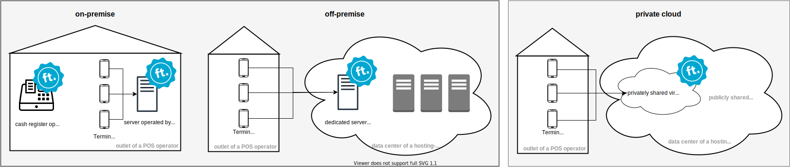
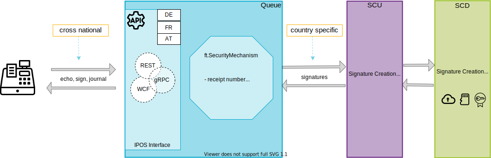

# Operation modes

The fiskaltrust.Middleware can be operated in following operational environments:

([click to enlarge](images/operational-environments.svg))

Identification of the operational environment from the perspective of a POS operator:

| hosted in-house | hosted in a different building         | dedicated hardware resource                                  | privately shared (hardware) resource        | operational environment |
| --------------- | -------------------------------------- | ------------------------------------------------------------ | ------------------------------------------- | ----------------------- |
| **yes**         | no                                     | **yes** *(e.g. on a cash register or local network server)* | no                                          | **on-premise**          |
| no              | **yes** *(e.g. in a data center)* | **yes** *(e.g. dedicated server)*                       | no                                          | **off-premise**         |
| no              | **yes**                                | no                                                           | **yes** *(e.g. virtualised resources)* | **private cloud**       |

Availability of supported operational environments is dependent on the market as shown in the following table:

| operation mode                                   | AT                                                           | DE                                               | FR                                                           |
| ------------------------------------------------ | ------------------------------------------------------------ | ------------------------------------------------ | ------------------------------------------------------------ |
| **on- & off-premise**                            | **available**                                                | **available**                                    | **available**                                                |
| **private Cloud** *operated by a 3rd party* | **available**                                                | **available**                                    | not available *generally supported, but not offered*    |
| **private Cloud** *operated by fiskaltrust* | **available** *(by the fiskaltrust product Signature.Cloud)* | not available *due to legal restrictions* * | **available** *(by the fiskaltrust product Signature.Cloud)* |

*In Germany, the fiskaltrust.Middleware must always be operated as a local component of the electronic recording system. For example, if the electronic recording system runs on a local Windows based cash register, the fiskaltrust.Middleware has to be operated on the same operational environment (this could be the same machine, or a local network server). If the electronic recording system is a SaaS solution operated in the Cloud, the fiskaltrust.Middleware has to be operated in the same data center.

## Components of the fiskaltrust.Middleware

Regardless of the characteristics of the product, fiskaltrust.Middleware consists of several logical components. This chapter provides an overview on these components.

### On-premise & off-premise installed components

The on-premise solution of the fiskaltrust.Middleware requires [installation](../installation/operation-modes.md)  and configuration for the client. Below the most important components of the Middleware are illustrated:

#### IPOS Interface

The IPOS interface is part of the queue, a component of the fiskaltrust.Middleware. It enables the communication between the cash register and the fiskaltrust.Middleware and is identical for all supported countries (cross national).

The iPOS Interface offers three interface methods:

- *echo* (check availability), 
- *sign* (sign receipt data, send special receipts) and 
- *journal* (export data).

To establish a communication with the IPOS interface, following communication services are recommended based on the POS systems prerequisites:

| POS system technology stack | gRPC            | REST                       | WCF  |
| --------------------------- | --------------- | -------------------------- | ---- |
| **.NET client**             | **recommended** | alternative recommendation |      |
| **Java client**             | **recommended** |                            |      |
| **Web App**                 |                 | **recommended**            |      |

The availability of supported communication services is dependent on the market as shown in the following table:

| Communication service | AT            | DE            | FR            |
| --------------------- | ------------- | ------------- | ------------- |
| **gRPC**              | not supported | **supported** | not supported |
| **REST**              | **supported** | **supported** | **supported** |
| **WCF**               | **supported** | **supported** | **supported** |

More detailed information, including the data flow, you can find in the [communication chapter](../communication/communication.md).

#### Queue

In addition to enable the communication with the cash register via iPOS Interface, the queue also serves to encapsulate the functionality of a receipt chain: All regular receipts created by the POS-System and sent to the fiskaltrust.Middleware are processed in the ft.SecurityMechanism. This mechanism takes care of the creation of the unique, consecutive receipt number, the chaining and the persistence of the data.  After getting secured and stored in the queue, the response of the fiskaltrust.SecurityMechanism is sent back to the POS-System. All special receipts (for example the periodical closings) are sent as "requests to execute a special function" to the fiskaltrust.Middleware and get responded by it. 

#### SCU

The SCU (Signature Creation Unit) handles the country-specific implementation of the security solution and is responsible for the signatures. For specific information regarding supported Signature Creation Devices and platforms, please refer to the appropriate appendices:

- Austria

- [Germany]( (../../appendix-de-kassensichv/operation-modes/on-premise-installation.md) )
- France

#### SCD

The SCD (Signature Creation Device) is not part of the fiskaltrust.Middleware. Signature Creation Devices are providing additional security and functionalities based on local market regulation, delivered by third party vendors (e.g. a software based cloud solution, a hardware device, or a certificate), supported by fiskaltrust via the SCU. The choice of the SCD has impacts on the fiskaltrust.Middleware configuration, therefore available SCDs, its configuration, functionalities and limitations regarding the fiskaltrust.Middleware are documented in the appropriate appendices of the markets.

The signature creation device can be generally accessed via following channels: 

- *directly* (e.g. with a attached hardware), 
- *locally* (e.g. via local network), or via 
- *network* (e.g. external network, internet). 

#### Helipad Helper

The Helipad Helper is used to support updates and configurations.

#### Hardware requirements

For the operation of the installed components of the fiskaltrust.Middleware following minimum hardware requirements are recommended:

| Hardware                          | Minimum requirements                                         |
| --------------------------------- | ------------------------------------------------------------ |
| **General hardware requirements** | The fiskaltrust.Middleware can be generally operated on a [Rasperry PI 2](https://www.raspberrypi.org/products/raspberry-pi-2-model-b/). |
| **Local storage**                 | Around 500 MB (200 MB for the Middleware components + 200 MB reserved for update-packages); optional: storage for SQLite db (around 8-10Kb/receipt) |
| **Hardware connectivity**         | For the German market: USB, SD, Micro-SD or COM port for a local hardware-based security device (Technische Sicherheitseinrichtung, TSE). For the Austrian market: USB port |
| **Internet connectivity**         | Optional, but strongly recommended: (WIFI)modem for Internet connectivity to use software-security-, data as a service-, backup,- or configuration-/update services. |

#### Supported software platforms

For detailed information on supported platforms and its restrictions, please refer to the linked appendices of the applicable markets in the table below:

| Platform        | AT            | DE                                                           | FR            |
| --------------- | ------------- | ------------------------------------------------------------ | ------------- |
| **Android**     | not supported | [**supported**](../../appendix-de-kassensichv/operation-modes/on-premise-platforms/android.md) | not supported |
| **Linux/macOs** | **supported** | [**supported**](../../appendix-de-kassensichv/operation-modes/on-premise-platforms/linux.md) | **supported** |
| **Windows**     | **supported** | [**supported**](../../appendix-de-kassensichv/operation-modes/on-premise-platforms/windows.md) | **supported** |

#### Launcher

The Launcher is a software (file) named `fiskaltrust.exe`, which is used only for the on-premise installed products (e.g. AT products fiskaltrust.SignatureCard or fiskaltrust.SignatureBox). For Windows, it is a .NET command-line application and a .NET Windows service. For Linux and Mac, the launcher can be executed via Mono, version 3.2.8 or higher, or used as daemon.

The main tasks of the launcher are:

  - providing basic configuration settings such as ftCashBoxId and access token
  - comparing the configuration data retrieved from fiskaltrust.Helipad with the local configuration
  - updating queue- and SCU packages accordingly to the configuration
  - execution of configured packages
  - load balancing of multiple queues

The executable file `fiskaltrust.exe` and the corresponding DLLs can be distributed via copy-paste and then configured and installed with the help of a command-line parameter. The launcher can be downloaded (incl. configuration) from the [https://portal.fiskaltrust.de/CashBox](https://portal.fiskaltrust.de/CashBox), or found on nuget.org and configured manually.

Call parameter of the launcher are documented in the chapter [installation](../installation/installation.md).

### Private cloud (operated by a third party) installed components

No installation or configuration is required for the client and any platform can use this service. The availability and use of SaaS installed components is dependent on local regulations and currently available for Austria and Germany. In Germany, because of different market regulation, the fiskaltrust.Middleware components must be hosted and operated by the POS creator in the same datacenter where the receipt generation process of a distributed point of sale system occurs.

The components for the SaaS solution are the same as for the local solution; except the launcher, which is not needed. In Germany, the fiskaltrust.Middleware components can be delivered by a predefined Kubernetes Namespace which can be deployed by a Helm-Chart. fiskaltrust provides a "Backend POD" Docker image and Helm-Charts to be deployed at the POS creators environment.

### Private cloud (operated by fiskaltrust) installed components

No installation or configuration is required for the client and any platform can use this service. This service is currently available in Austria and France.
