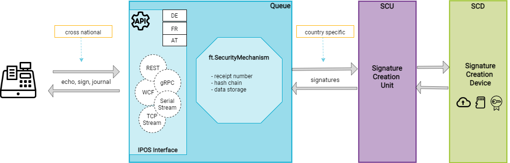

# Operation modes

Dependent on local market regulations, following operation modes are supported by the fiskaltrust.Middleware:

- on-premise (for POS systems hosted in-house, on a cash-register or on a local network-server) 
- off-premise (for POS systems hosted by a third-party and usually supported by a different third-party; f.e. server housing in a data center)
- private Cloud by 3rd party (hosted and maintained by a third-party)
- private Cloud by fiskaltrust (hosted and maintained by fiskaltrust)

| operation mode                                 | AT            | DE*           | FR            |
| ---------------------------------------------- | ------------- | ------------- | ------------- |
| **on- & off-premise**                          | **supported** | **supported** | not supported |
| **private Cloud operated by 3rd party**   | **supported** | **supported** | not supported |
| **private Cloud operated by fiskaltrust** | supported     | not supported | **supported** |

*In Germany, the fiskaltrust.Middleware must always be operated as a local component of the electronic recording system. For example, if the electronic recording system runs on a local Windows based cash register, the fiskaltrust.Middleware has to be operated on the same machine. If the electronic recording system is a SaaS solution operated in the Cloud, the fiskaltrust.Middleware has to be operated in the same data center.

## Components of the fiskaltrust.Middleware

Regardless of the characteristics of the product, fiskaltrust.Middleware consists of several logical components. This chapter provides an overview on these components.

### On-premise & off-premise installed components

This solution requires installation and configuration for the client. The platform support is dependent on the local market. The availability and use of the on-premise solution is dependent on local regulations and currently available for Austria and Germany.

#### Launcher

The Launcher is a software (file) named `fiskaltrust.exe`, which is used only for the on-premise installed products (e.g. AT products fiskaltrust.SignatureCard or fiskaltrust.SignatureBox). For Windows, it is a .NET command-line application and a .NET Windows service. For Linux and Mac, the launcher can be executed via Mono, version 3.2.8 or higher, or used as daemon.

The main tasks of the launcher are:

  - providing basic configuration settings such as ftCashBoxId and access token
  - comparing the configuration data retrieved from fiskaltrust.Helipad with the local configuration
  - updating queue- and SCU packages accordingly to the configuration
  - execution of configured packages
  - load balancing of multiple queues

The executable file `fiskaltrust.exe` and the corresponding DLLs can be distributed via copy-paste and then configured and installed with the help of a command-line parameter. It can be downloaded (incl. configuration) from the Portal’s configuration-\>cashbox page, or found on nuget.org and configured manually.

#### ASP.net 5/Core Web App

An ASP.NET application provides the functionality of a queue via the REST service. This service is provided in Austria and Germany. For details, please refer to the country specific appendices.

#### Queue

The queue serves to encapsulate the functionality of a receipt chain for various platforms and localisations. In accordance with the interface description, the queues can be addressed individually or via a load balanced channel of the launcher.

#### SCU

The SCU (Signature Creation Unit) serves to encapsulate the communication with a signature creation device. The respective signature creation device can be accessed via different channels: directly, locally, or via network. This service is provided only on selected markets. For details, please refer to country specific appendix.

#### Helipad Helper

The Helipad Helper is used to support updates and configurations.

#### Supported platforms

For supported platforms, please refer to the appendices of the applicable markets:

- Supported platforms in Austria
- Supported platforms in Germany

### SaaS installed components

No installation or configuration is required for the client and any platform can use this service. The availability and use of SaaS installed components is dependent on local regulations and currently available for Austria, France and Germany. In Austria and France the SaaS installation is hosted and operated by fiskaltrust ("ft.SignatureCoud"). In Germany, because of different market regulation, the fiskaltrust.Middleware components must be hosted and operated by the POS creator in the same datatcenter where the receipt generation process of a distributed point of sale system occurs.

The components for the SaaS solution are the same as for the local solution; except the launcher, which is not needed. In Germany, the fiskaltrust.Middleware components can be delivered by a predefined Kubernetes Namespace which can be deployed by a Helm-Chart. fiskaltrust provides a "Backend POD" Docker image and Helm-Charts to be deployed at the POS creators environment.

### Configuration of the fiskaltrust.Middleware

#### Online Portal

All configuration settings, as well as the relevant extensions, are managed via the online fiskaltrust.Portal. For further information, refer to the appropriate appendix.

#### Queue

A Queue is a part of communication line between the POS-System and the fiskaltrust.Middleware. All regular receipts created by the POS-System are sent to the fiskaltrust.Middleware to get secured and stored in the Queue, and the response of the fiskaltrust.SecurityMechanism is sent back. All special receipts (for example the periodical closings) are sent as "requests to execute a special function" to the fiskaltrust.Middleware and get answered by it. At least one Queue must be created for each POS-System.

#### Journal

A journal is an export of internal structured data of the receipts from the Queue(s). There are three types of journals: a protocol journal saving all requests, a journal which records all events happening in the queue (starts, stops, failures), and localized journals depeding on the national laws. For more details please refer to the appropriate appendix. The format of a common journal export is JSON.

#### Notifications

The information for notifications is extracted from the processing protocol and stored internally in the action journal. Helipad retrieves this information and processes it in accordance with country specific law. Special events have a localized reporting requirement. In online mode, notifications can be uploaded, automated and transported further at fiskaltrust.SecurityMechanism. If in offline mode, notifications are transported via zero receipts within the signature block.

#### Configuration Scenarios

The POS System connects to the fiskaltrust.Middleware to process the receipt chaining calculation. A Cash register means an individual fiskaltrust.SecurityMechanism - in the fiskaltrust.Portal it is called "CashBox" and represents the real CashRegister and its configuration with the SecurityMechanism. The cash register is identified via the ftCashBoxId. This is unique worldwide and also the first part of the authentication on the fiskaltrust.Helipad. The second part is an authentication token.

#### Single Queue scenario

The most common scenario uses a connection to a single fiskaltrust.Queue, which takes care of performing all the requested operations in accordance to the national law and requlations.

*Illustration* *8. Use of an individual queue.*

#### Scenario with several queues for performance improvement

The POS System can require special operating conditions, e.g. a when a big flow of receipts is requested, the fiskaltrust.Middleware will ensure a high level of reliability by using multiple parallel Queues.

In this scenario, the fiskaltrust.Middleware hosts several Queues to optimize the performance of the service by distributing the workload evenly between the Queues. Each individual queue is reachable by the fiskaltrust.IPOS. This direct connection can be necessary in case of receipts with special functions and also in in case of special chunked Journals (Journals for specific range). The queues can be operated in a load balancing mode or in a backup mode via the balancer interface.

*Illustration 9. fiskaltrust.Middleware in a configuration for performance optimization*
