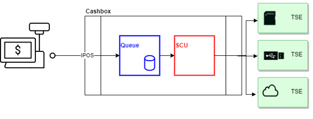

# Middleware Integration

## Übersicht

Als Kassenhersteller haben Sie Anfangs das  Ziel sich mit unserer kostenlosen ft.Middelware aus ihrem Kassensystem heraus zu verbinden und Ihre Integration zu testen. Dieses Dokument fasst die notwendigen Schritte zusammen um dieses Ziel zu erreichen. 

Im Einzelnen sind folgende Schritte zu durchlaufen:

1. [Konfiguration einer Cashbox (Konfigurationscontainer) im Portal](#konfiguration-einer-cashbox)
2. [Downloaden und Starten des Launcher](#download-und-starten-des-launcher)
3. [Initialisierung mit einem Startbeleg](#initialisierung-mit-einem-startbeleg)
4. [Absetzen weiterer Requests](#absetzen-weiterer-requests)

Im Folgenden werden wir auf die einzelnen Schritte detailierter eingehen.

## Konfiguration einer Cashbox

Eine sogenannte Cashbox ist ein Konfigurationscontainer, der die Konfiguration der einzelenen Komponenten der fiskaltrust.Middleware beinhaltet. Über die Cashbox können die Konfigurationen miteinander verbunden werden. So kann die Cashbox die Konfiguration von Queue, SCU und diversen Helper beinhalten und diese miteinander verbinden. Im folgenden werden wir die Konfiguration der zum Testen benötigten SCU und der Queue vornehmen, diese in die Cashbox inkludieren und verbinden.



### Konfiguration der SCU

Die SCU (Security Creation Unit, deutsch: Signatur-Erstellungs-Einheit) ist eine Komponente der ft.Middelware, die für die Kommunikation mit der TSE zuständig ist. Je nachdem welche TSE sie benutzen möchten, benötigt die SCU eine entsprechende Konfiguration.

Um die SCU Konfiguration anzulegen, wählen Sie im Portal den Menüpunkt  ``Konfiguration -> Signatur-Erstellungs-Einheit``  und drücken Sie den Button "Erstellen". Geben Sie eine kurze Beschreibung (Bezeichnung) ein und wählen Sie bei "Package Name" das Paket für Ihre TSE aus. Wählen Sie danach die neueste Version unter "Package Version" aus und drücken Sie auf "Speichern".

Es werden nun weitere Konfigurationangaben abverlangt. Je nach vorher gewähltem TSE-Paket können diese variieren. Im allgemeinen geben Sie hier an, wie die SCU die TSE ereichen kann und über welchen Endpunkt die Queue mit der SCU kommunizieren wird. Um den Kommunkationsendpunkt zum Erreichen der SCU anzugeben, wählen sie z.B. gRPC aus indem Sie den entsprechenden Knopf im unteren Bereich drücken. Das Eingabefeld wird automatisch ausgefüllt und kann bei Bedarf weiter editiert werden. Für unser Ziel in diesem Dokument reicht der automatisch vorgegebene gRPC Endpunkt. 

Als Nächstes können Sie im oberen Bereich angeben, wie die SCU die gewählte TSE erreichen kann:

#### Cryptovision
Geben Sie den Gerätepfad an, den Laufwerkbuchstaben gefolgt von Doppelpunkt an dem sie die TSE angeschlossen haben. Zum Beispiel ```E:```

#### Swissbit
Geben Sie den Gerätepfad an, den Laufwerkbuchstaben gefolgt von Doppelpunkt an dem sie die TSE angeschlossen haben. Zum Beispiel ```E:```

#### Diebold Nixdorf
Geben Sie den Com Anschluß an, an den Sie die TSE angeschlossen haben. Zum Beispiel ```COM6```

#### Epson
In Überarbeitung.

#### Fiskaly TSE
Geben Sie die TSS-ID, API-Schlüssel und den "Geheimen" Schlüssel ein. Testdaten erhalten Sie im fiskaly Dashboard. Melden Sie sich bitte dazu auf der fiskaly Website an. Alternativ können Sie in unserem Test-Shop eine kostenlose Test-Fiskaly TSE beziehen. Dabei wird automatich eine SCU mit den dazugehörigen Daten für Sie erstellt. Hinweis: Wählen Sie im Shop vor dem Einlegen der Test-Fiskaly TSE in den Warenkorb die Filiale aus (Outlet Dropdown im oberen Bereich).

Speichern Sie die Konfiguration Ihrer SCU nach Eingabe der benötigten Daten. Im nächsten Schritt werden wir die Queue konfigurieren.

### Konfiguration der Queue

Die Queue ist eine Komponente der fiskaltrust.Middleware, sammelt die Belege und ist für das Erzeugen der Belegkette verantwortlich. Des Weiteren ist die Queue die Komponente der fiskaltrust.Middleware mit der das Kassensystem kommuniziert. An die Queue senden Sie Ihre Belegdaten und erhalten Signaturen und andere Daten zurück.

Unter dem Menüpunkt  ``Konfiguration -> Queue``  befindet sich der Button zum Anlegen einer neuen Queue. Durücken Sie den Button, um zur Eingabemaske zu gelangen. Geben Sie hier eine kurze Beschreibung (Bezeichnung) und die CashboxIdentification ein. Die CashboxIdentifikation wird später von der SCU als ClientId für die TSE verwendet. Deshalb ist es wichtig hierbei einen "printable string" mit maximal 20 Zeichen einzugeben, und dass der **verwendete Wert eindeutig ist**. Nach dem Speichern erscheint eine Maske in der Sie den Kommunikationsendpunkt angeben können. Über diesen werden wir später die Queue erreichen. Für unser Beispiel nehmen wir http(REST) indem wir den dazugehörigen Button drücken. Nach dem Speichern sind wir mit der Konfiguration der Queue fertig und können im nächsten Schritt die Cashbox, also unseren Konfigurationscontainer anlegen.

### Cashbox anlegen, Queue und SCU verbinden

Unter dem Menüpunkt ``Konfiguration -> CashBox`` befindet sich der Button zum Anlegen einer neuen Cashbox. Drücken Sie diesen, um zur Eingabemaske zu gelangen. Drücken Sie nach Eingabe einer kurzen Beschreibung (Bezeichnung) den Speichern Button. Die Cashbox wurde angelegt und erscheint nun in der Liste. 

Als Nächstes wollen wir die Konfiguration der Queue und SCU in die angelegte Cashbox packen und diese mit einander verbinden. Drücken Sie dazu den zur Cashbox zugeordneten Button mit Listensymbol. Hier können Sie nun die zuvor angelegte Queue und SCU über die dazugehörigen Checkboxen auswählen und Ihre Auswahl speichern. Im Folgenden werden wir die Queue mit der SCU verbinden. Klappen Sie dazu in der Übersicht der Chasboxen den Listeneintrag der neuen Cashbox auf. Der Detailbereich zeigt die enthaltenen Konfigurationen. Der Queuekonfiguration sind rechts zwei Buttons zugeordnet. Drücken Sie den ersten Button (Pfeilsymbol), um die neue SCU der Queue zuzuordnen. Ein Popup erscheint in dem Sie die SCU auswählen können. Nach dem Zuordnen und Speichern sind wir mit der Konfiguration unserer Cashbox fertig.


## Download und Starten des Launcher

#### Download
Der Download des Launcher wird über den Button "Download .NET Launcher" (Globus Symbol) initiiert. Vor dem Download ist es jedoch wichtig, dass Sie ein "Rebuild" der Cashbox vornehmen. Drücken Sie dazu den "Rebuild" Button (erster grauer Button mit Reload-Symbol) in der Zeile der CashBox. Nach Rebuild können Sie nun den Launcher herunterladen.

#### Debug Modus einstellen
Sie erhalten ein Zip-File in dem sich der Laucher und entsprechende Konfigurations- und andere Dateien befinden. Entpacken Sie nun das Zip-File. Im neu entpackten Ordner befindet sich eine ```test.cmd``` Datei die wir editieren werden. Öffnen Sie diese mit einem Editor Ihrer Wahl und fügen Sie der zweiten Zeile (die fiskaltrust.exe startet) das Argument ``` -verbosity=Debug``` am Ende hinzu. Dadurch erhalten wir später detailiertere Logausgaben. Speichern und Schließen sie nun die ```test.cmd``` Datei.

#### Starten
Sie könenn den Launcher durch Doppelcklick auf die ```test.cmd``` Datei starten. Es erscheint ein Terminal in dem Sie den Start der lokalen Middelware über entsprechende Logmeldungen nachverfolgen können. Dieses Fenster bleibt offen und visualisiert Logmeldungen zum weiteren Verlauf. Achten Sie darauf nicht in den Innenbereich des Fensters zu klicken, da dies den Service pausiert (Windows Feature). Sollte Ihnen das versehentlich passieren, so klicken Sie erneut hinein und drücken Sie "Enter" um die Unterbrechung aufzuheben. 

## Initialisierung mit einem Startbeleg

Nach dem Starten des Launcher steht Ihnen die lokale Middleware zur Verfügung. Als Nächstes werden wir die Initialisierung über einen Startbeleg vornehmen. Starten Sie dazu unsere Postman Collection aus unserem fiskaltrust [middleware-demo-postman](https://github.com/fiskaltrust/middleware-demo-postman) Github repo.

### Konfiguration der Postman Collection

Die Postman Collection muss so konfiguriert werden, dass sie Requests an die zuvor gestarete, lokale Middleware senden kann. Gehen Sie dazu auf "Edit" und wählen Sie den Tab "Variables". Hier befinden sich die für uns zwei wichtigen Variablen:  ```base_url``` und  ```cashbox_id```, deren Werte wir eingeben müssen. 

#### base_url

Bei ```base_url``` geben wir die URL des zuvor angelegten http(REST) Endpunkt der Queue an. Den benötigten Wert finden wir im Portal unter dem Menüpunkt ```Konfiguration -> Queue``` . Klappen Sie den Detailbereich des Listeneitrags unserer Queue auf und kopieren Sie von dort die URL. Bsp. ```rest://localhost:1500/f84bf516-a17b-4432-afa6-8c1050e2854d```. Ersetzen Sie nun in der URL ```rest://```mit ```http://``` um den Wert für die Postman ```base_url``` Variable zu erhalten. Bsp. ```http://localhost:1500/f84bf516-a17b-4432-afa6-8c1050e2854d```. Geben Sie jetzt diesen Wert in Postmman bei der Variable ```base_url``` als  ```CURRENT_VALUE``` an.

#### cashbox_id

Bei ```cashbox_id``` müssen wir die ID unseres Konfigurationskontainer angeben (nicht zu verwechseln mit der CashboxIdentification). Den Wert für die ```cashbox_id``` können wir im Portal unter dem Menüpunkt ```Konfiguration -> CashBox``` finden. Klappen Sie hierzu den Detailbereich des Listeneintrags unserer Cashbox auf und kopieren Sie den Wert von **CashBoxId:**. Bsp. ```90682627-f707-45ab-84df-f855118bba97```. Geben Sie diesen nun als Wert der Variable ```cashbox_id```  unter  ```CURRENT_VALUE```  in der Postman collection an.

#### Startbeleg Request absetzen

In der Postman collection finden Sie einen Eintrag mit dem Namen ```Initial Operation Receipt```.  Klicken Sie diesen und wählen Sie den Tab ```Body``` um dessen Inhalt einzusehen. Sie können nun den Request absetzen indem sie den ```Send``` Button drücken. Der Request wird an die lokale Middleware gesendet und Sie erhalten den Response der Middleware zurück, der in Postman dargestellt wird. Im Terminal können Sie entsprechende Logmeldungen einsehen. Der ft.SecurityMechanism der Middleware und die TSE sind nun initialisiert und wartet auf weitere Requests.

## Absetzen weiterer Requests

### Interface doc

Die Schnittstelle zur Middleware ist in unserem [interface-doc](https://github.com/fiskaltrust/interface-doc/) Github Repository beschrieben. Das fiskaltrust interface-doc repo enthält wichtige Informationen und Beschreibungen zur Kommunikation mit der Middleware. Im Ordner [doc](https://github.com/fiskaltrust/interface-doc/tree/master/doc) befindet sich ein allgemeiner Teil (Verzeichniss  ```general```) und  länderspezifischen Teile, die den allgemeinen Teil je nach Land detailierter spezifizieren. Es ist wichtig, dass Sie sich mit dieser Schnittstellenbeschreibung auseinandersetzen um witere Schritte vornehmen zu können.

### Postman collection
In der oben gennanten Postman Collection befinden sich viele weitere Beispiele für Requests die Sie analysieren und ausführen können. Nach der Einarbeitung in die Schnittstellenbeschreibung [interface-doc](https://github.com/fiskaltrust/interface-doc/) empfehlen wir Ihnen unser [Webinar-Video](https://www.youtube.com/watch?v=mq1hHL8ezOg&t=15s) zur Middleware in dem wir die Beispiele erläutern und weitere wichtige Informationen für Sie gesammelt und vorgeführt haben.

## Weiterführende Informationsquellen

- Deutsche fiskaltrust Website: [https://fiskaltrust.de](https://fiskaltrust.de/)
- fiskaltrust Dokumentations-Plattform: [https://docs.fiskaltrust.cloud](https://docs.fiskaltrust.cloud/)
- FAQ: [fiskaltrust docs - faq](https://docs.fiskaltrust.cloud/doc/faq/qna/market-de.html) und [Github faq repo](https://github.com/fiskaltrust/faq) zum Anlegen von Issues (Fragen).
- fiskaltrust Gihub repos: [https://github.com/fiskaltrust](https://github.com/fiskaltrust)
- fiskaltrust Videos: [Youtube Channel](https://www.youtube.com/channel/UCmMlqO4L3AzkEhh6WYA8BJg)


