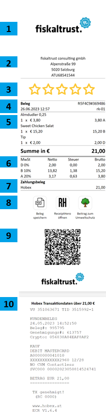
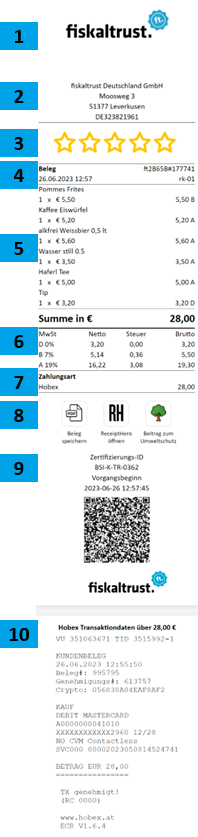
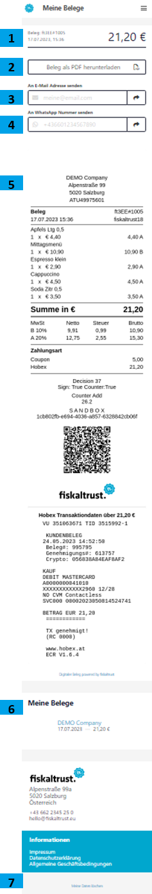

# Introduction 

This documentation describes the fiskaltrust digital receipt system in a way to provide consumers with receipts that are issued in a format other than paper. Instead of receiving a paper receipt, customers are provided with a unique and tamper-proof link to a digital receipt document that is stored securely in the fiskaltrust.Cloud. This receipt document includes all the relevant information that would typically be found on a paper receipt such as merchant identification, location, date and time, services, prices, VAT, payment methods, payment terms, and fiscalization information. 

# Core Concept 

The digital receipt document is transformed into a human-readable format via an HTML document and is provided to the consumer through a link that uses HTTPS for transmission. The digital receipt itself is tracking- and cookie-free, to benefit of enhanced privacy, faster loading speed and a cross-device compatibility. No app is required by the consumer to scan the QR-Code or the read the HTML receipt document. The digital receipt system provides several ways to issue receipts, including through a customer facing display, Give-Away (QR-Label) and the InStore App. The system also ensures that the receipts are stored securely beyond the statutory retention period by an independent third party, which has no interest in changing the tax burden. Additionally, the system logs further processing of the receipt, such as generating a PDF document or other forms of further manipulation. 

# Goal of our digital receipt 

The overarching goal of fiskaltrust is to provide a universal methodology, based on the Receipt.Request and Receipt.Response data format and the fiskaltrust internal security mechanism. In the fiskaltrust.Cloud, a receipt document is stored securely and transformed into a human readable form via an HTML document. This human-readable HTML document is provided via a unique and tamper-proof link that uses HTTPS for transmission. The globally recognized standards HTML and HTTPS ensure maximum compatibility on devices worldwide and in various applications. Our digital receipt is more seamless than paper receipts for consumers and offers added values along the whole value chain, for PosOperator/Merchants, for PosDealers/Commercial Partners and for PosCreators/Integration Partners. 

# Consumer interaction 

All interactions with or by consumers are as intuitive as possible. Therefor well-known symbols, designs and flows are used, related to the device or apps the consumer is using on their mobile phones.

A consumer is not always interested in a receipt, but for special situations a receipt is required. This can be a refund after return of goods or to prove warranty in case of damaged goods. Also when a consumer is on the road with friends and family and purchases are laid out upfront, the receipt helps to keep track of spendings and can prove the amount which needs to be repaid.

When a consumer works for a business, in special when it comes to travel expenses, then also a receipt is required to get reimbursement of expenses from the employer. Also, the employing company is required to keep the receipt withing the bookkeeping records, in this case.

# Interact with the digital receipt 

Once a consumer receives a digital receipt, there are multiple options to interact with the document, related to the settings of issuing merchant. 
- Feedback (Only with carefree bundle)
- Share receipt into 3rd party application e.g. ReceiptHero (Share-Button) 
- Download receipt as PDF or send PDF to e-mail
- Link to special merchant offerings (tba) 
- Download membership or store card (tba)
- Create hospitality receipt (tba)

# Visualization and features on the digital receipt

The visualization of the digital receipt variates from the markets legal requirements. The interactions within these digital receipts aim to maximize intuitiveness. To display elements such as merchant logo and metadata (including the company’s legal name and address), it’s essential to initially configure this data in the fiskaltrust.Portal.

## Austria 

| Number  | Description |
| ------------- | ------------- |
| 1  | Merchant Logo from fiskaltrust.Portal   |
| 2  | Meta data from fiskaltrust.portal (Full name and legal form of company required – marketing name not compliant)   |
| 3  | Feedback (only with carefree)   |
| 4  | Date and time, receipt number (ft5F4C9#369486), Kassenidentifikationsnummer (rk-01)   |
| 5  | Line items, price information and tax keys   |
| 6  | VAT items   |
| 7  | Payment details   |
| 8  | Share button (to 3rd party apps like ReceiptHero), button to Consumer Application (Download and send receipt via PDF, etc.)   |
| 9  | National compliance requirements for Austria (QR-Code only)   |
| 10  | Transaction details from card payment or voucher   |

Digital receipt demo:  
https://receipts-sandbox.fiskaltrust.cloud/v0/1cb802fb-e694-4036-a857-6328842cb06f/8aecf05d-5d57-4905-9bef-458ad16d3ea9

## Germany 

| Number  | Description |
| ------------- | ------------- |
| 1  | Merchant Logo from fiskaltrust.Portal   |
| 2  | Meta data from fiskaltrust.portal (Full name and legal form of company required – marketing name not compliant)   |
| 3  | Feedback (only with carefree)   |
| 4  | Date and time, receipt number (ft5F4C9#369486), Kassenidentifikationsnummer (rk-01)   |
| 5  | Line items, price information and tax keys   |
| 6  | VAT items   |
| 7  | Payment details   |
| 8  | Share button (to 3rd party apps like ReceiptHero), button to Consumer Application (Download and send receipt via PDF, etc.)   |
| 9  | National compliance requirements for Austria (QR-Code only)   |
| 10  | Transaction details from card payment or voucher   |

## Consumer Application (*Preview) 

This web application offers a comprehensive receipt management solution that simplifies the process of tracking and sharing digital receipts for consumers. To reach to this application, consumers need to click on the digital receipt the Consumer App button. Consumers have the convenience of downloading their receipt in PDF format, send the receipt directly to their email address as a PDF attachment or send the receipt to a WhatsApp number, allowing an easy storage and sharing.

To ensure accuracy and satisfaction, a receipt preview is provided. This gives users the opportunity to review the receipt.

Once the consumer accepted the consent on the consumer application and sent a receipt to his e-mail, a profile will be created. The profile contains all the receipt, the consumer collected. The e-mail with the receipt as PDF will contain the URL to the receipt history page for the consumer. 

*Consumer Application in development. Currently only available in sandbox environment. 

| Number  | Description |
| ------------- | ------------- |
| 1  | Receipt number, date and time, total amount of receipt   |
| 2  | Download receipt as  |
| 3  | Send receipt as PDF to e-mail  |
| 4  | Send receipt to WhatsApp number  |
| 5  | Receipt preview  |
| 6  | Consumers collected receipts (Cookies needs to be accepted first to activate this feature)  |
| 7  | Delete collected receipts from list/device  |
