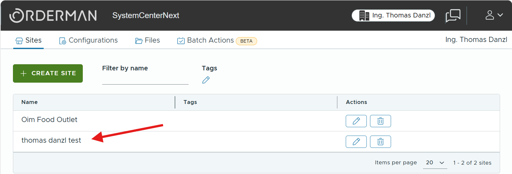
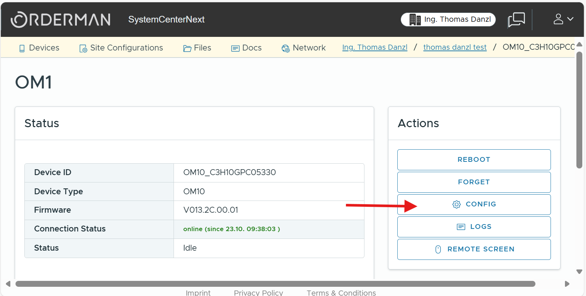
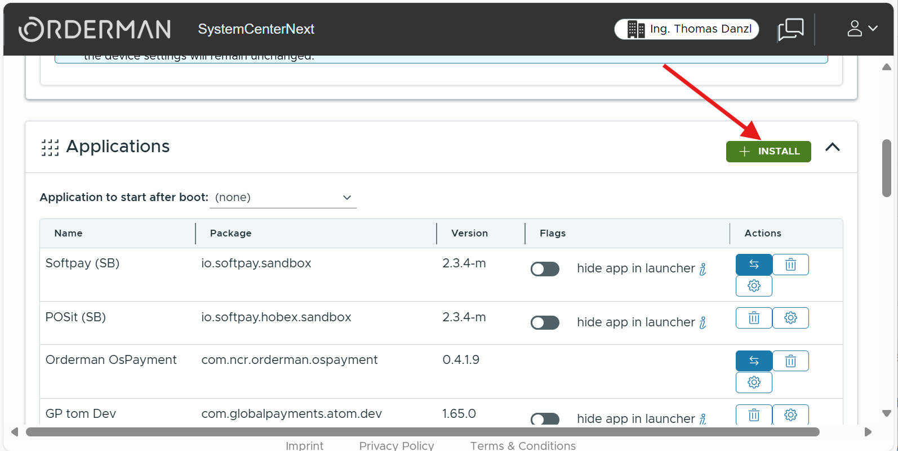
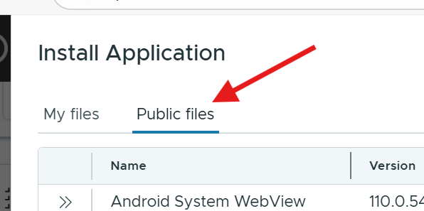
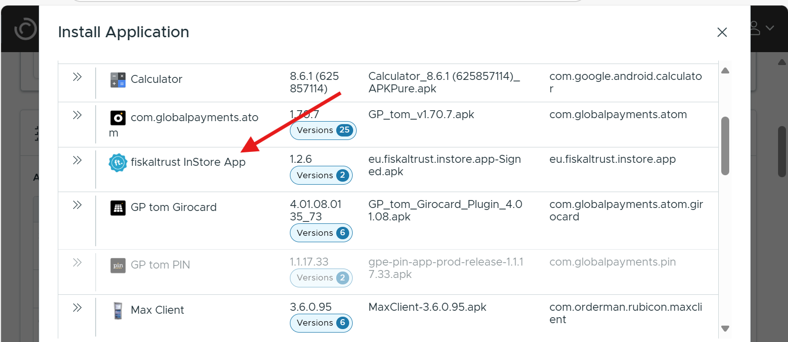
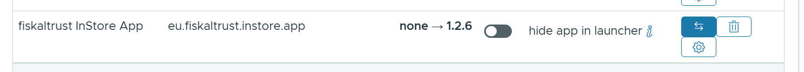
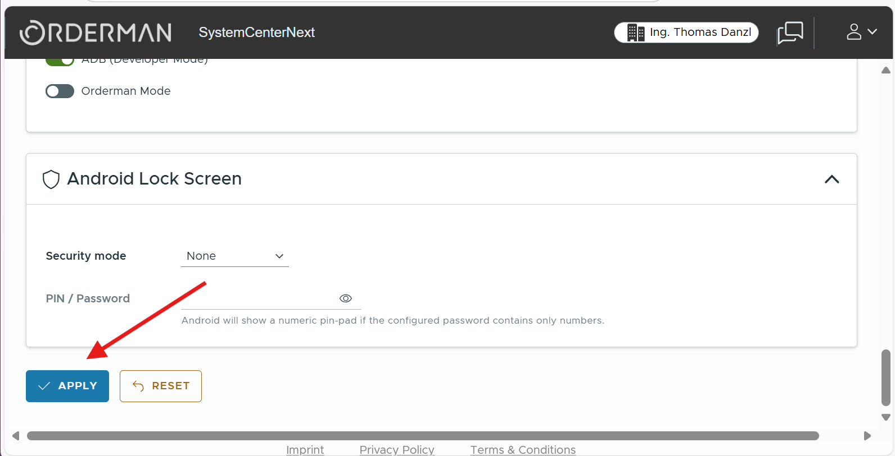

## Purpose

This guide explains how to publish and configure the fiskaltrust InStore App for Orderman Android POS devices via the Orderman SystemCenterNext (SCN) Portal.

## Prerequisites

Before starting, ensure you have:

- An active Orderman SCN account
- A site inside your company account
- A supported Android device (e.g., an Orderman10) enrolled to your site and online

## Steps for single, manual device install

### Step 1: Login to SCN

- Navigate to [Orderman SCN](https://next.orderman.com/) <!-- markdown-link-check-disable-line -->
- Login using your account information (e.g. via `Sign in with Google`)

### Step 2: Navigate to the site / device you want to configure

- Click on the site in which your device is enrolled
  
- Click on your device to get to the device details
  
- Click on the `Config` button on the right
  

### Step 3: Choose the app to install

- Navigate to the `Applications` card and click on `+ INSTALL` button on the right
  
- Navigate to the `Public files`
  
- Scroll and find the `fiskaltrust InStore App` entry. To install the latest available version just click this entry.
  

### Step 4: Apply your changes

The `fiskaltrust InStore App` should now be visible in the `Applications` card as to be installed. Here an example how this entry looks like when installing v1.2.6:

IMPORTANT: Do scroll down now and click on `APPLY` on the very left bottom in the devices `Config` to apply all changes (like our newly added app).

### Done - next is to configure the app

The devices list will now show your device and the installation progress.
When done the `fiskaltrust InStore App` should now be visible in the Orderman SCN Launcher.

Continue with starting and configuring in our [setup guide](../../Setup-guide/setup.md).

## Advanced install options

There are advanced options on how to configure multiple device with the same configuration template in one site or how to keep the app automatically updated via batch actions.
Please get in contact with Orderman to learn more about the advanced options.
