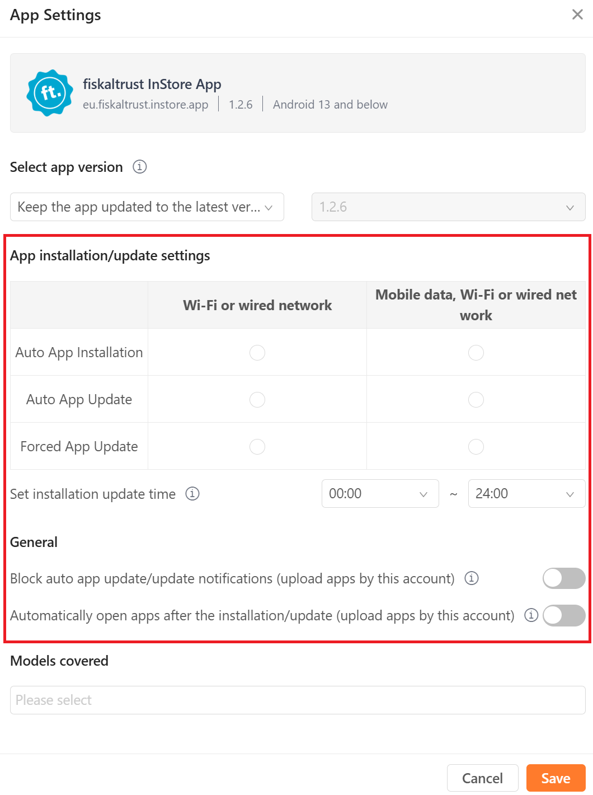

## Purpose

This guide explains how to publish and configure the fiskaltrust InStore App for Sunmi Android POS devices via the Sunmi Partner Portal.

## Prerequisites

Before starting, ensure you have:

- An active Sunmi Partner account
- List of supported Sunmi device models you want to target

## Step 1: Sign in to the Sunmi Partner Portal

1. Open: https://partner.sunmi.com/
2. Sign in with your Partner credentials.
3. Confirm you see the main dashboard.

## Step 2: Navigate to App Management

1. In the left (or top) navigation, open **App Store**.
2. Choose **Publish/Remove Apps**.

## Step 3: Locate the InStore App Entry

1. Use the search bar to enter: `InStore App`
2. Locate the app in the results list.
3. Click the gear icon (settings) for the app to open its configuration panel.

## Step 4: Fill in App Settings

:::caution

After adjusting settings or device model assignments, always press "Save" before leaving the page—unsaved changes will be lost .

:::

## Step 5: Select Device Models

1. In the device selection section, choose the Sunmi models you want to support.
2. Select the appropriate device models as shown in the image (e.g., "V2_PRO").

:::caution

After adjusting settings or device model assignments, always press "Save" before leaving the page—unsaved changes will be lost .

:::

**Last updated:** 16-10-2025