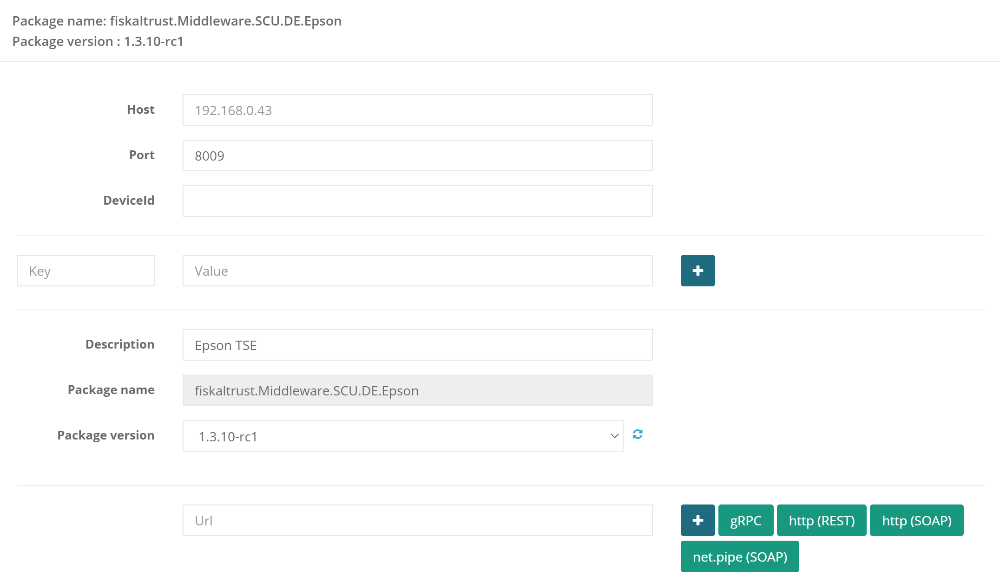

# Epson Hardware-TSE

### State of certification

Certification-ID of TSE according to chapter 9.2.2 of [Anwendungserlass zu § 146a AO](https://www.bundesfinanzministerium.de/Content/DE/Downloads/BMF_Schreiben/Weitere_Steuerthemen/Abgabenordnung/AO-Anwendungserlass/2021-11-04-aenderung-des-anwendungserlasses-zur-abgabenordnung-AEAO.pdf?__blob=publicationFile&v=2):

| Certification-ID                                             | Test item                                                   | Applicant       | Date       |
| :----------------------------------------------------------- | :---------------------------------------------------------- | :-------------- | :--------- |
| [BSI-K-TR-0373-2019](https://www.bsi.bund.de/SharedDocs/Zertifikate_TR/Technische_Sicherheitseinrichtungen/BSI-K-TR-0373-2019.html) | EPSON USB TSE, Vers. 1.0  EPSON microSD TSE, Vers. 1.0 | Epson Europe BV | 20.12.2019 |

#### Certification identification

"BSI-K-TR-0373-2019" is returned for 'ftSignatureType' `0x4445000000000022` (certification identification). 

## Signature Creation Unit

### Support

**Alpha from version:** 1.3.10-rc1

**Stable from version:** 1.3.10

The _fiskaltrust.Middleware.SCU.DE.Epson_ package connects the middleware with a Epson hardware-TSE.

### Parameters

| Name | Description | Optional |
| ---- | ------------ |--------- |
| _Host_ | The URL under which the TSE can be reached (without port) | mandatory |
| _Port_ | The port via which the TSE can be reached under the specified URL. If not defined, the standard port as defined by the manufacturer is used. | `8009` optional |
| _DeviceId_ | The device ID specific to the TSE. If not specified, the default value for local USB TSEs is used. | `local_TSE` optional |
| _Timeout_ | Timeout value for communication with the TSE in milliseconds. If not specified, the default value of 60 seconds is used. | `60000` optional |

Please pay attention to the case-sensitive use of the parameters.

### Configuration

- **Host:** DNS or IP address of the Epson server, Epson printer or local web service
- **Port:** Port of the Epson server, printer or local web service, usually 8009
- **DeviceId:** This setting is only relevant for the Epson server and is used to identify the server. The DeviceId can be found in the Epson Server Dashboard, which can be accessed via the host IP address.

## Troubleshooting:

| Problem                                                      | Possible cause                                               | Solution                                                     |
| ------------------------------------------------------------ | ------------------------------------------------------------ | ------------------------------------------------------------ |
| **The Developer TSE requests a self-test even though it has been unplugged and plugged in** |                                                              | Please perform a factory reset on the Developer TSE according to the manufacturer's instructions. |
| **Connection with the USB Epson TSE directly plugged in into the cash register cannot be established** |                                                              | Please ensure that the Epson driver for the TSE has been installed. You can downlod the driver from the following URL: https://download.epson-biz.com/modules/pos/?page=prod&pcat=51&pid=6397.  This does not apply to the use of the USB Epson TSE in an Epson server. |
| **USB Epson TSE do not work on a printer.**                  | For use on the printer, Epson only supports MicroSD Epson TSE. | Please use MicroSD Epson TSE for the use on the printer.     |
