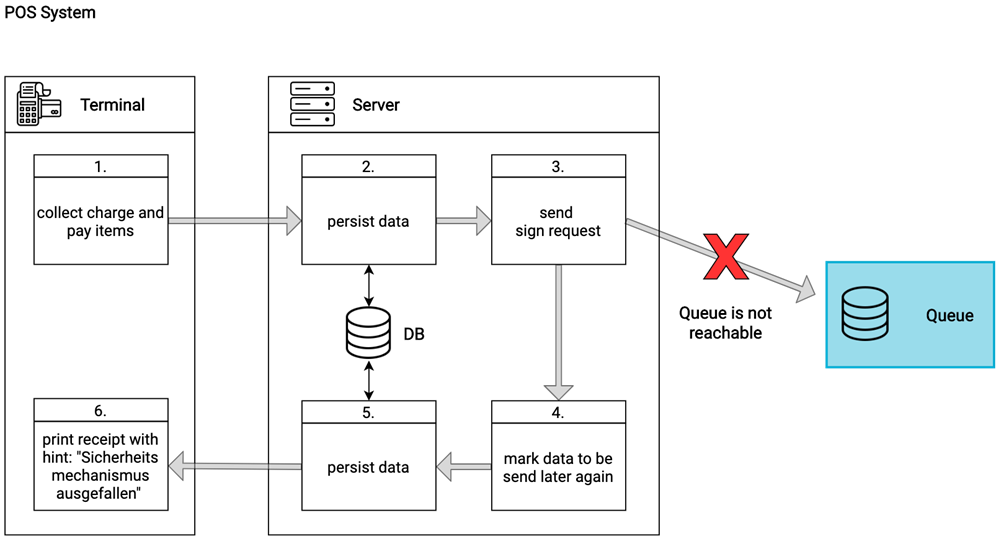
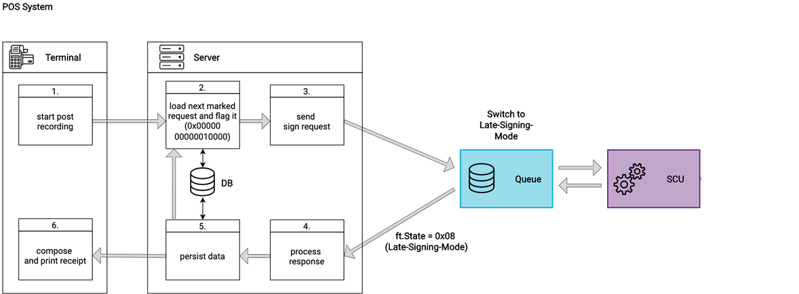
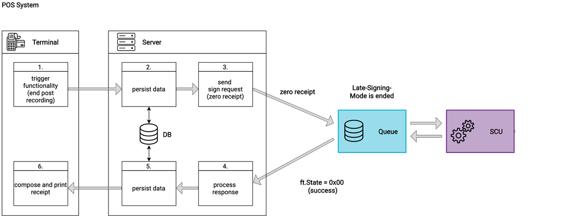

## Failure Scenario

This chapter describes the failure scenario and how to handle it in accordance with French law. The general rules for cash register integration are described in the Chapter ["Cash Register Integration"](../../general/cash-register-integration/cash-register-integration-regular-workflow.md) of this document.

### Middleware not reachable or failing

If a cash register cannot communicate with the fiskaltrust.Middleware it is most likely due to a failure of the network connection, the Middleware host, or the Middleware itself. Such a failure means that the electronic recording system is not operational and there is no access to the appropriate journal.

If the cash register doesn’t receive a response from the Middleware (e.g., due to a network or server outage), the following steps should be taken:

  -The cash register or input station  must automatically generate a receipt and a copy of it.
  - The receipt should be labeled with "mode dégradé" (degraded mode) and include the current failure counter.
  -The receipt copy should be stored until the problem is resolved. The cash register can store this copy electronically.
  - Once the Middleware is reachable again, send all receipts marked as "receipt copy, electronic recording system failed" to the Middleware.
  - Mark these receipts with the "failed receipt" flag to indicate the issue.  The flag can be found in the [Reference Table Chapter - ftReceiptCaseFlag](https://docs.fiskaltrust.cloud/docs/poscreators/middleware-doc/general/reference-tables#ftreceiptcaseflag).
  The Middleware will respond with a "Late Signing Mode" status.

Mark these receipts with the "failed receipt" code to indicate the issue. The Middleware will respond with a "Late Signing Mode" status.

:::tip

We recommend re-sending the first failed receipt with the receipt request flag 0x0000800000000000. This ensures that if the receipt was already sent but the response was lost (e.g., due to a network issue), the Middleware will retrieve and return the original receipt. More details about this flag can be found [here](https://docs.fiskaltrust.cloud/docs/poscreators/middleware-doc/general/reference-tables#ftreceiptcaseflag)

:::