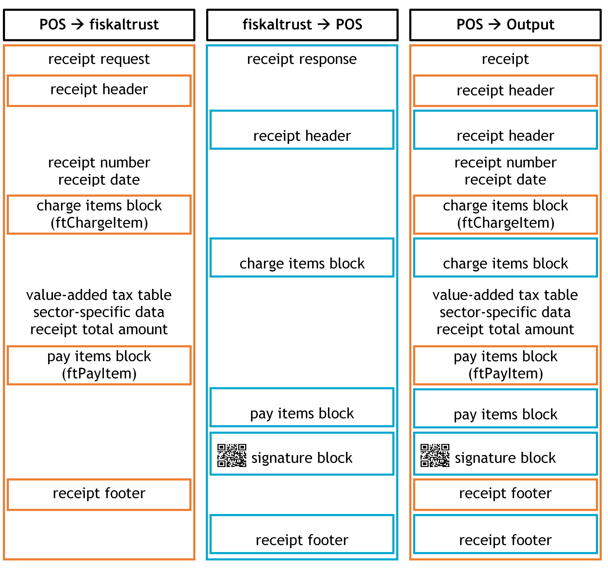

## Cash register integration

This chapter describes the cash register integration in accordance with French law. The general rules for cash register integration are described in the Chapter ["Cash Register Integration"](../../general/cash-register-integration/cash-register-integration-regular-workflow.md) of this document.

### Receipt creation process

#### The fiskaltrust.SecurityMechanism

The regular workflow of the fiskaltrust.SecurityMechanism in the French market defines the steps required for the creation of a receipt as follows:

  - get the data from the POS-System
  - determine the receipt type
  - assign a sequential number depending on the type
  - increase the daily and perpetual sales counter
  - create a signature for the receipt
  - chain the receipt in the general and the journal of the receipt type
  - create machine-readable code
  - create additional receipt data
  - save all the send and generated data
  - return the whole data to the POS-System

### Receipt for special functions

This section expands on the descriptions from the Chapter ["Receipt for special functions"](../../general/cash-register-integration/cash-register-integration-regular-workflow.md#c-receipt-for-special-functions-54) of the general part and describes the receipt types used for special functions on the French market.

In accordance with the Official Bulletin BOI-CF-COM-10-80-20160803 from August 3, 2016, and paragraph 3 bis of Article 286 of the French Tax Code, the proof of payment of a non-taxable person to a taxable person for a sale or service must be signed electronically and chained to ensure unalterability. There are additional requirements specified by law, which can be fulfilled by creating the following special receipts.

#### Zero Receipt

#### Start Receipt (Initial Receipt)

#### Stop Receipt (Closing Receipt)

#### End of Failure Receipt (Collective Failure Report)

#### Daily Receipt

Before the start of a new day, previous results of the cumulative sales counter (daily counter) have to be recorded. A cash register can request this daily receipt from a fiskaltrust.SecurityMechanism for this purpose.

A daily closing exports counters and summary data that are recorded for the current day. When a daily closing is executed, the perpetual total is fixed at that moment and included in the closing receipt. The day's sums are added month's totals and the amounts for the day are then reset back to zero. The totals and the summary data of the day are written into the journal.

#### Monthly Receipt

Before the beginning of a new monthly period, previous cumulative sales counter (monthly counter) results have to be recorded. A cash register can request this monthly receipt from a fiskaltrust.SecurityMechanism for this purpose.

A monthly closing exports counters and summary data that are recorded for the last month. When a monthly closing is executed, the perpetual total is fixed at that moment and included in the closing receipt. The month's sums are added to the year's totals and the amounts for the month are then reset back to zero. A monthly closing includes a daily closing. That means that a daily closing will be executed first, and the monthly closing follows. The totals and the summary data of the month are written into the journal.

#### Annual Receipt

Before the beginning of a new year, the previous results of the cumulative sales counter (yearly counter) have to be recorded. A cash register can request this yearly receipt from a fiskaltrust.SecurityMechanism for this purpose.

A yearly closing exports the counters and summary data that are recorded for the last year. When a yearly closing is executed, the perpetual total is fixed at that moment and included in the closing receipt. The totals of the year are written into the journal. A yearly closing includes a daily and monthly closing. That means first a daily, then a monthly closing and finally, the yearly closing will be executed. The totals and the summary data of the year are written into the journal.

#### Shift Receipt

Before the beginning of a new customised period (i.e. when the financial year is different from the calendar year), the preliminary result of the cumulative sales counter (shift counter) has to be recorded. A cash register can request this shift receipt from a fiskaltrust.SecurityMechanism for this purpose.

A shift closing exports the counters and the summary data recorded for the last custom period. When a shift closing is executed, the totals of the shift are written into the journal.

#### Archive Receipt

Archive receipts are the official requests to initiate the archiving procedure sent by the POS-System.

This receipt will be enqueued and uploaded to the fiskaltrust.Portal, which will process the archiving procedure.

The results will be shown, and the content will be available for download on a dedicated page (Tools -\> Exports).

The procedure archives the requested period. An archive can contain a maximum of 12 months from the start of the queue or from the last archive date, up to the receipt's date.  If the archiving period is longer than 12 months, multiple archive receipts have to be sent with the start date of each consecutive receipt beginning right after the end date of the previous one.

Every time an archive receipt is sent to the middleware, a hash recalculation is performed. If any discrepancies are found in the hashes, an error message will be displayed in the portal, under (Configuration-\> Queues\>ActionJournal)

### Receipt structure

This chapter describes the receipt structure applicable to the French market.

*Illustration* *24. Receipt Structure (FR); cash register- receipt data (header, charge items, pay items, footer) and fiskaltrust-receipt data (header, charge items, pay items, signature, footer)*

#### Receipt Header

#### Charge Items Block

#### Pay Items Block

#### Signature Block

A signature block is generated if a cryptographic signature is required. A JSON Web Token (JWT) is used for this process, and its structure contains three parts: header, payload and signature. This process signs all information provided in the header and in the payload. The type of hashing algorithm and encryption of the JSON-object are defined in the header, and their content is "ES256". The payload is a serialized receipt information which additionally contains the hash value of the previous receipt. Payload-fields identify the company that emits the receipt and the receipt itself and contain all the receipt content. In order to create a chain, the signature of the previous receipt produced by JWT has to be incorporated at the end of the next one. Both header and payload are processed as Base64URL strings and are signed with the private key of the queue using SHA-256 with ECDSA.

#### Receipt Footer

The receipt footer contains further information regarding the issuing company. The footer provided by the cash register can, for example, contain the SIRET and/or VAT number of the issuing enterprise.

There is no legal requirement for the content of the footer, but if the fiskaltrust.Middleware sends any additional information for this section, it has to be printed/stored by the cash register.

### Data Collection Log

The Data Collection Log consists of a localised set of information stored using JWT algorithm. The content of the payload is a set of meaningful information related to the type of receipt.

#### Receipt Journal

Receipt journals are JSON exports of internal structured data related to receipts handled by the fiskaltrust.Middleware. For each receipt type, a journal is created and maintained.

#### fiskaltrust.ActionJournal 

 fiskaltrust.ActionJournals are JSON exports of internal structured data related to special actions traced by the fiskaltrust.Middleware. There are journals related to different actions, e.g., a journal for the periodical counters, a journal for archiving, or a journal for a technical action log.
