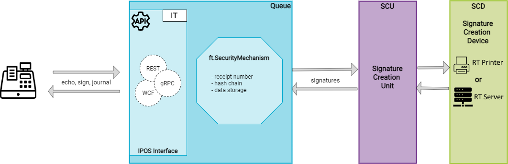
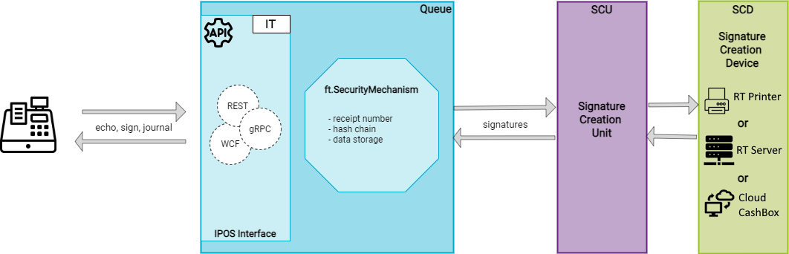

# Installation

## On-Premise

The illustration below shows the components available for the premise installation of the fiskaltrust.Middleware for the Italian market. For the operation modes available and the description of the components please refer to the [general part](../../general/operation-modes/operation-modes.md) .

## Cloud Solution

The illustration below shows the components available for the cloud solution of the fiskaltrust.Middleware for the Italian market. For the operation modes available and the description of the components please refer to the [general part](../../general/operation-modes/operation-modes.md) .

## Supported software platforms

- [Windows](on-premise-platforms/windows.md)
- [Linux, macOs](on-premise-platforms/linux.md)
- [Android](on-premise-platforms/android.md)

## Communication services/platform support matrix

For the Italian market, depending on the platform, following communication services are available:

|          | Windows       | Linux, macOS  |
|----------|---------------|---------------|
| **gRPC** | **supported** | **supported** |
| **REST** | **supported** | **supported** |
| **WCF**  | **supported** | not supported |

## SCU/characteristics & platform support matrix

|                               | Type,Form factor | Windows       | Linux, macOS  | Android       |
|-------------------------------|------------------|---------------|---------------|---------------|
| [Epson RT Printer](scu/epsonprinter.md) | Hardware printer | **supported** | **supported** | **supported** |
| [Custom RT Printer](scu/customprinter.md) | Hardware printer | **supported** | **supported** | **supported** |
| [Custom RT Server](scu/customserver.md) | Hardware server | **supported** | **supported** | **supported** |
| [IVA Servizi](scu/ivaservizi.md) | Government web | **supported  via CloudCashBox** | **supported via CloudCashBox** | ** supported  via CloudCashBox** |

## Hardware requirements

For hardware requirements, please refer to the [general part](../../general/operation-modes/operation-modes.md).

## Local data storage/platform support matrix

Following local data storage options can be configured in the queue:

|                                                            | Windows       | Linux, macOS  | Android       |
|------------------------------------------------------------|---------------|---------------|---------------|
| **[SQLite-storage](on-premise-databases/sqlite.md)**       | **supported** | **supported** | **supported** |
| **[EF-storage](on-premise-databases/entity-framework.md)** | **supported** | **supported** | not supported |
| **[MySQL-storage](on-premise-databases/mysql.md)**         | **supported** | not supported | **supported** |

## Local data export

-  Z-Report
-  X-Report
-  XZ-Report

## Configuration Scenarios

<!-- markdown-link-check-disable-next-line -->
For configuration scenarios for operating the fiskaltrust.Middleware, please refer to the [Rollout documentation](https://docs.fiskaltrust.cloud/docs/posdealers/buy-resell/rollout-plans).

## Installation

For the on- and off-premise installation of the fiskaltrust.Middleware please refer to the [installation chapter in the general part](../../general/installation/installation.md).

